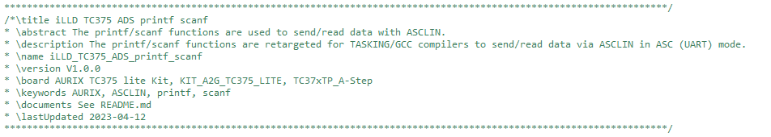
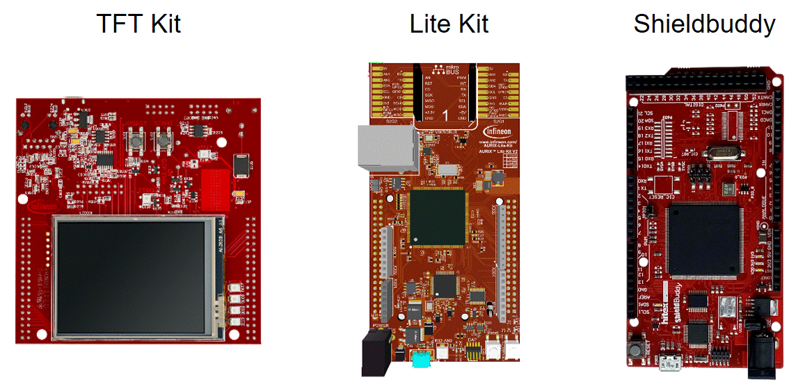
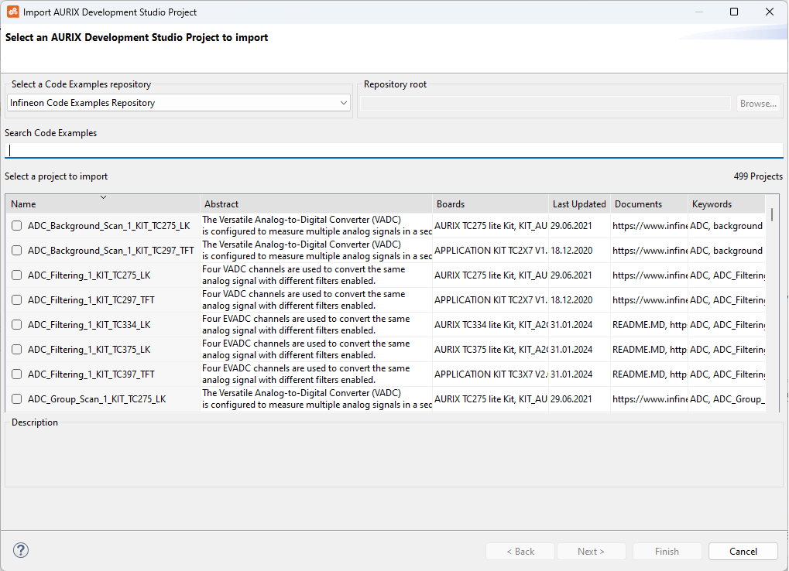
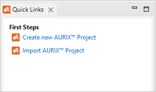

# Code Examples for AURIX™ Development Studio
More than hundreds of code examples are available for AURIX™ devices in this repository. 
Each code example is made up of two parts: the **[source code](#source-code)** and the corresponding **[tutorial](#tutorial)**.

To import a code example into AURIX™ Development Studio, follow the guide at the [end on this page](#how-to-import).

**NOTE:** For any question or request, please use the dedicated [Infineon AURIX™ forum](https://community.infineon.com/t5/AURIX/bd-p/AURIX/page/1).

## Topics
The code examples in this repository cover at least the following topics, divided by macro category:

|   Communication Protocols     |   Data Handling   |   Timers  |   Analog/Digital Signals  |   CPU Management  |   Alarms, Interrupts and Resets   |
|   ------------------------------------------------------------    |   ------------------------------------------------------------    |   ------------------------------------------------------------    |   ------------------------------------------------------------    |   ------------------------------------------------------------    |   ------------------------------------------------------------    |
|   ASCLIN module handling for LIN, UART and SPI    |   Flexible CRC Engine control |   Capture and Compare Unit control    |   Versatile Analog-to-Digital converter control   |   Assembly code execution |   Device Reset type trigger and detection |
|   Ethernet communication   |   Input-Output Monitor control |   Clock System    |   Delta-Sigma Analog-to-Digital converter control |   Code execution from SRAM    |   Interrupt handling  |
|   I2C communication   |   BUS register protection |   General Purpose Timer control   |   GPIO port control   |   Performance registers usage |   Safety Management Unit control  |
|   CAN communication   |   Memory Protection control   |   Generic Timer Module control    |       |   Power Management System control |       |
|   SPI communication   |   Data and Program Flash programming  |   System Timer Module control |       |   Multicore   |       |
|       |   DMA control |       |       |   Trap recognition    |       |
|       |   Memory test |       |       |   Watchdog handling   |       |

## Source code
The source code of each code example is based on Infineon Low Level Drivers (iLLDs), for which the documentation can be found on [this webpage](https://www.infineon.com/design-resources/platforms/aurix-software-tools/aurix-embedded-sw/aurix-illd-drivers). 

Each code example is provided with a comment section called "metadata" in the Cpu0_Main.c file, which include:
- **Title**: the title of the code example
- **Abstract**: a short description of the example’s scope
- **Description**: a detailed description of the example’s scope
- **Name**: the example’s univocal name
- **Version**: the version number of the example (*V&lt;major changes&gt;.&lt;minor changes&gt;.&lt;bugfixes&gt;* e.g. V1.0.2)
- **Board**: a list of boards supported by the code
- **Keywords**: a list of keywords used to ease the search
- **Documents**: a list of links to documents useful for the code example
- **Last Updated**: date of the last modification

e.g.:

### Name
The name of each code example follows a specific naming scheme:

- &lt;Code name&gt;&#95;&lt;ID number&gt;&#95;&lt;Board short name&gt;
- &lt;Framework&gt;_&lt;Board short name&gt;&#95;ADS&#95;&lt;Code name&gt;

e.g. : ADC&#95;Filtering&#95;1&#95;KIT&#95;TC375&#95;LK
e.g. : iLLD&#95;TC375&#95;ADS&#95;Blinky_LED_CPP

where:
- The **code name** summarizes in a couple of words the scope and the module used in the example
- The **ID number** is an identification number for the example scope (If the same scope would be achieved using different code, then the two code examples would be called &#95;1 and &#95;2 in order to differentiate them)
- The **board short name** describes which board the example code has been developed for (using board-specific port pins such as LED, communication, etc.)
- The **framework** indicates the software framework used: "iLLD" for Infineon Low Level Drivers or "BMETAL" for Bare Metal implementations

### Board
The code examples supports the following types of boards:

 - Aggiungere triboard

In particular, the following boards are supported:

|   AURIX™ TC2xx Boards           |   AURIX™ TC3xx Boards        |   AURIX™ TC4xx Boards        |
|---------------------------------|------------------------------|------------------------------|
|     KIT_AURIX_TC234_TFT         |     KIT_A2G_TC334_LITE       |     KIT_A3G_TC4D7_LITE       | 
|     KIT_AURIX_TC237_TFT         |     KIT_A2G_TC367_5V_TFT     |     KIT_A3G_TC497_LITE       | 
|     KIT_AURIX_TC265_TFT         |     KIT_A2G_TC375_ARD_SB     |     KIT_A3G_TC487_LITE       | 
|     KIT_AURIX_TC275_ARD_SB      |     KIT_A2G_TC375_LITE       |     KIT_A3G_TC467_LITE       | 
|     KIT_AURIX_TC275_LITE        |     KIT_A2G_TC377_5V_TFT     |                              | 
|     KIT_AURIX_TC277_TFT         |     KIT_A2G_TC387_5V_TFT     |                              | 
|     KIT_AURIX_TC297_TFT         |     KIT_A2G_TC397_5V_TFT     |                              | 
|                                 |     KIT_A2G_TC3xx_5V_TRB_S   |                              | 

## Tutorial

The code examples provide tutorials in one of two different formats
- PDF
- README.md

### Code Examples with PDF tutorial
**PDF tutorial** can be downloaded directly by following the link inside the metadata in the [Source Code](#source-code).

Each tutorial contains the following information:
- **Summary**: An abstract and a detailed description of the example's scope
- **Introduction**: A generic introduction on the used module and its main features
- **Hardware**: The used hardware and how to configure it
- **Implementation**: A detailed explanation of how to implement the module's configuration using iLLDs and exploits their features
- **Run and Test**: The steps to follow to make sure the code is working properly and interact with it
- **References**: Useful links

### Code Examples with README.md tutorial 
README.md is provided within the project. This file is automatically opened when the code example is imported into AURIX™ Development Studio, giving you immediate access to the documentation alongside the source code.

- **Abstract**: An abstract and a detailed description of the example's scope
- **Device**: The device used in the code example 
- **Board**: The board used for testing the code example
- **Scope of work**: A generic introduction on the used module and its main features
- **Hardware setup**: The used hardware and how to configure it
- **Implementation**: A detailed explanation of how to implement the module's configuration using iLLDs and exploits their features
- **Compiling and programming**: The steps to build and flash the programm in the board
- **Run and Test**: The steps to follow to make sure the code is working properly and interact with it
- **References**: Useful links

## How To Import
To **import** a code example, use the dedicated import function in AURIX™ Development Studio: *File* &gt;&gt; *Import...* &gt;&gt; *Infineon* &gt;&gt; *"AURIX Development Studio Project"*, select *"Infineon Code Examples Repository"* and select the code example to be imported.

The same result can be achieved by clicking on "*Import AURIX Project*" in the Quick Links view of AURIX™ Development Studio:

 
 
