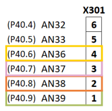
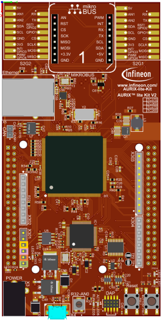
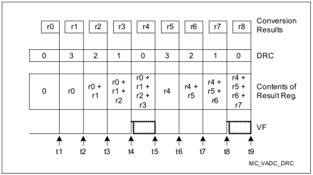
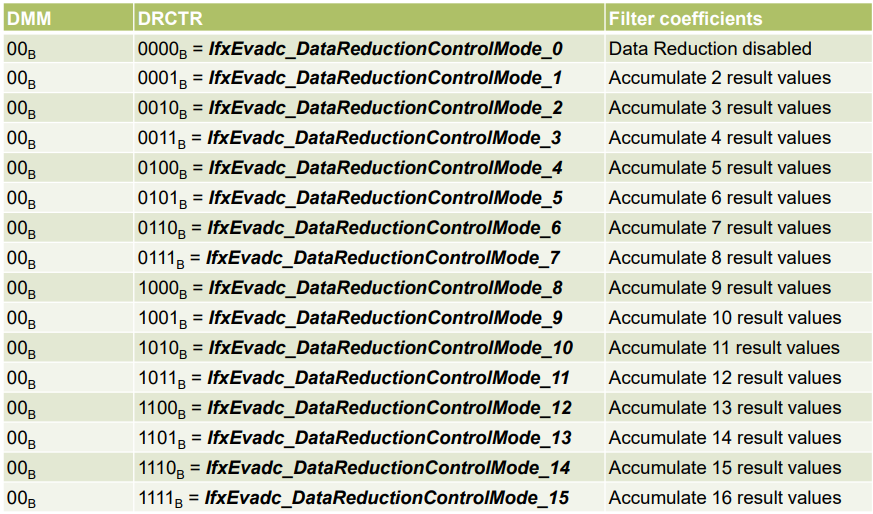
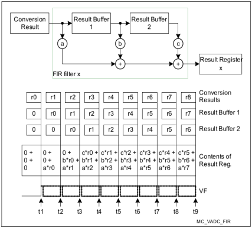
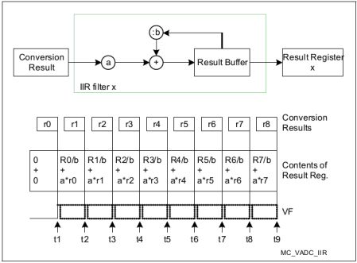
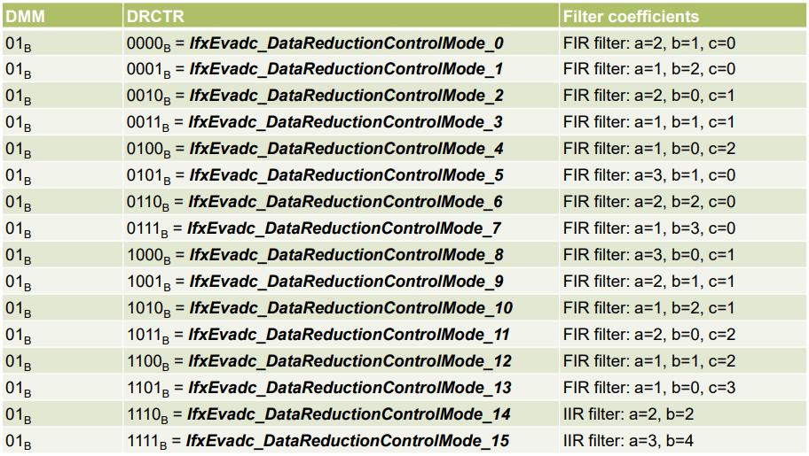
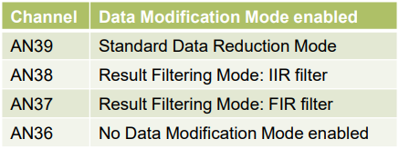
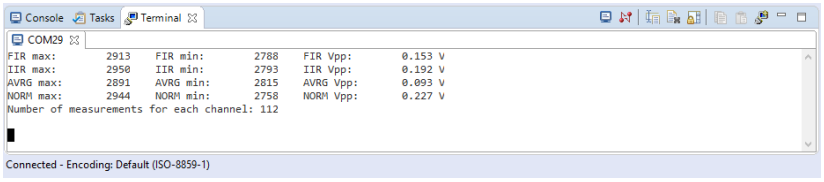

  

# ADC_Filtering_1_KIT_TC375_LK
Four EVADC channels are used to convert the same analog signal with different filters enabled.

## Device  
The device used in this example is AURIX&trade; TC33xTP_A-Step.

## Board  
The board used for testing is the AURIX&trade; TC375 lite Kit (KIT_A2G_TC375_LITE).

## Scope of work  
The Enhanced Versatile Analog-to-Digital Converter (EVADC) module is configured to convert four channels. The data resulting from the conversions of three channels is automatically modified: one channel computes an average on 4 results, another channel applies a 3rd order Finite Impulse Response (FIR) filter and another channel applies a 1st order Infinite Impulse Response (IIR) filter. Finally, the last channel measures the same signal without Data Modification. The channels are continuously converted and, for each of them, the maximum and minimum values are stored, which are then sent through UART in order to be compared.

## Introduction  
The Enhanced Versatile Analog-to-Digital Converter module (EVADC) of the AURIX&trade; TC37x comprises 8 independent analog to digital converters (EVADC groups) with up to 16 analog input channels each.

Each channel can convert analog inputs with a resolution of up to 12-bit.

Analog/Digital conversions can be requested by several request sources: 
- Queued request source, specific to a single group 
- Synchronization source, synchronized conversion request from another ADC master kernel

A queued request source provides several buffer stages building a queue and can handle application-specific arbitrary conversion sequences up to the queue size.

The trigger for the conversion can be sent:
- Once (by another external module)
- On a regular time base (by an external timer)
- Permanently (by using the refill option)

The data resulting from conversions can be automatically modified before being used by an application to reduce the required CPU/DMA load to process the conversion.

Three types of data modification are supported:
- Standard Data Reduction Mode
- Result Filtering Mode
- Difference Mode

With Standard Data Reduction Mode, the EVADC accumulates up to 16 values before generating a result interrupt. This mode can be used on any result register of any group GxRES0..GxRES15, where x is the number of the group.

When Result Filtering Mode is enabled, depending on the configuration, the EVADC can apply either a 3rd order Finite Impulse Response (FIR) filter with selectable coefficients, or a 1st order Infinite Impulse Response (IIR) filter with selectable coefficients to the conversion results. This mode can be applied on the result registers GxRES7 and GxRES15 of any group, where x is the number of the group.

The Difference Mode subtracts the content of the result register GxRES0 from the conversion results. This mode can be used on the result registers GxRES1,...,GxRES15 of any group, where x is the number of the group.

## Hardware setup  
This code example has been developed for the board KIT_A2G_TC375_LITE.

In this example, the pins AN36, AN37, AN38 and AN39 are used, connected to a voltage source. 

  

Note: The channels can be HW filtered by the board, depending on which capacitor/resistors couples are soldered. Consult the AURIX&trade; TC375 lite Kit’s User Manual to check which channels are filtered by HW.

Note: The reference voltage (VAREF) of the EVADC on the board KIT_A2G_TC375_LITE is 3.3 V.

## Implementation  

### Configuration of the EVADC
The configuration of the EVADC is done in the *initADC()* function in four different steps:
- Configuration of the EVADC module
- Configuration of the EVADC group
- Configuration of the EVADC channels
- Configuration of the data modification

When the EVADC module, its group and channels are configured together with the Data Modification registers, the scan sequence is started with the function *IfxEvadc_Adc_startQueue()*.
### Configuration of the EVADC module
The default configuration of the EVADC module, given by the iLLDs, can be used for this example.

This is done by initializing an instance of the *IfxEvadc_Adc_Config* structure and applying default values to its fields through the function *IfxEvadc_Adc_initModuleConfig()*.

Then, the configuration can be applied to the EVADC module with the function *IfxEvadc_Adc_initModule()*.

### Configuration of the EVADC group
The configuration of the EVADC group is done by initializing an instance of the *IfxEvadc_Adc_GroupConfig* structure with default values through the function *IfxEvadc_Adc_initGroupConfig()* and modifying the following fields:
- *arbiter* – a structure that represents the enabled request sources, which can be one of the three queue 
sources. In this example, *arbiter.requestSlotQueue0Enabled* is set to *TRUE*, thus enabling the request queue 0
- *queueRequest[0]* – a structure that allows to configure the queue request source 0 by setting:
  - *triggerConfig* – a parameter that specifies the trigger configuration
- *master* – to indicate which converter is the master
- *groupId* – to select which converter to configure

The configuration is applied through the function *IfxEvadc_Adc_initGroup()*.

### Configuration of the EVADC channels
The configuration of each channel is done by initializing an instance of the *IfxEvadc_Adc_ChannelConfig* structure with default values through the function *IfxEvadc_Adc_initChannelConfig()* and modifying the following fields:
- *channelId* – to select the channel to configure
- *resultRegister* – to indicate the register where the A/D conversion value is stored

Then, the configuration is applied with the function *IfxEvadc_Adc_initChannel()* and the channel is added to the queue through the function *IfxEvadc_Adc_addToQueue()*.

Finally, the result registers used for storing the conversion results can be configured to use data modification, in order to enable the filtering.

### Configuration of the data modification
The data modification is configured in the *applyFiltering()* function.

To support the EVADC data modification it is needed to directly modify the Group Result Control Registers (GxRCRy, with x indicating the Group number and y indicating the result register where to apply the filtering).

### Configuration of the data modification
To enable the *Standard Data Reduction Mode* on a specific result register, the Data Modification Mode (DMM) bit field of the associated GxRCRy register must be set to *IfxEvadc_DataModificationMode_standardDataReduction* (00B) and the Data Reduction Control (DRCTR) bit field of the same register can be set to one of the values presented in table 1.

When the conversion is ready, depending on the configuration of the DRCTR bit field, the result register contains the sum of up to 16 result values, thus it is needed to divide the content of the result register GxRESy by the number of the accumulated values in order to obtain an average of the measurements.

  

Note: Using Standard Data Reduction Mode, the final result must be read before the next data reduction sequence starts (before t5 or t9 in the example), otherwise the Valid Flag (*VF*) bitfield will not be cleared. 

In order to read a correct measurement, VF must be 1 and Data Reduction Counter (DRC) bitfield must be 0.

#### Table 1
  

To enable *the Result Filtering Mode* on a specific result register, the Data Modification Mode (DMM) bit field of the associated GxRCRy register must be set to *IfxEvadc_DataModificationMode_resultFilteringMode* (01B) and the Data Reduction Control (DRCTR) bit field of the same register can be set to enable either a 3rd order Finite Impulse Response (FIR) filter or a 1st order Infinite Impulse Response (IIR) filter, both with selectable coefficients, according to the values in table 2.

When a *FIR filter* is enabled, depending on the selected coefficients, a gain of 3 or 4 (the DC gain of a FIR filter is equal to the sum of its coefficients) is applied to the ADC result, producing a 14-bit value. Therefore, in order to obtain the filtered measurement, it is needed to divide the content of the result register by the sum of the selected coefficients.

  

The selectable coefficients for an *IIR filter* lead to a gain of 4 to the ADC result, producing a 14-bit value. 
Consequently, in order to obtain the filtered measurement, the content of the result register needs to be divided by 4. 

All the measurement’s divisions are carried out in the *Cpu0_main.c* file, after reading the conversion result from the result register.

The FIR and IIR filters need to be initialized, otherwise the first values are incorrect (see the figures for the two filters). 

Note: In this example, a delay before starting to read the conversion results is needed. This ensures that incorrect values are not read due to the filters not being yet at full speed.

#### Table 2
 

In this example, the converted channels are configured as it follows:

#### Table 3
 

The channel AN36 has no data modification enabled in order to use it as a comparison.

### Read the EVADC measurements
Finally, to read a conversion, the function *readADCValue()* is used, which calls the *IfxEvadc_Adc_getResult()* function from iLLDs until a new measurement is returned (a new measurement is considered correct only when both the Valid Flag and the Data Reduction Counter bitfield are set to 1 and respectively 0, the latter is needed because the Standard Data Reduction Mode is enabled on the AN39 pin).

All the functions used to get a conversion and configuring the EVADC module, its group and channels can be found in the iLLD header *IfxEvadc_Adc.h*.

### Configuration of the UART
In this example, the UART connection is used to make the debugging more convenient and easier to understand. The configured EVADC channels are continuously read, but the maximum and minimum values, together with the computed Vpp are printed using UART communication only when the user requests them.

The *initUART()* function initializes the UART communication.

The iLLD function *IfxAsclin_Asc_initModuleConfig()* fills the configuration structure *ascConf* with default values. Then, the parameters used to configure the module are set, depending on the needed connection: baudrate, Tx and Rx buffers, Tx and Rx pin configuration etc.

Finally, *IfxAsclin_Asc_initModule()* initializes the module with the user configuration and *IfxAsclin_Asc_stdIfDPipeInit()* initializes the standard interface to use the ASCLIN module.

The functions *isDataAvailable()* and *receiveData()* are used to interface with the ASCLIN module to check if new data is available through the function *IfxAsclin_Asc_getReadCount()* and, respectively, to receive data over the UART communication through the function *IfxAsclin_Asc_read()*.
The function *IfxStdIf_DPipe_print()* is used to print the stored processed values.

The functions used to interface and initialize the ASCLIN module can be found in the iLLD header *IfxAsclin_Asc.h*, while the latter can be found in the iLLD header *IfxStdIf_DPipe.h*.

## Compiling and programming  
Before testing this code example:  
- Power the board through the dedicated power connector
- Connect the board to the PC through the USB interface  
- Build the project using the dedicated Build button  or by right-clicking the project name and selecting "Build Project"  
- To flash the device and immediately run the program, click on the dedicated Flash button 

## Run and Test
For this training, a serial monitor is required for using the Shell. The monitor can be opened inside the AURIX&trade; Development Studio using the following icon:

  

The serial monitor must be configured with the following parameters to enable the communication between the board and the 
PC:
-  Speed (baud): 115200
-  Data bits: 8
-  Stop bit: 1

After code compilation and flashing the device, perform the following steps:
- Connect the channels AN39, AN38, AN37 and AN36 to any DC signal between 0 and 3.3V
- Open the serial monitor and start the serial communication, linked with the appropriate COMx port (this can be checked in the Device Manager)
- After a few seconds, send the character “1” to print the maximum and minimum values read by the channels, together with the computed Vpp

Note : The maximum and minimum values are expressed as a 12-bits integer value, in decimal format (0 - 4095 range), while the Vpp is expressed in Volts.

Note : It can be noticed that for this signal, the filter applying an average is the most effective one to reduce the Vpp range.

## References  

AURIX&trade; Development Studio is available online:  
- <https://www.infineon.com/aurixdevelopmentstudio>  
- Use the "Import..." function to get access to more code examples  

More code examples can be found on the GIT repository:  
- <https://github.com/Infineon/AURIX_code_examples>  

For additional trainings, visit our webpage:  
- <https://www.infineon.com/aurix-expert-training>  

For questions and support, use the AURIX&trade; Forum:  
- <https://community.infineon.com/t5/AURIX/bd-p/AURIX>  