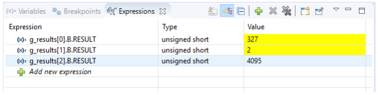

  

# ADC_Queued_Scan_1_KIT_TC397_TFT
The Enhanced Versatile Analog-to-Digital Converter (EVADC) is configured to measure multiple analog signals in a sequence using queued request.

## Device  
The device used in this example is AURIX&trade; TC39xTP_A-Step.

## Board  
The board used for testing is the AURIX&trade; TC397 TFT (KIT_A2G_TC397_5V_TFT).

## Scope of work  
The Queued Request of the Enhanced Versatile Analog-to-Digital Converter (EVADC) module is used to continuously scan the analog inputs channels 1, 4 and 5 of group 2. 

## Introduction  
The Enhanced Versatile Analog-to-Digital Converter module (EVADC) of the AURIX&trade; TC39x comprises 12 independent analog to digital converters (EVADC groups) with up to 16 analog input channels each.

Each channel can convert analog inputs with a resolution of up to 12-bit.

Analog/Digital conversions can be requested by one request sources: 
- Queued request source, specific to a single group

A queued source can issue conversion requests for an arbitrary sequence of input channels. The channel numbers for this sequence can be freely programmed

The trigger for the conversion via the queued source can be sent:
- Once (by another external module)
- On a regular time base (by an external timer)
- Permanently (by using the refill option)

## Hardware setup  
This code example has been developed for the board KIT_A2G_TC397_5V_TFT.

The signals to be measured have to be connected to channels 1, 4 and 5 of the group 2 of the VADC (pins AN17, AN20, AN21).

  

Note: The channels can be HW filtered by the board, depending on which capacitor/resistors couples are soldered. Consult the Application Kit’s Manual to check which channels are filtered by HW.

Note: For the testing purposes, connect V_UC or GND to the channels. 

## Implementation  

### Configuration of the EVADC
The configuration of the EVADC is done in the *initEVADC()* function in four different steps:
- Configuration of the EVADC module
- Configuration of the EVADC group
- Configuration of the EVADC channels
- Filling the queue

### Configuration of the EVADC module with the function initEVADCModule()
The default configuration of the EVADC module, given by the iLLDs, can be used for this example.

This is done by initializing an instance of the *IfxEvadc_Adc_Config* structure and applying default values to its fields through the function IfxEvadc_Adc_initModuleConfig().

Then, the configuration can be applied to the EVADC module with the function *IfxEvadc_Adc_initModule()*.

The configuration of the EVADC group is done by initializing an instance of the *IfxEvadc_Adc_GroupConfig* structure with default values through the function IfxEvadc_Adc_initGroupConfig() and modifying the following fields:
- *groupId* – to select which converters to configure
- *master* – to indicate which converter is the master. In this example, only one converter is used, therefore it is also the master
- *arbiter* – a structure that represents the enabled request sources. In this example, it is set to *arbiter.requestSlotQueue0Enabled*
- *triggerConfig* – a parameter that specify the trigger configuration

Then, the user configuration is applied through the function *IfxEvadc_Adc_initGroup()*.

The configuration of each channel is done by initializing a separate instance of the *IfxEvadc_Adc_ChannelConfig* structure with default values through the function *IfxEvadc_Adc_initChannelConfig()* and modifying the following fields:
- *channelId* – to select the channel to configure
- *resultRegister* – to indicate the register where the A/D conversion value is stored

Then, the configuration is applied to the channel with the function *IfxEvadc_Adc_initChannel()*. 

### Filling the queue
Each channel is added to the queue through the function *IfxEvadc_Adc_addToQueue()*. 

When the EVADC configuration is done and the queue is filled, the conversion is started with the function *IfxEvadc_Adc_startQueue()*.

To read a conversion, the iLLD API *IfxEvadc_Adc_getResult()* is used inside the function *readEVADC()*.

All the functions used for configuring the EVADC module, its groups and channels together with reading the conversion results can be found in the iLLD header *IfxEvadc_Adc.h*.

## Compiling and programming  
Before testing this code example:  
- Power the board through the dedicated power connector
- Connect the board to the PC through the USB interface  
- Build the project using the dedicated Build button  or by right-clicking the project name and selecting "Build Project"  
- To flash the device and immediately run the program, click on the dedicated Flash button 

## Run and Test
After code compilation and flashing the device, perform the following steps:
- Run the code and then pause it
- Repeat step number one to see that the result is changing accordingly to the signal you measure, AN17 is *g_results[0]*, AN20 is *g_results[1]* and AN21 is *g_results[2]*.

## References
AURIX&trade; Development Studio is available online:  
- <https://www.infineon.com/aurixdevelopmentstudio>  
- Use the "Import..." function to get access to more code examples  

More code examples can be found on the GIT repository:  
- <https://github.com/Infineon/AURIX_code_examples>  

For additional trainings, visit our webpage:  
- <https://www.infineon.com/aurix-expert-training>  

For questions and support, use the AURIX&trade; Forum:  
- <https://community.infineon.com/t5/AURIX/bd-p/AURIX>  