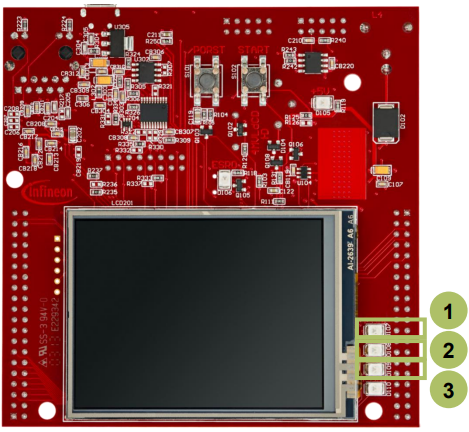

  

# ADC_Filtering_1_KIT_TC397_TFT
The Enhanced Versatile Analog-to-Digital Converter (EVADC) is configured to measure an analog signal using queued request.

## Device  
The device used in this example is AURIX&trade; TC39xTP_A-Step.

## Board  
The board used for testing is the AURIX&trade; TC397 TFT (KIT_A2G_TC397_5V_TFT).

## Scope of work  
An analog input channel is continuously converted using the queued mode. The input value is determined using the microcontroller’s supply voltage, ground level or letting the analog pin open and floating. Three LEDs are used, each indicating a voltage interval. Thus depending on the conversion value, a certain LED will light up.

## Introduction  
The AURIX&trade; microcontrollers provide a series of analog input channels (up to 16 for each ADC) connected to a cluster of Analog/Digital Converters (up to 12) using the Successive Approximation Register (SAR) principle. Each converter of the ADC cluster is represented as a group and can operate independently of the others

Analog/Digital conversions can be requested by one request source: 
- Queued request source, specific to a single group 

A queued source can issue conversion requests for an arbitrary sequence of input channels. The channel numbers for this sequence can be freely programmed.

The trigger for the conversion via the queued source can be sent:
- Once (by another external module)
- On a regular time base (by an external timer)
- Permanently (by using the refill option)

## Hardware setup  
This code example has been developed for the board KIT_A2G_TC397_5V_TFT.

In this example, the pin AN2 is used.

 
  

**Note**: The channels can be HW filtered by the board, depending on which capacitor/resistors couples are soldered. Consult the Application Kit’s Manual to check which channels are filtered by HW.

## Implementation  

### Configuration of the EVADC
The configuration of the EVADC is done in the *initEVADC()* function in four different steps:
- Configuration of the EVADC module
- Configuration of the EVADC group
- Configuration of the EVADC channels
- Filling the queue

### Configuration of the EVADC module with the function initEVADCModule()
The default configuration of the EVADC module, given by the iLLDs, can be used for this example.
This is done by initializing an instance of the *IfxEvadc_Adc_Config* structure and applying default values to its fields through the function *IfxEvadc_Adc_initModuleConfig()*.
Then, the configuration can be applied to the EVADC module with the function *IfxEvadc_Adc_initModule()*.

### Configuration of the EVADC group with the function initEVADCGroup()
The configuration of the EVADC group is done by initializing an instance of the *IfxEvadc_Adc_GroupConfig* structure with default values through the function *IfxEvadc_Adc_initGroupConfig()* and modifying the following fields:
- *groupId* – to select which converters to configure
- *master* – to indicate which converter is the master. In this example, only one converter is used, therefore it is also the master
- *arbiter* – a structure that represents the enabled request sources. In this example, it is set to *arbiter.requestSlotQueue0Enabled*

Then, the user configuration is applied through the function *IfxEvadc_Adc_initGroup()*.

### Configuration of the EVADC channels with the function initEVADCChannels()
The configuration of each channel is done by initializing a separate instance of the *IfxEvadc_Adc_ChannelConfig* structure with default values through the function *IfxEvadc_Adc_initChannelConfig()* and modifying the following fields:
- *channelId* – to select the channel to configure
- *resultRegister* – to indicate the register where the A/D conversion value is stored

Then, the configuration is applied to the channel with the function *IfxEvadc_Adc_initChannel()*. 

### Filling the queue
Each channel is added to the queue through the function *IfxEvadc_Adc_addToQueue()*. 

When the EVADC configuration is done and the queue is filled, the conversion is started with the function *IfxEvadc_Adc_startQueue()*.

Finally, to read a conversion, the function *IfxEvadc_Adc_getResult()* from iLLDs is used inside the function *readEVADC()*.

All the functions used for configuring the EVADC module, its groups and channels together with reading the conversion results can be found in the iLLD header *IfxEvadc_Adc.h*.

The visualization with LEDs is done using the functions *initializeLEDs()*, *readEVADC()* and *indicateConversionValue()* :
- The function *initializeLEDs()* :
  - initializes the port pins 13.0, 13.1 and 13.2 as push-pull outputs using the function *IfxPort_setPinMode()*
  - set the port pins 13.0, 13.1 and 13.2 to high state in order to switch the LEDs off by calling the function *IfxPort_setPinHigh()*
- The function *readEVADC()* :
  - defines an object conversionResult of the type *Ifx_EVADC_G_RES*
  - uses the function *IfxEvadc_Adc_getResult()* to continuously retrieve the result value until the *valid flag* of the object *conversionResult* turns to high signaling that a new measurement is available
  - assigns the converted value to the global variable *g_result*
- The function *indicateConversionValue()* is continuously executed and depending on the value of *g_result* :
  - lights up the LED D107 (P13.0) if the discrete converted value is greater than 0xAAA
  - lights up the LED D108 (P13.1) if the discrete converted value is smaller and equal than 0xAAA and greater and equal than 0x555
  - lights up the LED D109 (P13.2) if the discrete converted value is smaller than 0x555
  - 
## Compiling and programming  
Before testing this code example:  
- Power the board through the dedicated power connector
- Connect the board to the PC through the USB interface  
- Build the project using the dedicated Build button  or by right-clicking the project name and selecting "Build Project"  
- To flash the device and immediately run the program, click on the dedicated Flash button 

## Run and Test
After code compilation and flashing the device, verify the behavior of the LEDs:
- Connect the AN2 to different voltage sources and observe the LEDs (1), (2) and (3).

## References  

AURIX&trade; Development Studio is available online:  
- <https://www.infineon.com/aurixdevelopmentstudio>  
- Use the "Import..." function to get access to more code examples  

More code examples can be found on the GIT repository:  
- <https://github.com/Infineon/AURIX_code_examples>  

For additional trainings, visit our webpage:  
- <https://www.infineon.com/aurix-expert-training>  

For questions and support, use the AURIX&trade; Forum:  
- <https://community.infineon.com/t5/AURIX/bd-p/AURIX>  