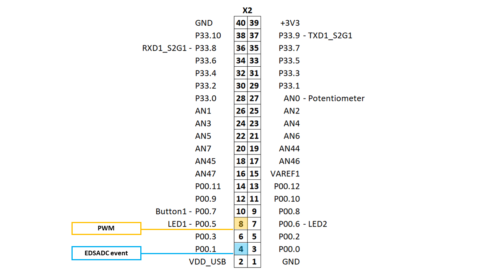
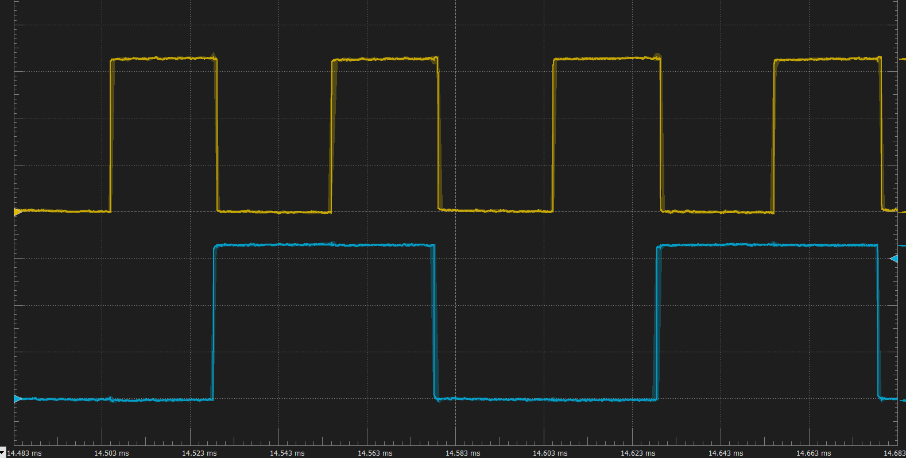

  

# BMETAL_TC375_ADS_EDSADC_GTM_Window_Integration 

**The EDSADC integration window control by PWM signal generated by GTM.**

## Device  
The device used in this example is AURIX™ TC37xTP_A-Step

## Board  
The board used for testing is the AURIX™ TC375 lite Kit (KIT_A2G_TC375_LITE).

## Scope of work 
This example is intended to show how to configure EDSADC and GTM to implement hardware controled integration window in the EDSADC Digital filter chain.

## Introduction  

The AURIX™ TC3x Enhanced Delta-Sigma Analog-to-Digital Converter (EDSADC) module is an Analog to Digital Converter (ADC) peripheral component based on the Delta-Sigma conversion principles that include an oversampling modulator and digital filter chain for noise filtering and decimation. The EDSADC includes an Integrator module to allow producing integrated results of values generated during the defined integration window. During this window, the final result value is produced by adding a configurable number of values (up to 64). After that, the integration result is stored in the result register and the integrator and the counter are cleared. The integration window can be configured either in the Software-Controlled Mode or in the external Trigger-Controlled Mode to support a wide range of applications. Integration is widely used in current measurements through shunt resistors at defined positions in the signal waveform and in resolver applications where integration is used to eliminate the carrier signal component. 

The Generic Timer Module (GTM) is a modular timer unit designed to accommodate many timer applications. In the presented example GTM is used to control the integration window of EDSADC and to capture the timestamps at the beginning of the integration window and at the final integration result event. GTM includes the Advanced Routing Unit (ARU) connected Timer Output Module (ATOM) which is able to generate complex output signals without CPU interactions. 
Time Base Unit (TBU), Monitor Unit (MON) and ATOM. TIM and TBU 

In this example, EDSADC is utilized to measure a value on channel 0, connected to port pin AN2. The integration window is controlled by the PWM signal generated by the GTM Atom 0 Channel 4. For capturing of timestamps two GTM TIM channels are utilized. TIM Channel 4 is used to capture TBU timestamp of the trigger event (rising edge) for the integration window, and TIM Channel 0 captures the TBU time stamp of the EDSADC integration result event. With a difference between these two timestamps, one can observe the duration between trigger event and EDSADC main service request which designates completion of the integration.

## Hardware setup

This code example has been developed for the board KIT_A2G_TC375_LITE (AURIX™ TC375 lite Kit). No additional hardware is needed.

## Implementation

**[CPU] EDSADC initialization:**

EDSADC is configured in the initialization function *enable_EDSADC_chan0()*:
- Enables clock for the Converter Control Block
- Configures clock for the EDSADC modulator
- Configures main filter chain decimation rate   
- Enables Integrator sub-module for 60 values integration   
- Configures integration window in Trigger-Controlled mode
- Enables Service Request for main event
- Performs EDSADC calibration 

**[CPU] GTM initialization:**

GTM is enabled by calling the initialization function *enable_GTM_trigger()*:

- Enables clock for GTM module
- Disables cluster protections
- Sets GTM-CLS0 clock without divider (100MHz)
- Enables CMU_CLK0
- Enables PWM on ATOM0_4, with the clock source CMU_CLK0 
- Configures the PWM duty cycle and period 
- Routes trigger signal from EDSADC to ATOM0_4 
- Configures TIM0 Channel 4 for PWM edge detection 
- Configures TIM0 Channel 0 for EDSADC event detection 
- Configures ATOM0 outputs are mapped to AURIX™ TC37xTP_A-Step pins  

**[CPU] Example Start**

The *enable_EDSADC_chan0()* function starts EDSADC which is awaiting the external trigger signal (rising edge) to enable the integration window. The *enable_GTM_trigger()* function configures GTM and starts to generate PWM signal routed as a trigger for the EDSADC integrator window. After configuring GTM, execution flow goes into an infinite loop that polls the status bit of the Integrator and displays it pin P00.0.

## Compiling and programming
Before testing this code example:

- Power the board through the dedicated power connector
- Connect the board to the PC through the USB interface
- Build the project using the dedicated Build button  or by right-clicking the project name and selecting "Build Project"
- To flash the device and immediately run the program, click on the dedicated Flash button   

## Run and Test
After code compilation and flashing the device, observe the following signals, all located in the X2 connector.

  

- P00.5  Displayes PWM - rising edge enables integration window, falling edge disables integration.
- P00.1 Toggles on each EDSADC event (integration completion event).  

  

## References  

AURIX™ Development Studio is available online:  
- <https://www.infineon.com/aurixdevelopmentstudio>  
- Use the "Import..." function to get access to more code examples  

More code examples can be found on the GIT repository:  
- <https://github.com/Infineon/AURIX_code_examples>  

For additional trainings, visit our webpage:  
- <https://www.infineon.com/aurix-expert-training>  

For questions and support, use the AURIX™ Forum:  
- <https://community.infineon.com/t5/AURIX/bd-p/AURIX>  
