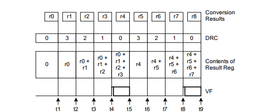
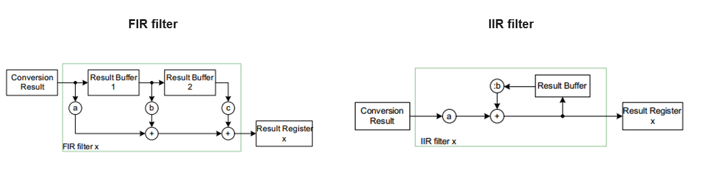
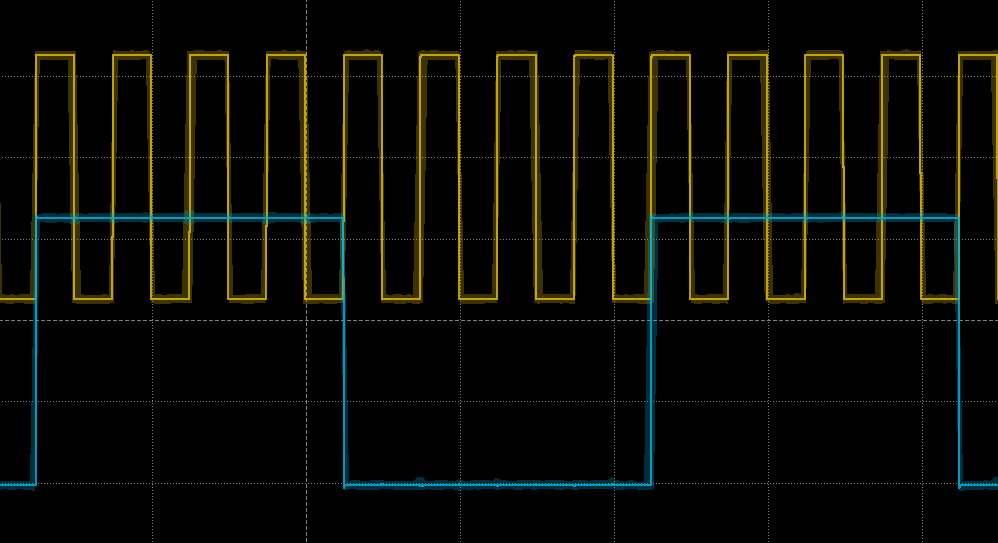

  

# BMETAL_TC375_ADS_EVADC_DataModification 

**EVADC module data modification and filtering functionality**

## Device  
The device used in this example is AURIX™ TC37xTP_A-Step

## Board  
The board used for testing is the AURIX™ TC375 lite Kit (KIT_A2G_TC375_LITE).

## Scope of work 
This example demonstrates results built-in post-processing features and filtering functionality of the TC3x EVADC module.

## Introduction  

The AURIX™ TC3x Enhanced Analog-to-Digital Converter (EVADC) includes a set of built-in Data Modification options e.g. accumulation, digital filtering and difference modes. This functionality allows to remove noise from the input signal without CPU overhead by applying low pass filtering. Each data modification option can be selected for any result source individually in the EVADC result control register (GxRCRy), where x is the number of the group and y is a number of a channel. 

**Standard Data Reduction** 

With Standard Data Reduction Mode, the EVADC performs averaging function by accumulating for up to 16 values before generating a result interrupt. The number of accumulated samples is selectable by the user.   

**Filtering**

The Filtering Mode allows the user to apply either a 3rd order Finite Impulse Response (FIR) filter with selectable coefficients, or a 1st order Infinite Impulse Response (IIR) filter with selectable coefficients to the conversion results. 

**Difference Mode** 

The Difference Mode subtracts the content of the selected result register from the
conversion results. This mode can be used on any result register GxRES0..GxRES15 of any
group, where x is the number of the group.

In the presented example PWM signal generated by the Generic Timer Module (GTM) is used to control the sampling period of EVADC by triggering conversion on a rising edge of the PWM signal. In this example, EVADC is configured to sample channel 0 of Group 0, connected to port pin AN0. The sampled signal can be processed by one of the Data Modification methods according to the user selection. 

## Hardware setup

This code example has been developed for the board KIT_A2G_TC375_LITE (AURIX™ TC375 lite Kit). No additional hardware is needed.

## Implementation

**EVADC initialization:**

EVADC is configured in the initialization function *enable_EVADC_G0CH0()*:
- Enable the module
- Set up internal clock to 40MHz
- Enable Normal operation mode
- Request calibration
- Set up Queue 0
- Set up external trigger GTM_trig_0
- Set up channel settings
- Set up Data Modification Mode (DMM)
- Set up Service Request

**GTM initialization:**

GTM is enabled by calling the initialization function *enable_GTM_trigger()*:
- Enables clock for GTM module
- Disables cluster protections
- Sets GTM-CLS0 clock without divider (100MHz)
- Enables CMU_CLK0
- Enables PWM on ATOM0_4, with the clock source CMU_CLK0 
- Configures the PWM duty cycle and period 
- Configures ATOM0 outputs are mapped to AURIX™ TC37xTP_A-Step pins  

**Example Start**

The *enable_EVADC_G0CH0()* function configures EVADC internal clock to 40MHz, enables the analog sub-system, and performs startup calibration. Arbitration slot 0 is configured and conversion on channel 0 is added to queue request source. The trigger source control is set for a rising edge of an external trigger (GTM ADC trigger 0). The function also configures sampling time, channel settings and performs initialization of the desired data modification function inc. accumulation, FIR or IIR. The *enable_GTM_trigger()* function configures GTM and starts the generation of the PWM signal routed as a trigger for the EVADC queue. After configuring GTM, the execution flow goes into an infinite loop. PWM signal is displayed on P00.5. EVADC sampled results are processed in the dedicated Service Request Handler *evadc_ch0_isr()* which toggles P00.1 pin upon the new result.

## Compiling and programming
Before testing this code example:

- Power the board through the dedicated power connector
- Connect the board to the PC through the USB interface
- Build the project using the dedicated Build button  or by right-clicking the project name and selecting "Build Project"
- To flash the device and immediately run the program, click on the dedicated Flash button   

## Run and Test
After code compilation and flashing the device, observe the following signals, all located in the X2 connector.

  

- P00.5 Displayes PWM - rising edge enables sampling on the AN0 input.
- P00.1 Toggles on each EVADC event (conversion and data modification is complete).  

The selection of a desirable Data Modification mode is done in the global *g_dmm_mode_cfg* variable by settings its value to one of the defined optiona e.g. MODE_DMM_DISABLE, MODE_DMM_AVERAGE, MODE_DMM_FIR or MODE_DMM_IIR.
By selecting MODE_DMM_DISABLE option the Data Modification functionality is disabled.

The Standard Data Reduction mode (averaging) is selected by assigning MODE_DMM_AVERAGE value to the *g_dmm_mode_cfg* variable. The number of accumulated samples is defined in the DMM_AVERAGE_NUM definition (default value is 3 which corresponds to 4 sample accumulation). The waveform of the PWM and EVADC result event with averaging mode is present in the figure below. As can be seen in the figure the ADC events come on each 4rd PWM edge due to the data reduction function.     

  

## References  

AURIX™ Development Studio is available online:  
- <https://www.infineon.com/aurixdevelopmentstudio>  
- Use the "Import..." function to get access to more code examples  

More code examples can be found on the GIT repository:  
- <https://github.com/Infineon/AURIX_code_examples>  

For additional trainings, visit our webpage:  
- <https://www.infineon.com/aurix-expert-training>  

For questions and support, use the AURIX™ Forum:  
- <https://community.infineon.com/t5/AURIX/bd-p/AURIX>  
