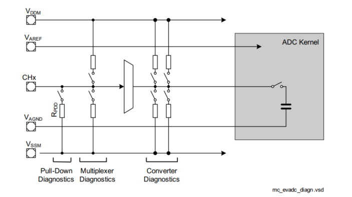
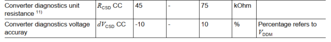
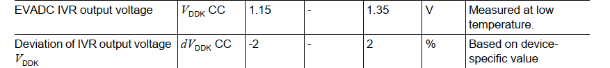
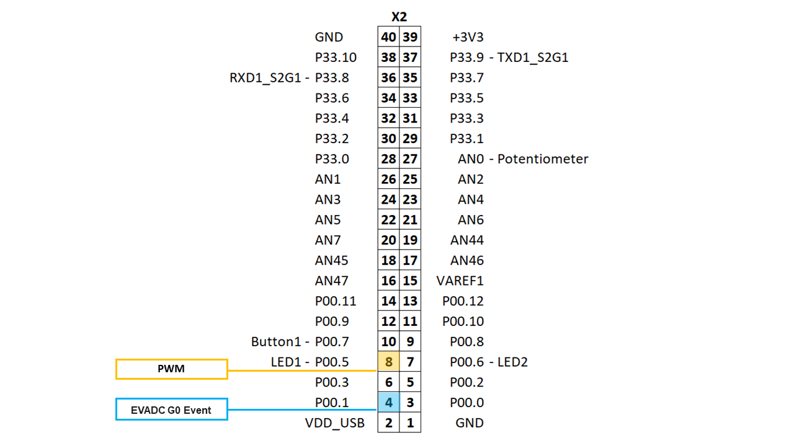
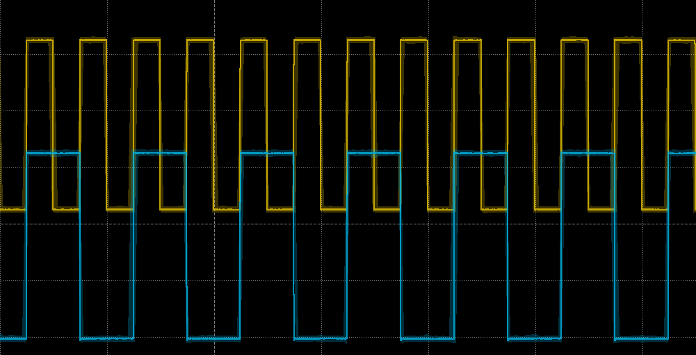

  

# BMETAL_TC375_ADS_EVADC_Diagnostics 

**EVADC module run-time diagnostics configuration**

## Device  
The device used in this example is AURIX™ TC37xTP_A-Step

## Board  
The board used for testing is the AURIX™ TC375 lite Kit (KIT_A2G_TC375_LITE).

## Scope of work 
This example demonstrates run-time configuration of the TC3x EVADC module to perform internal diagnostics.

## Introduction  

The AURIX™ TC3x Enhanced Analog-to-Digital Converter (EVADC) integrates several diagnostic features to verify the functionality of the module and to detect functional errors in both digital and analog blocks. The diagnostics functions can be enabled to apply test signals and additional loads with known values to the signal path. This allows to verify converter functionality by comparing test measurements with the expected values.  

**Converter Dignostics**

Converter Diagnostics (CD) allows to apply known test voltage levels e.g. VDDM, VSSM, 1/2 VDDM, 2/3VDDM to the signal path by selecting a combination of built-in pullup and pulldown resistors. This permits to verify the converter functionality and conversion results validity against expected input values. The test signals can be connected instead of or in parallel to the converted input. The CD is available in the queued source 2 and can be accessible by any EVADC Group on a virtual Channel 24 (Alias feature Channel 0 and Channel 1). In the presented example CD is performed by the Group 0 Channel 0.

When comparing CD measurement results against the selected test levels, the CD voltage accuracy specified in the device datasheet has to be considered for computing min-max boundaries of the expected value. The example of the CD verification and boundaries calculation is presented in the *Verify_G0_CD* function in the *Cpu0_Main.c* source file.    
   

**Vddk supervision signal**

The Aurix TC3x EVADC module includes a set of internal diagnostic (supervision) voltage signals with known levels e.g. V_ANACOMM, V_MTS(VDDK),V_AGND, V_AREF and V_EDSADC to check the functionality of the converter by comparing measured signals with expected values. The VDDK signal is provided by an internal bandgap source and implemented to support EVADC reference supply plausibility check and reference drift diagnostic. 

In order to implement diagnostic tests with VDDK two values have to be compared in the Application SW:
1.	Expected VDDK reference value and its upper and lower boundaries,
2.	VDDK measurement by EVADC.

A typical value of the VDDK source is specified in the device-specific datasheet as 1.25V in the EVADC IVR output voltage parameter. The VDDK bandgap source accuracy is defined in the datasheet by the dVDDK symbol. Note the difference between the dVDDK datasheet’s symbol and the DVDDK temperature compensation record. The dVDDK value for VAREF and VDDM ≥ 4.5V (e.g. 5V) is specified in the range of ±2%, and ±3% (according to errata ADC_TC.H032) for VAREF and VDDM < 4.5V (e.g. 3.3V).

VDDK deviation from a nominal value depends on the manufacturing variation, supply voltage (errata ADC_TC.H032) and on the current die temperature. Thus, for each test the expected value of VDDK has to be recalculated to adapt temperature variation. To compensate temperature dependency, a device and group-specific base values (VDDKC) and temperature compensation records (DVDDK) are stored in the on-chip Flash memory (USER_UCB segment). The nominal VDDK value is calculated based on the Flash record values and the current die temperature:

Vddk(V) = VDDKC + (DVDDK × (Tj + 40)/1000),

where VDDKC is a flash record holding a group-specific VDDK base value in mV at -40°C, DVDDK is a flash record holding a group-specific VDDK temperature deviation in µV/K. Tj is the current die temperature which can be measured on-chip either by a Core Die Temperature Sensor (DTSC) or by a Die Temperature Sensor in Power Management System (DTS PMS). Inthe presented example DTS PMS is used for themperature measurments. The accuracy of DTS PMS is specified in the range ±3 degrees. The VDDK signal is an internal voltage source that can be measured by any EVADC Group on Channel 29 (Alias feature Channel 0 and Channel 1). In the presented example VDDK test is performed on Group 0 Channel 1. The example of the VDDK value verification and its boundaries calucationis is given in the *Verify_G0_VDDK* function in the *Cpu0_Main.c* source file.    

In the presented example the Generic Timer Module (GTM) is used to control the sampling period of EVADC by triggering queue conversion on a rising edge of the generated PWM signal.

## Hardware setup

This code example has been developed for the board KIT_A2G_TC375_LITE (AURIX™ TC375 lite Kit). No additional hardware is needed.

## Implementation

**EVADC initialization:**

EVADC is configured in the initialization function *enable_EVADC_G0CH0()*:
- Enable the module
- Set up internal clock to 40MHz
- Enable Normal operation mode
- Request calibration
- Set up Queue 2 with Channel 0 and Channel 1
- Set up external trigger GTM_trig_0
- Set up Channel settings

**GTM initialization:**

GTM is enabled by calling the initialization function *enable_GTM_trigger()*:
- Enable clock for GTM module
- Disable cluster protections
- Set GTM-CLS0 clock without divider (100MHz)
- Enable CMU_CLK0
- Enable PWM on ATOM0_4, with the clock source CMU_CLK0 
- Configure the PWM duty cycle and period 
- Configure ATOM0 output to be mapped to AURIX™ TC37xTP_A-Step pin  

**Example Start**

The *enable_EVADC_G0()* function configures EVADC internal clock to 40MHz, enables the analog sub-system, and performs startup calibration. Group 0 Arbitration slot 2 is configured and conversions on Channel 0 and Channel 1 are added to the queued request source. The trigger source control is set for a rising edge of an external trigger (GTM ADC trigger 0). The function also configures sampling time and performs initialization of channel settings. The *enable_GTM_trigger()* function configures GTM and starts the generation of the PWM signal routed as a trigger for the EVADC queue. 

After configuring GTM, the execution flow goes into an infinite main loop. Inside the loop, a switch-case statement implements a 2-state state machine which based on the state variable *acquisition_state* configures EVADC Group 0 either for diagnostics measurements or for analog input sampling. The *init_EVADC_G0_Diagnostics()* function performs initialization of the diagnostics features, CD and VDDK on Channel 0 and Channel 1, correspondently. The choice of CD test level is defined by the *CD_PULLUP_LEVEL* macro definition. 

In order to perform run-time modification of the channel properties inc. *GxCHCTRy, GxICLASSi, GLOBICLASSi, GxALIAS* registers, it is recommended to change the configuration parameters of a converter group only while this group’s converter is inactive and no conversions for the respective channel are scheduled. The example of the run-time modification of the channel properties is given in the *init_EVADC_G0_Diagnostics* and *init_EVADC_G0_AnalogInput()* functions. The verification of the diagnostics measurements is performed in the *verify_EVADC_G0_Diagnostics()* function which invokes *Verify_G0_CD()* and *Verify_G0_VDDK()* functions for the CD and VDDK verification, correspondently. 

In the next cycle of the main loop, the state machine disables diagnostics features and configures analog acquisition inputs for Channel 0 and Channel 1. The GTM-generated PWM signal is displayed on P00.5. EVADC sampled results are processed in the dedicated Service Request Handler *evadc_ch0_isr()* which toggles the P00.1 pin upon the new result.

## Compiling and programming
Before testing this code example:

- Power the board through the dedicated power connector
- Connect the board to the PC through the USB interface
- Build the project using the dedicated Build button  or by right-clicking the project name and selecting "Build Project"
- To flash the device and immediately run the program, click on the dedicated Flash button   

## Run and Test
After code compilation and flashing the device, observe the following signals, all located in the X2 connector.

  

- P00.5 Displayes PWM - rising edge triggers queue 2 conversion.
- P00.1 Toggles on each EVADC event (queue conversion is complete).  

  

## References  

AURIX™ Development Studio is available online:  
- <https://www.infineon.com/aurixdevelopmentstudio>  
- Use the "Import..." function to get access to more code examples  

More code examples can be found on the GIT repository:  
- <https://github.com/Infineon/AURIX_code_examples>  

For additional trainings, visit our webpage:  
- <https://www.infineon.com/aurix-expert-training>  

For questions and support, use the AURIX™ Forum:  
- <https://community.infineon.com/t5/AURIX/bd-p/AURIX>  
