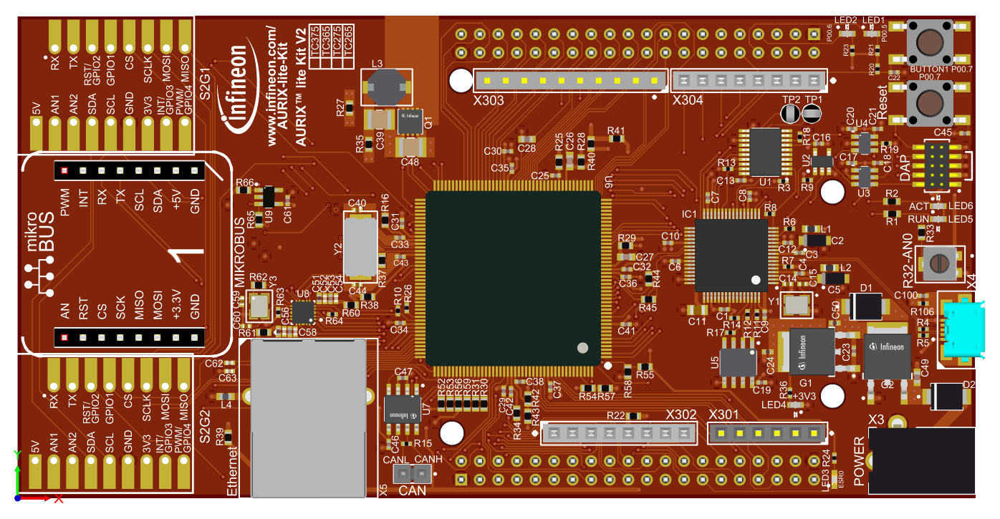

  

# BMETAL_TC375_ADS_GTM_TIM_TGO_Debug  
**This example demonstrates how the GTM signals can be routed to OCDS trigger output pins TGO.**  

## Device  
The device used in this example is AURIX&trade; TC37xTP_A-Step

## Board  
The board used for testing is the AURIX&trade; TC375_LITE(KIT_A2G_TC375_LITE)

## Scope of work  
Two ATOM channels are used to generate two PWM signals and these signals are XORed using the LUT of the TIM channel. The filtered output of the TIM channel is routed to the TGO (Trigger Output) pin. This is intended only for debug purpose as it uses OCDS module.

## Introduction  
The Generic Timer Module (GTM) is a modular timer unit designed to accommodate many timer applications.

The Timer Input Module (TIM) is responsible for filtering and capturing input signals of the GTM. Several characteristics of the input signals can be measured inside the TIM channels. 

The ARU connected Timer Output Module (ATOM), which is part of the GTM, is able to generate complex output signals without CPU interactions.

The Clock Management Unit (CMU) is responsible for clock generation of the GTM. The Configurable Clock Generation Subunit (CFGU) provides eight clock sources for the GTM submodules TIM, TBU, MON and ATOM.

The TGO is the trigger output fucntionality of the OCDS used to route internal signals to the output pin for debugging purpose.

## Hardware setup  
This code example has been developed for the board KIT_A2G_TC375LITE (AURIX&trade; TC375 LITE) :   
  
                             

## Implementation

**GTM initialization:**

GTM is enabled by calling the initialization function *enableGTM()*
- enables clock for GTM module
- disables cluster protections
- sets GTM-CLS0 clock with divider (100MHz)
- CLK0 uses default frequency
- enables CMU_CLK0

**Mapping GTM pins **

TIM inputs and ATOM outputs are mapped to TC375 pins by calling the functions *pinningGTM()*

** TIM0 Configuration:**

The function *configTIM()* configures TIM0_CH0 which uses the LUT to XOR TIM_IN with the AUX_IN, The ATOM0_CH0 is used as the AUX_IN using the internal multiplexer.

**ATOM0 Configuration:**

The function *configATOM()* configures ATOM0_CH0 and ATOM0_CH1 to generate two PWM signals, the trigger from ATOM0_CH0 is used to reset ATOM0_CH1.  

**TGO connection Configuration:**

The function *configTIMtoTGO()* configures routing from GTM TIM0 to the TGO pin.

**Configure GTM **

The function *configureGTM()* configures and enables the required GTM modules.

## Compiling and programming
Before testing this code example:  

- Connect the board to the PC through the USB interface
- Build the project using the dedicated Build button  or by right-clicking the project name and selecting "Build Project"
- To flash the device and start a debug session, click on the Debug button  and create a configuration for a debugger (double clicking on the debugger name, a default configuration is created)

## Run and Test   
Connect the pins P0.2(ATOM0_CH1) to P0.9 (TIM0_CH0) externally. In the debug session, run the target and the ATOM signals can be observed on the pins P0.0 and P0.2 and the XORed output is at P20.0 (TGO0) using a logical analyzer or oscilloscope.

  
 

## References  
AURIX&trade; Development Studio is available online:  
- <https://www.infineon.com/aurixdevelopmentstudio>  
- Use the "Import..." function to get access to more code examples  

More code examples can be found on the GIT repository:  
- <https://github.com/Infineon/AURIX_code_examples>  

For additional trainings, visit our webpage:  
- <https://www.infineon.com/aurix-expert-training>

For questions and support, use the AURIX&trade; Forum:  
- <https://community.infineon.com/t5/AURIX/bd-p/AURIX>  
