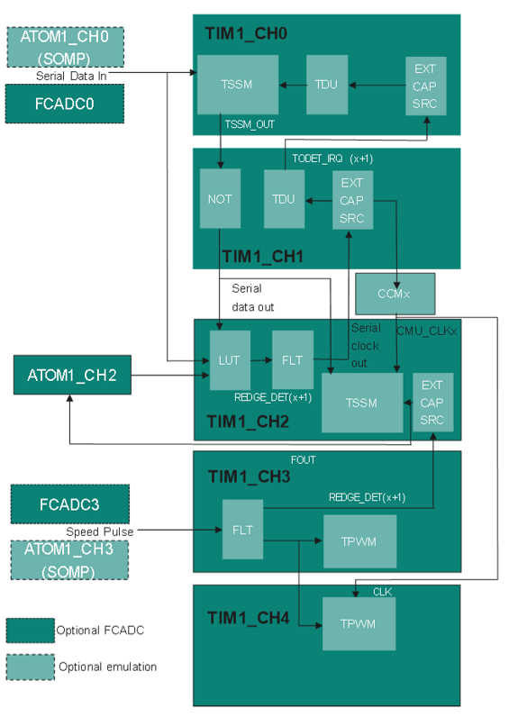

# BMETAL_TC375_ADS_WSS_GTM_TSSM_HW 
**This is a demo code for interfacing the TLE5046iC Wheel Speed Sensor (WSS) using GTM block, the AK protocol is decoded by the GTM-TIM using TSSM mode of operation**

## Device  
The device used in this example is AURIX&trade; TC37xTP_A-Step  

## AK protocol  

The WSS modulates periodic current pulses of different magnitudes for speed pulse (14 to 28mA) and data (7mA to 14mA), a sample frame is like below. The width of the speed pulse and the AK data period is 50µs typically. The AK data is manchester coded, the rising and falling edge at the middle of the period corresponds to bits 1 and 0 respectively.

## Scope of work 

The TIM block within the GTM is used to decode the AK protocol. The are five TIM channels used in this example, three of them perform the manchester decoding, the fourth is used to measure the period of the speed pulse signal and the fifth is used to count the number of bits transmitted in the AK frame for handling the shorten frame.

## Introduction  
The Generic Timer Module (GTM) is a modular timer unit designed to accommodate many timer applications.

The Timer Input Module (TIM) is responsible for filtering and capturing input signals of the GTM. Several characteristics of the input signals can be measured inside the TIM channels. 

The ARU connected Timer Output Module (ATOM), which is part of the GTM, is able to generate complex output signals without CPU interactions.

The Clock Management Unit (CMU) is responsible for clock generation of the GTM. The Configurable Clock Generation Subunit (CFGU) provides eight clock sources for the GTM submodules TIM, TBU, MON and ATOM.

The implementation block diagram is as shown below. 'Serial Data In' is the manchester encoded signal from the sensor, 'Serial Data Out' and 'Serial Clock Out' are the output generated by the GTM TIM modules. 'Serial Data Out' is inverted sample and hold version of 'Serial Data In', the sample point is chosen based on the 'Serial Clock Out' (3/4 of the bit period from falling edge). 'Serial Clock Out' is XORed signal of 'Serial Data In' and 'Serial Data Out'. Finally, 'Serial Data Out' sampled at the falling edge of 'Serial Clock Out' which provides the manchester decoded data.

 

CPU configures and enables the GTM module and configures TIM channels are used to decode the AK protocol. 'Serial Data In' is sensor output and is provided as input to TIM1_CH0 and TIM1_CH2. TIM1_CH0 operates in TSSM mode and is used to generate the sample and hold signal, shift clock is TDU_SAMPLE_EVT (two events are generated for sample and hold). TIM1_CH1 is used to delay the sampling event at 3/4 of period using TDU, also it inverts the F_OUT from TIM1_CH0 using it's LUT. TIM1_CH2 is used to decode the AK data using the TSSM mode, 'Serial Data In' and 'Serial Data Out' are XORed using it's LUT which is 'Serial Clock Out'. Falling edge of 'Serial Clock Out' is used for sample clock. TIM1_CH3 is used to measure the period of the speed pulse signal. TIM1_CH4 is used to find the number of bits transmitted in the AK frame. In the interrupt handler of the TIM1_CH3, CPU can read the period of the speed pulse signal and the decode AK data frame.

'Serial Data In'   - TIM_IN of TIM1_CH0 and TIM1_CH2

'Serial Data Out'  - F_OUT of TIM1_CH1

'Serial Clock Out' - F_OUT of TIM1_CH2

'Speed Pulse'      - TIM_IN of TIM1_CH3 and TIM1_CH4

 

Note: There are three modes of operation controlled by the macros *WSS_EMULATION* and *USE_FCADC*

* With Real WSS and internal FCADC:  when *WSS_EMULATION* is FALSE and *USE_FCADC* is TRUE

* With Real WSS and external comparators:  when *WSS_EMULATION* is FALSE and *USE_FCADC* is FALSE

* WSS Emulation: when *WSS_EMULATION* is TRUE and *USE_FCADC* is FALSE

## Hardware setup  

The board used for testing is the AURIX&trade; TC375_LITE(KIT_A2G_TC375_LITE)
 
 

For the emulation mode, litekit, USB cable and connecting wires are sufficient. For the real WSS, additional WSS sensor board with external comparator(*USE_FCADC* is FALSE) is required.

## Implementation 

**[CPU] WSS_Configurations.h**

There are different modes of operation which is controlled by the *WSS_EMULATION* and *USE_FCADC* macros in *WSS_Configurations.h* file. By default, the emulation is not enabled and isolation of the speed pulse and AK data signal is done through internal FCADC.

 * *WSS_EMULATION* needs to be FALSE when using real sensor, to be TRUE only when there is no WSS and the speed pulse and data signals needs to be emulated
 * *USE_FCADC* needs to be FALSE when external comparator is used to isolate the speed pulse and the data signals or when *WSS_EMULATION* is TRUE. *USE_FCADC* to be TRUE when the user intends to use internal FCADC.
 * *BIT_1_T* needs to be configured based on the pulse width of the speed pulse BIT_1_T = tp/2. Other bit durations are derived based on this.
 * *EMULATION_DATA* to be configured with EMULATION_DATA1/EMULATION_DATA2/EMULATION_DATA3
 * *SPEED_PERIOD* is used as period of the speed pulse for emulation purpose
 * *TDU_COUNTER* is used to create delay of 3/4th of bit period in the TIM1_CH1's TDU
 * *SPEED_PULSE_THRESHOLD* and *DATA_THRESHOLD* are used to set the reference values of the FCADCs
 * *NUM_OF_POLES* specifies the number of magnetic poles in the ring sensor
 * *TIM_RESOLUTION* specifies the resolution in seconds based on the TIM1_CH3 clock selection
 

**[CPU] WSS_GTM_demo.c/h**

**[CPU] GTM initialization:**

GTM is enabled by calling the initialization function *enableGTM()*
- enables clock for GTM module
- disables cluster protections
- sets GTM-CLS0 clock without divider (200MHz)
- sets GTM-CLS1 clock without divider (200MHz)
- CLK0 uses default frequency
- CLK3 used for TIM1_CH1 TBU is configured for 4 MHz
- enables CMU_CLK0-3

**[CPU] Mapping GTM pins **

TIM inputs are mapped to TC375 pins by calling the functions *pinningGTM()*

**[CPU] TDU Configuration:**

The function *configTDU1_0()* configures the TIM1_CH0 TDU to generate two TDU_SAMPLE_EVT events for every external capture. The first event is used to sample and next for hold. The TDU starts on the external capture and stop during TDU_WORD_EVT

The function *configTDU1_1()* configures the TIM1_CH1 TDU to generate periodic TDU_WORD_EVT events based on the external capture. The main purpose to be generate delay of 3/4th of bit period for sampling the serial data.

**[CPU] TIM1 Configuration:**

The function *configTIM()* configures four TIM channels

The function *configTIM1_0()* configures TIM1_CH0 is used to generate the sample and hold signal from the AK data signal
The function *configTIM1_1()* configures TIM1_CH1 is used to delay the sampling event at 3/4 of period using TDU and also inverts the sample and hold signal using it's LUT
The function *configTIM1_2()* configures TIM1_CH2 is used to decode the AK data using the TSSM mode
The function *configTIM1_3()* configures TIM1_CH3 is used to measure the period of the speed pulse signal
The function *configTIM1_4()* configures TIM1_CH4 is used to find the numbers of bits transmitted in the AK frame

**[CPU] ATOM1 Configuration:**

The function *configATOM()* configures four ATOM1_CH2 to generate mask signal when a speed pulse is detected. ATOM1_CH2 operates in one-shot mode and generate pulse of fixed width. This signal is used in the TIM1_CH2 LUT to enable the data decoding when speed pulse occurs.

**[CPU] Configure GTM **

The function *configureGTM()* configures and enables the required GTM modules for decoding the AK protocol

**[CPU] Start Demo **

This function *startDemo()* start the decoding by enabling the TIM1_CH0-TIM1_CH4 channels which captures speed pulse and decodes the AK data respectively

**[CPU] TIM1_CH3 Interrupt Handler **

The function *speedPulseHandler()* is the handler corresponding to the TIM1_CH3 interrupt. It occurs when the rising edge is detected on the speed pulse signal. Within this handler, the speed and the AK data are read and put in speedPeriod[] and decodedData[] array. Enables ATOM1_CH0 if emulation is enabled. 

**[CPU] FC_Adc.c/h** (when *USE_FCADC* is TRUE)

*startFCAdc* calls the following APIs to enable, configure and start the Fast Compare ADCs

**[CPU] Enabling the EVADC **

The clocking of the EVADC is enabled by calling *initFCAdc()*

**[CPU] Setting fast compare reference and boundary flag**

*initFCADCchannel()* configures the FCADC channel in software mode with the provided reference value and the boundary flag selection

**[CPU] Starting FCADC channels **

FCADC channel is started by calling *startFCADCchannel()* 

**[CPU] WSS_Emulation.c/h ** (when *WSS_EMULATION* is TRUE)

**[CPU] Mapping ATOM outputs **

ATOM outputs required for the emulation are mapped to TC375 pins by calling the functions *pinningEmulation()*

**[CPU] TIM1 Configuration:**

The function *configEmulationTIM()* connects ATOM1_CH0 (AK data) and ATOM1_CH3 (speed pulse) to the AUX input of TIM1_CH0 and TIM1_CH3 respectively

**[CPU] ATOM0 Configuration:**

The function *configEmulationATOM()* configures and starts ATOM1_CH0 and ATOM1_CH3 to generate PWM signals emulating the AK data and speed pulse.

**[CPU] Emulation Configuration:**

The function *configureEmulation()* configures and enables the required GTM modules for emulating WSS

**[CPU] ATOM1_CH0 Interrupt Handler **

The function *ATOMIntHandler()* is the handler corresponding to the ATOM1_CH0 interrupt. This is triggered when the CCU0TC event occurs and the shadow registers SR0 and SR1 are updated in this handler based on the lutATOMDuty/lutATOMPeriod till the last bit of the frame is emulation.

## Compiling and programming
Before testing this code example:  
- Connect the board to the PC through the USB interface
- Build the project using the dedicated Build button  or by right-clicking the project name and selecting "Build Project"
- To flash the device and start a debug session, click on the Debug button  and create a configuration for a debugger (double clicking on the debugger name, a default configuration is created)

## Run and Test  

After code compilation and flashing the device, you can test for one of the following cases.

** With Real WSS and internal FCADC: **

This test requires hardware connections, the WSS should be powered externally and the current pulse output should be connected with a resistor to ground (50 ohm used in this example).  This signal to be connected to AN16 and P00.11 pins of the TC375 corresponding to the FCADC0 and FCADC3, the ground of the WSS and the lite kit to be connected as well. The boundary flags FCADC0 and FCADC3 are internally routed to TIM1_CH0 and TIM1_CH3 inputs, the boundary flag of FCADC0 is also connected to CBFLOUT2 and then routed to TIM1_CH2 so TIM1_CH0 and TIM1_CH2 has AK data input. Additionally, P33.4 and P33.2 can be optionally monitored to check the boundary flag output of the FCADC. After code compilation and flashing the device, the speed and the decode data are read by the CPU in *speedPulseHandler* interrupt routine. The user can be observe the variables *speedPeriod[]* and *decodedData[]* in the debugger to know the speed and AK data information. 

** Pin connections **

- WSS signal to be connected AN16 and P00.11
- P33.4 &rarr; FC0BFLOUT &rarr; FCADC0 boundary flag corresponding to AK data signal
- P33.2 &rarr; FC3BFLOUT &rarr; FCADC3 boundary flag corresponding to speed pulse signal

 

The signals located in the X1 and X2 connectors can also be observed optionally to verify if the data is decoded correctly. 

  

** With Real WSS and external comparators: ** 
 
This test requires hardware connections, the WSS should be powered externally and the speed pulse and AK data signal are spilt using external comparators. The speed pulse signal to the connected to the pins P00.12 (TIM1_CH3) and the data signals needs to the connected to the pins P22.1 (TIM1_CH0) and P21.4 (TIM1_CH2), the ground of the WSS and the lite kit to be connected as well. After code compilation and flashing the device, the speed and the decode data are read by the CPU in *speedPulseHandler* interrupt routine. The user can be observe the variables *speedPeriod[]* and *decodedData[]* in the debugger to know the speed and AK data information.

** Pin connections **

- P00.12 &rarr; GTM_TIM1_CH3 &rarr; speed pulse signal from the sensor board
- P22.1 &rarr; GTM_TIM1_CH0 &rarr; AK data signal from the sensor board
- P21.4 &rarr; GTM_TIM1_CH2 &rarr; AK data signal from the sensor board

 

The signals located in the X1 and X2 connectors can also be observed optionally to verify if the data is decoded correctly. 

  

** WSS Emulation : **

With the WSS emulation is enabled, the speed pulse signal and AK data are emulated using ATOM1_CH3 and ATOM1_CH0 channels respectively. To be similar to the AK frame, ATOM1_CH0 also sends the speed pulse initially before sending the data. It is possible to change the pulse width and frequency of the speed with the provided macros. ATOM1_CH0 and ATOM1_CH3 are connected to the AUX input of the TIM1_CH0 and TIM1_CH3 respectively, additionally P00.0(ATOM1_CH0) to be connected P21.4(TIM1_CH2)externally. After code compilation and flashing the device, the speed and the decode data are read by the CPU in *speedPulseHandler* interrupt routine. The user can be observe the variables *speedPeriod[]* and *decodedData[]* in the debugger to know the speed and AK data information.

** Pin connections **

- P00.0 &rarr; GTM_ATOM1_CH0 &rarr; emulation of AK data 
- P21.4 &rarr; GTM_TIM1_CH2 &rarr; to be connected externally to P00.0
- P20.1 &rarr; GTM_ATOM1_CH3 &rarr; emulation of speed pulse  
 

 

The signals located in the X1 and X2 connectors can also be observed optionally to verify if the data is decoded correctly. 

  

## Further Notes

- The demo is only provided as a reference for implementing AK protocol for evaluation. There is no qualification attached to it, it is responsibility of the integrator.
- In this implementation, the data is decoded on the rising edge of the speed pulse. Due to this for the last speedpulse, the captured data is not available and the data received at the next speed pulse is not valid. The user can handle this step in the application if needed to correctly decode the last data.
- This implementation doesn’t validate the pulse width of the speed pulse and the data signals; it can be done by the application if required.
- The period, duty cycle and the start offset (for synchronization) are fixed in the example and can be modified and if need recalibration could be done at runtime. As the TIM1_CH3 operates in TPWM, and the width of the speed pulse is captured in TIM1_CH3_GPR0 which can used for this compensation.
- It is assumed the TC375 device is up before the WSS starts sending the AK frames.

## References  
AURIX&trade; Development Studio is available online:  
- <https://www.infineon.com/aurixdevelopmentstudio>  
- Use the "Import..." function to get access to more code examples  

More code examples can be found on the GIT repository:  
- <https://github.com/Infineon/AURIX_code_examples>  

For additional trainings, visit our webpage:  
- <https://www.infineon.com/aurix-expert-training>

For questions and support, use the AURIX&trade; Forum:  
- <https://community.infineon.com/t5/AURIX/bd-p/AURIX>   
