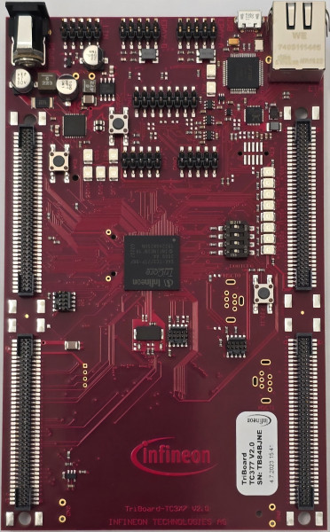
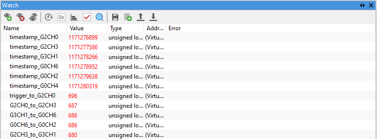

  
# BMETAL_TC377_ADS_EVADC_Daisy_Chain_1

**This example demonstrates the daisy chain method, to connect multiple conversions on different EVADC groups using just one trigger.**  

## Device  
The device used in this example is AURIX™ TC37xTP_A-Step  

## Board  
The board used for testing is AURIX™ TC377 TriBoard KIT_A2G_TC377_5V_TRB
  
## Scope of work  
Daisy Chain can be used to connect conversions on multiple EVADC instances. Note, the same queue entry shall be used on each participating EVADC.  

## Introduction  
The AURIX™ TC3x Enhanced Analog-to-Digital Converter (EVADC) has multiple instances (groups). Typically one conversion trigger is only able to do conversions on the same instance.

Daisy Chain can be used to connect conversions on multiple EVADC instances. Note, the same queue entry shall be used on each participating EVADC.

## Hardware setup  
No extra hardware setup is needed, as the conversion results themselves are uncritical. Important is, user sees the pre-programmed conversions are automatically executed one by one.

   

## Implementation  
Below 3 conversion queues are pre-programmed:
EVADC2 Ch0 &rarr; EVADC2 Ch3 &rarr; EVADC3 Ch1 &rarr; EVADC1 Ch6 &rarr; EVADC1 Ch2 &rarr; EVADC1 Ch4

All of them belong to Queue 1 of each EVADC. One software will be given to Queue 1 on EVADC2 and all conversions will be done one after another.

When the result of each conversion is generated, this example code will read the System Timer and generate a timestamp for each result.

## Compiling and programming
Before testing this code example:  
- Connect the board to the PC through the USB interface
- Build the project using the dedicated Build button  or by right-clicking the project name and selecting "Build Project"
- To flash the device and start a debug session, click on the Debug button  and create a configuration for a debugger (double clicking on the debugger name, a default configuration is created)

## Run and Test   
Use either the integrated debugger or a commercial one to observe following timestamps:

Please note, after each reset the timestamp absolute values may vary, but the order should be the same.

The timestamp is obtained by software from the System Timer, which is running at 100MHz. Accordingly, each timestamp tick corresponds to 10ns.

The difference between 2 consecutive conversions should be around 6793.75ns (the theoretical conversion time of each conversion), which is around 680 System Timer ticks.

## References  

AURIX&trade; Development Studio is available online:  
- <https://www.infineon.com/aurixdevelopmentstudio>  
- Use the "Import..." function to get access to more code examples  

More code examples can be found on the GIT repository:  
- <https://github.com/Infineon/AURIX_code_examples>  

For additional trainings, visit our webpage:  
- <https://www.infineon.com/aurix-expert-training>  

For questions and support, use the AURIX&trade; Forum:  
- <https://community.infineon.com/t5/AURIX/bd-p/AURIX>  
