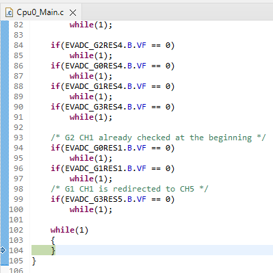

  

# BMETAL_TC377_ADS_EVADC_Master_Slave_1

**TC3xx EVADC master-slave synchronous conversion and Alias feature**  

## Device  
The device used in this example is AURIX™ TC37xTP_A-Step  

## Board  
The board used for testing is AURIX™ TC377 TriBoard KIT_A2G_TC377_5V_TRB
  
## Scope of work  
This example demonstrates how to properly configure multiple EVADC groups (up to 4, within the same synchronization group) for master-slave synchronous conversion. In addition, Alias feature (channel redirection) is explained, too.

The master will trigger the same channel(s) on the slave(s) at the same time. If other channel is expected, "Alias feature" will help.

## Introduction  
The AURIX™ TC3x Enhanced Analog-to-Digital Converter (EVADC) has multiple instances (groups). In order to do sampling at the same time, e.g. to measure motor phase currents simultaneously, it is necessary to configure the participating instances as master-slaves.
 

## Hardware setup  
No extra hardware setup is needed, as the conversion results themselves are uncritical. Important is, user sees the master and all slaves have produced conversion results.

## Implementation  
In this example, EVADC2 is configured as the master, and EVADC0, EVADC1 and EVADC3 are assigned as the slaves. When EVADC2 Ch0, Ch4 and Ch1 are converted in sequential, the same channels on EVADC0, EVADC1 and EVADC3 will be converted at the same time, too.

In addition, EVADC3 Ch1 is redirected to Ch5. It means, EVADC3 Ch5 will be converted instead of Ch1, when EVADC3 Ch1 (a slave channel) is triggered by the master channel EVADC2 Ch1.

## Compiling and programming
Before testing this code example:  
- Connect the board to the PC through the USB interface
- Build the project using the dedicated Build button  or by right-clicking the project name and selecting "Build Project"
- To flash the device and start a debug session, click on the Debug button  and create a configuration for a debugger (double clicking on the debugger name, a default configuration is created)

## Run and Test
The master sends out synchronous conversion requests to all slaves. Then the master and all the slaves will prepare themselves for synchronous conversion.

When every member (the master and all the slaves) has sent his "ready signal" to each other, synchronous conversion will take place. Of course, such preparation is transparent and user just needs to properly connect the "trigger signals" and "ready signals".

Note, EVADC3 Ch1 has been redirected to Ch5.

  
  
User shall see, the software finally lands in the last permanent loop. This means, all channels including the master and the slaves, have already produced ADC results.

      

## References  

AURIX&trade; Development Studio is available online:  
- <https://www.infineon.com/aurixdevelopmentstudio>  
- Use the "Import..." function to get access to more code examples  

More code examples can be found on the GIT repository:  
- <https://github.com/Infineon/AURIX_code_examples>  

For additional trainings, visit our webpage:  
- <https://www.infineon.com/aurix-expert-training>  

For questions and support, use the AURIX&trade; Forum:  
- <https://community.infineon.com/t5/AURIX/bd-p/AURIX>  
