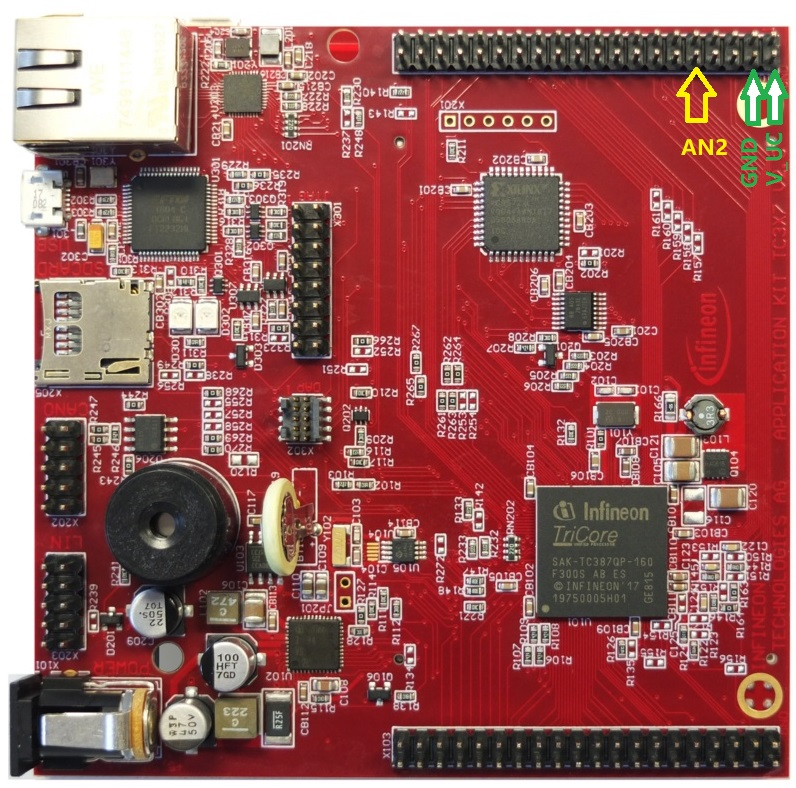

 
 
# BMETAL_TC387_ADS_EDSADC_FIFO_1
 
**Bare metal code example to initialize TC387 EDSADC, its FIFO, interrupt and FIFO read.** 

## Device 
 
The device used in this example is AURIX™ TC38xQP_A-Step
 
## Board 
 
The board used for testing is the AURIX™ TC387 application kit (KIT_A2G_TC387_5V_TFT)
 
## Scope of work 

This bare metal code example initializes TC387 EDSADC and its FIFO.
Every time when the FIFO is full (with 4 results in single-word read mode, DRM = 0), an interrupt is triggered and results are fetched from FIFO.
A 100ns wait is inserted between each read (the first read after interrupt does not need wait). See user manual chapter "Result Service Request Generation and Read Sequencing" foot note.
Corresponding FIFO error bits are checked when reading results, in order to ensure data integrity.
 
## Introduction 
 
- EDSADC0 is initialized.
- Its FIFO is enabled in single-word read mode. One result interrupt will be triggered, once the FIFO is full (4 results stored in the FIFO).
- By every FIFO read, corresponding error bits (WRERR and RDERR) are checked. If any error bit is set, user shall consider FIFO underflow (returned value is invalid) or overflow (result is lost).
- **When reading the FIFO, as user manual mentioned, at least 8 SPB clock cycles must be ensured between each read.** Because CPU read (compared to DMA transfer) is too fast, an explicit wait shall be inserted between each CPU read.
- The first FIFO read after interrupt is triggered does not need the 8 SPB clock cycles wait. 
 
## Hardware setup 
 
This code example has been developed for the board KIT_A2G_TC387_5V_TFT: 
 
 

## Implementation 
 
The *EDSADC_FIFO.c* and *EDSADC_FIFO.h* files wrap all the necessary EDSADC initialization functions. *init_EDSADC_FIFO()* initializes EDSADC0 and its FIFO. *resultISR()* is called by hardware every time when the FIFO is full.

Inside *resultISR()*, user sees a 100ns wait is inserted between each FIFO read, because CPU read is too fast (compared to DMA transfer). The wait shall be at least 80ns (8 SPB clock cycles, this code example fSPB = 100MHz). **See user manual chapter "Result Service Request Generation and Read Sequencing" foot note.** For the first FIFO read after interrupt it is not necessary to wait.

To avoid unnecessary result interrupt, interrupt is disabled before *init_EDSADC_FIFO()* is called. After *init_EDSADC_FIFO()* has been executed, FIFO is flushed and its error bits are cleared, followed by interrupt enable. 
 
## Compiling and programming
 
Before testing this code example: 
- Power the board through the dedicated power connector
- Connect the board to the PC through the USB interface
- Build the project using the dedicated Build button  or by right-clicking the project name and selecting "Build Project"
- To flash the device and immediately run the program, click on the dedicated Flash button   
 
## Run and Test 

Once started, EDSADC0 is permanently writing new conversion results into the FIFO.
- The 2 dimensional global array *g_result[10][4]* stores up to 10 groups results. Each group contains 4 EDSADC results (FIFO can store up to 4 results in single-word read mode).  
- EDSADC0 is configured in single ended mode, and its multiplexer is set to position "A". Accordingly, its negative input pin is internally connected to reference ground VAGND. User may connect the positive input pin AN2 to any voltage between 0 to 5V for test purpose (e.g. the GND or V_UC pins). 
- Because the main purpose of this code example is to demonstrate how to use the FIFO with CPU read (compared to DMA transfer), it is not required for user to connect the input pins to some certain voltage level. It is sufficient to just look at the result array *g_result[10][4]*.
- Below shows an example result. Each array element shows a slight difference, due to noises in real application.

Example in the watch window of a commercial debugger:

Example in the watch window of the ADS built-in winIDEA debugger:

 
## References 
 
AURIX™ Development Studio is available online: 
- <https://www.infineon.com/aurixdevelopmentstudio> 
- Use the "Import..." function to get access to more code examples 
 
More code examples can be found on the GIT repository: 
- <https://github.com/Infineon/AURIX_code_examples> 
 
For additional trainings, visit our webpage: 
- <https://www.infineon.com/aurix-expert-training> 
 
For questions and support, use the AURIX™ Forum: 
- <https://community.infineon.com/t5/AURIX/bd-p/AURIX>