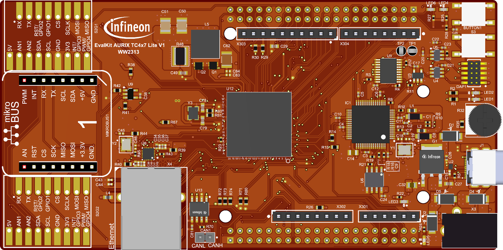
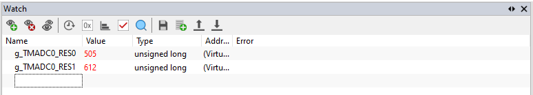

  

# BMETAL_TC4D7_LITE_ADS_TMADC_Timestamp_1

**This example demonstrates how to generate timestamp for each new TMADC result.**  

## Device  
The device used in this example is AURIX™ TC4D7XP_A-Step_CC_COM    

## Board  
The board used for testing is the AURIX™ TC4D7 lite Kit (KIT_A3G_TC4D7_LITE)

**Warning: this example software shall only be executed on boards with VDDM = 3.3V. For any other boards with VDDM = 5V, ADC_SUPLLEV.B.TMADCSUP must be set to 1! Otherwise device could be damaged!**    

## Scope of work  
The TC4x Time-Multiplexed Analog-to-Digital Converter (TMADC) generates a timestamp for each new conversion result (the time point when the sampling phase finishes) to qualify the result. The timestamp has a fixed resolution of 200ns. This demo shows the generated timestamps for user's reference.  

## Introduction  
The AURIX™ TC4x Time-Multiplexed Analog-to-Digital Converter (TMADC) generates a timestamp for each new conversion result (the time point when the sampling phase finishes) to qualify the result. The timestamp has a fixed resolution of 200ns.  

## Hardware setup  
No hardware setup is needed, as the TMADC conversion result itself is unimportant.

  

## Implementation  
This example stops the sampling on TMADC0 Ch1 20µs after TMADC0 Ch0. Because the triggers for end of conversion is controlled by software, the corresponding timestamps shall show a difference of around 20µs (may not be exactly 20µs).   

## Compiling and programming
Before testing this code example:  
- Connect the board to the PC through the USB interface
- Build the project using the dedicated Build button  or by right-clicking the project name and selecting "Build Project"
- To flash the device and start a debug session, click on the Debug button  and create a configuration for a debugger (double clicking on the debugger name, a default configuration is created)

## Run and Test   
Please note, the generated timestamps (absolute values) may vary after each reset. However, the difference between the 2 timestamps should be around 20µs.

In below example results, TMADC0 Ch0 finishes its sampling at 505 and TMADC0 Ch1 at 612. Because each timestamp tick is fixed to 200ns, the time between the two results is (612 - 505) * 200ns = 21.4µs, which matches the expectation 20µs.

Use the integrated debugger or a commercial one to observe the timestamps:                          

  

## References  

AURIX&trade; Development Studio is available online:  
- <https://www.infineon.com/aurixdevelopmentstudio>  
- Use the "Import..." function to get access to more code examples  

More code examples can be found on the GIT repository:  
- <https://github.com/Infineon/AURIX_code_examples>  

For additional trainings, visit our webpage:  
- <https://www.infineon.com/aurix-expert-training>  

For questions and support, use the AURIX&trade; Forum:  
- <https://community.infineon.com/t5/AURIX/bd-p/AURIX>  
