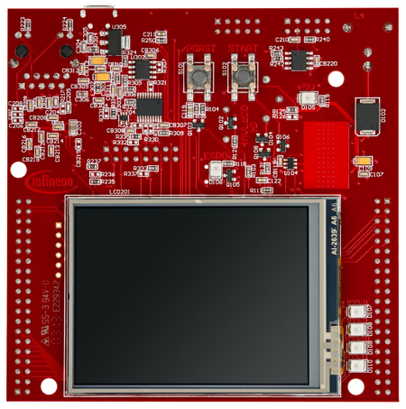
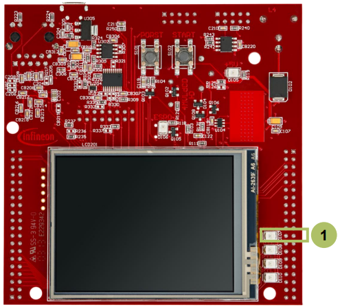

  

# Blinky_LED_1_KIT_TC367_TFT
**An LED is blinking based on the timing given by a wait function.**  

## Device  
The device used in this example is AURIX&trade; TC36xTP_A-Step.

## Board  
The board used for testing is the AURIX&trade; TC367 TFT (KIT_A2G_TC367_TFT).

## Scope of work  
A wait function is used to add delays between switching on and switching off an LED on port pin P13.0.

## Introduction  
The individual control and data bits of each GPIO port are implemented in a number of registers. The registers are used to configure and use the port as general-purpose I/O.

The port input/output control registers configure the functionality and characteristics of the GPIO port pin such as port direction (input or output), pull-up, pull-down, and push-pull or open-drain functionality.

## Hardware setup  
This code example has been developed for the board KIT_A2G_TC367_5V_TFT.

  

## Implementation  

### Initialization of the LED

The LED is initialized with the function *IfxPort_setPinModeOutput()* from the iLLD *IfxPort.h*.

The LED is switched off with the function *IfxPort_setPinHigh()* from the iLLD *IfxPort.h*.

### Toggling of the LED

The state of the LED is toggled with the function *IfxPort_togglePin()* from the iLLD *IfxPort.h*.

This state is hold for one second with the function *waitTime()* from the iLLD *Bsp.h*.

## Compiling and programming  
Before testing this code example:  
- Power the board through the dedicated power connector
- Connect the board to the PC through the USB interface  
- Build the project using the dedicated Build button  or by right-clicking the project name and selecting "Build Project"  
- To flash the device and immediately run the program, click on the dedicated Flash button 

## Run and Test   

After code compilation and flashing the device, observe the **LED D107** (1), which should be blinking at a frequency of approximately 1 Hz.

  

## References  

AURIX&trade; Development Studio is available online:  
- <https://www.infineon.com/aurixdevelopmentstudio>  
- Use the "Import..." function to get access to more code examples  

More code examples can be found on the GIT repository:  
- <https://github.com/Infineon/AURIX_code_examples>  

For additional trainings, visit our webpage:  
- <https://www.infineon.com/aurix-expert-training>  

For questions and support, use the AURIX&trade; Forum:  
- <https://community.infineon.com/t5/AURIX/bd-p/AURIX>  