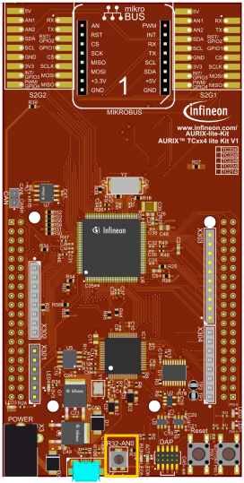
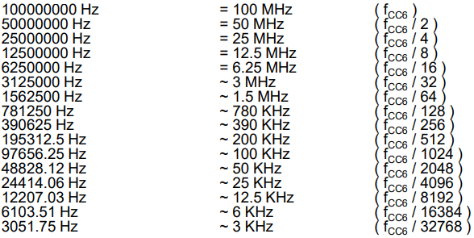
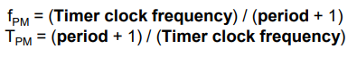
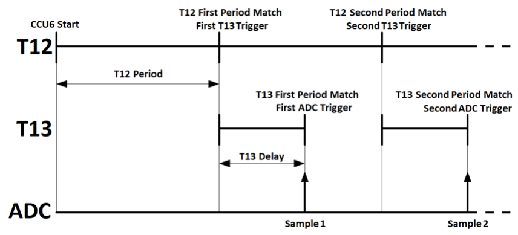
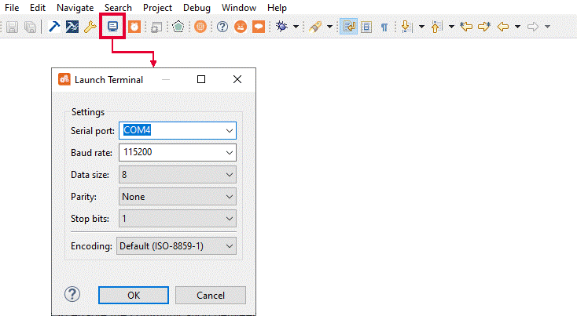
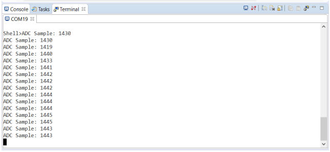

  

# CCU6_ADC_1_KIT_TC334_LK
CCU6 timers T12 and T13 are used to trigger the Enhanced Versatile Analog-to-Digital Converter (EVADC).
## Device  
The device used in this example is AURIX&trade; TC33xTP_A-Step.

## Board  
The board used for testing is the AURIX&trade; TC334 lite Kit (KIT_A2G_TC334_LITE).

## Scope of work  
The Timer T12 is defining the Analog-to-Digital Converter (ADC) sample rate. Due to the instability of the signals (e.g. the overshoot period), a delay is introduced by Timer T13 after each period match of Timer T12. This ensures that the measurement is done when the signal is already stable. UART communication is used to display all measured values on a terminal monitor.

## Introduction  
The Capture/Compare Unit 6 (CCU6) is a high-resolution 16-bit capture and compare unit with application specific modes, mainly used for AC drive control.

The CCU6 unit is made up of a Timer T12 Block with three capture/compare channels and a Timer T13 Block with one compare channel. Timer T12 can also be used as a trigger for Timer T13.

When a period match occurs, the timer can start counting again (continuous mode) or can stop and wait for another trigger (single shot mode). In this example, Timer T12 is used in continuous mode and it triggers Timer T13, which is configured in single shot mode.

The CCU6 has four Service Request Output lines that can be used to trigger other peripherals like ADC, without CPU intervention at different time intervals.

The Enhanced Versatile Analog-to-Digital Converter module (EVADC) of the AURIX&trade; TC33x comprises 4 independent analog to digital converters, each converting with a resolution up to 12-bit.

Several request sources can request an Analog/Digital conversion following different configurations. A conversion can be requested to be done once or repeatedly.

Interrupts can be generated once conversions are finished.

External peripherals like CCU6, GTM, etc. can trigger a sampling request.

## Hardware setup  
This code example has been developed for the board KIT_A2G_TC334_LITE.

In this example, the pin AN0, connected to the board’s potentiometer, is used.

 

**Note**: The channels can be HW filtered by the board, depending on which capacitor/resistors couples are soldered. Consult the AURIX&trade; TC334 lite Kit’s User Manual to check which channels are filtered by HW.  
**Note**: The reference voltage (VAREF) of the EVADC on the board KIT_A2G_TC334_LITE is 3.3 V.

## Implementation  

### Configure the CCU6 unit
Configuration of the CCU6 Timer is done in the *init_CCU6()* function by initializing an instance of the *IfxCcu6_Timer_Config* structure, which contains the following fields:
- *timer* – a parameter that allows to choose which of the two timers to configure. In this case, T13 is the master Timer and T12 is used as slave for its trigger.
- *base* – a structure that allows to set:
  - *t12frequency* – input clock frequency in Hz of the Timer T12
  - *waitingTime* – 16-bit register that determines the maximum count value for the Timer T12. It is used as value for the period register, which represents the waiting time in ticks before a new trigger event occurs for Timer T13
  - *t13frequency* – input clock frequency in Hz of the Timer T13
  - *t13period* – 16-bit register that determines the maximum count value for the Timer T13 
- *trigger* – a structure for configuring the triggers for both timers
  - *t13InSyncWithT12* – allows synchronous operations between the two timers
- *timer13* – a structure that allows to:
  - *t12SyncEvent* – set the Timer T12 event that represents the Timer T13 trigger
  - *t12SyncDirection* – define if a trigger event is to be considered valid based on the counting direction of the Timer T12

The functions used for CCU6 configuration are:
- *IfxCcu6_Timer_initModuleConfig()* – fills the configuration structure with default values 
- *IfxCcu6_Timer_initModule()* – initializes the timer module with the user configuration
- *IfxCcu6_enableInterrupt()* and *IfxCcu6_routeInterruptNode()* – indicate which event generates the Interrupt Service Request and on which Service Request line. This enables the CCU6 to trigger an ADC conversion without the CPU intervention
- *IfxCcu6_enableSingleShotMode()* – configures the timer to count in single shot mode
- *IfxCcu6_Timer_start()* – starts the timer

The above functions can be found in the iLLD headers *IfxCcu6_Timer.h* and *IfxCcu6.h*.

### Timer module frequency
In Timer Mode, the input clock of the timer module is derived from the internal module clock fCC6.  
By default, the internal module clock fCC6 is initialized by the iLLDs to run at 100 MHz. 

Starting from this value, it is possible to set the timer module frequency to the following exact values:

 

**Note**: Any value can be set as *frequency* parameter, but the software will round up the chosen value to the nearest higher frequency listed in the above table (e.g. setting *timerConfig.base.t12Frequency = 400000* the timer will run at 781250 Hz).

### Period Match Frequency calculation
To calculate the actual Period Match frequency fPM (the number of occurrences per second in which the timer counter value reaches the period value and is reset), two parameters have to be considered: *Timer clock frequency* and its *period*.

- The *Timer clock frequency* can be freely selected as described in the previous slide
- The *period* value is stored in a 16-bit register, which limits its maximum value to 65535

The Period Match frequency and period can then be calculated as:

 

In this example, a clock frequency equal to 48828 Hz is chosen for both timers, while the periods are set to have a T12 period match frequency equal to 1 Hz (ADC sample rate, 1 sample/sec) and a T13 period match (delay) time equal to 0.5 seconds (ADC sample delay).

### Configuration of the EVADC
The configuration of the EVADC is done in the *init_EVADC()* function in three different steps:
- Configuration of the *EVADC module*
- Configuration of the *EVADC group*
- Configuration of the *EVADC channel*

### Configuration of the EVADC module
The functions used for configuring the EVADC module are:
- *IfxEvadc_Adc_initModuleConfig()* – initializes the EVADC module configuration structure with the default values
- *IfxEvadc_Adc_initModule()* – initializes the EVADC module with the user configuration, which in this case is the default configuration

### Configuration of the EVADC group
Configuration of the EVADC group is done by initializing an instance of the *IfxEvadc_Adc_GroupConfig*
structure, which contains the following fields:
- *arbiter* – a structure that represents the enabled request sources, which can be one of the three queue sources. In this example, *arbiter.requestSlotQueue0Enabled* is set to *TRUE*, thus enabling the request queue 0
- *queueRequest[0]* – a structure that allows to configure the queue request source 0 by setting:
  - *triggerConfig* – a parameter that specifies the trigger configuration
- *master* – to indicate which converter is the master
- *groupId* – to select which converter to configure

The functions used for configuring the EVADC group are:
- *IfxEvadc_Adc_initGroupConfig()* – fills the group configuration structure with default values 
- *IfxEvadc_Adc_initGroup()* – initializes the EVADC group specified in the parameters with the user configuration

### Configuration of the EVADC channel
Configuration of the EVADC channel is done by initializing an instance of the *IfxEvadc_Adc_ChannelConfig* structure, which contains the following fields:
- *channelId* – a parameter that allows to choose which of the channels to configure
- *resultRegister* – indicates the register where the sample value is stored
- *resultPriority* – the priority of the result trigger interrupt
- *resultServProvider* – interrupt service provider for the result trigger interrupt. This can be any of the available CPUs or the DMA

In this example, the interrupt is used to print the measurements through UART communication.

The functions used for configuring the EVADC channel are:
- *IfxEvadc_Adc_initChannelConfig()* – fills the channel configuration structure with default values 
- *IfxEvadc_Adc_initChannel()* – initializes the channel with the user configuration
- *IfxEvadc_Adc_addToQueue()* – add the channel to the queue

When both the CCU6 and EVADC modules are configured, a single scan sequence is triggered by the CCU6 timer T13 period match event.

All the functions used for configuring the EVADC module, group and channel can be found in the iLLD header *IfxEvadc_Adc.h*.

### Events timing
The graph shows the temporal evolution of events: T12 period matches, T13 period matches and ADC sampling instants.

 

### Configuration of the UART
In this example, the UART connection is used to make the debugging more convenient and easier to understand. 

The *init_UART()* function initializes the UART communication.

The iLLD function *IfxAsclin_Asc_initModuleConfig()* fills the configuration structure *ascConf* with the default values. Then, the parameters used to configure the module are set, depending on the needed connection: baudrate, sampling mode, interrupts, Tx and Rx buffers and port pins configuration.

Finally, *IfxAsclin_Asc_initModule()* initializes the module with the user configuration and *IfxAsclin_Asc_stdIfDPipeInit()* initializes the standard interface to use the ASC module.

The above functions can be found in the iLLD header *IfxAsclin_Asc.h*.

## Compiling and programming  
Before testing this code example:  
- Power the board through the dedicated power connector
- Connect the board to the PC through the USB interface  
- Build the project using the dedicated Build button  or by right-clicking the project name and selecting "Build Project"  
- To flash the device and immediately run the program, click on the dedicated Flash button 

## Run and Test
For this training, a serial monitor is required for visualizing the values. The monitor can be opened inside the AURIX&trade; Development Studio using the following icon:

 

The serial monitor must be configured with the following parameters to enable the communication between the board and the PC: 
- Speed (baud): 115200
- Data bits: 8
- Stop bit: 1

After code compilation and flashing the device, perform the following steps:

- Connect the board to the PC
- Open the serial monitor with the appropriate COM port and settings (can be seen in the Device Manager)
- Check the ADC conversions sampled every one second in the serial monitor console

  

## References  

AURIX&trade; Development Studio is available online:  
- <https://www.infineon.com/aurixdevelopmentstudio>  
- Use the "Import..." function to get access to more code examples  

More code examples can be found on the GIT repository:  
- <https://github.com/Infineon/AURIX_code_examples>  

For additional trainings, visit our webpage:  
- <https://www.infineon.com/aurix-expert-training>  

For questions and support, use the AURIX&trade; Forum:  
- <https://community.infineon.com/t5/AURIX/bd-p/AURIX>  