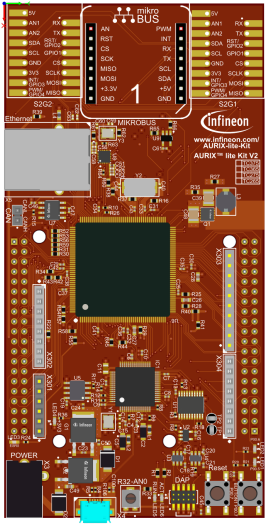
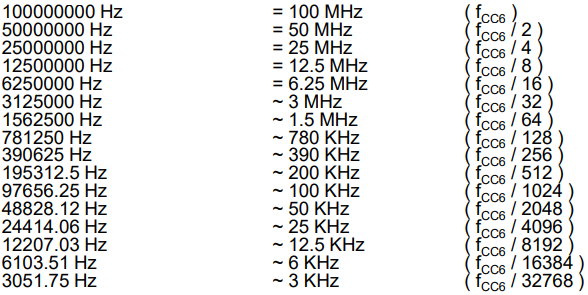
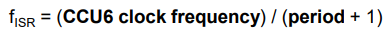
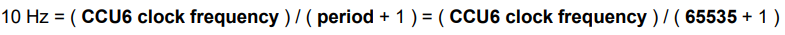
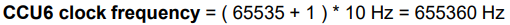
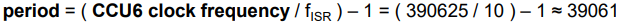
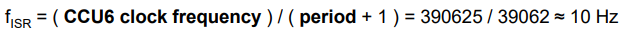
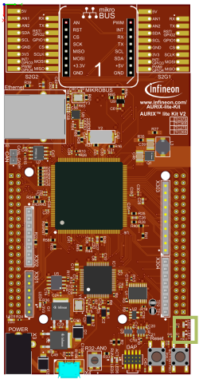

  

# CCU6_Interrupt_1_KIT_TC375_LK
The CCU6 unit generates an interrupt every 500 ms and increments a counter in its Interrupt Service Routine (ISR).

## Device  
The device used in this example is AURIX&trade; TC37xTP_A-Step.

## Board  
The board used for testing is the AURIX&trade; TC375 lite Kit (KIT_A2G_TC375_LITE).

## Scope of work  
Timer T12 of the CCU6 unit generates an interrupt on a "period match" event every 500 ms. Inside the ISR, a counter variable is incremented. The LEDs toggle based on the value of the counter:
- LED1 on and LED2 off: counter % 2 == 0
- LED1 off and LED2 on: counter % 2 == 1

## Introduction  
The Capture/Compare Unit 6 (CCU6) is a high-resolution 16-bit capture and compare unit with application specific modes, mainly used for AC drive control.

The CCU6 unit is made up of a Timer T12 Block with three capture/compare channels and a Timer T13 Block with one compare channel. In this example, Timer T12 Block is used.

Among other features, the CCU6 has the capability to generate interrupts when its count reaches a predefined period value (16-bit).

## Hardware setup  
This code example has been developed for the board KIT_A2G_TC375_LITE.

 

## Implementation  

### Configure and control the LEDs
The LEDs can be switched on/off by controlling the port pins to which they are connected using methods from the iLLD headers *IfxPort.h*.

In the setup phase, the port pins connected to the LEDs are configured as push-pull output mode using the function *IfxPort_setPinMode()*.

During program execution, the LEDs are switched on and off using the function *IfxPort_setPinState()*.

### Configure the CCU6 unit
Configuration of the CCU6 Timer is done by initializing an instance of the *IfxCcu6_Timer_Config* structure, which contains the following fields:
- *base* – a structure that allows to set:
  - *frequency* – input clock frequency in Hz of the timer module
  - *period* – 16-bit register that determines the maximum count value for the timer
- *timer* – a parameter that allows to choose which of the two timers to configure
- *interrupt1* – a structure that allows to set:
  - *priority* – priority of the generated interrupt by CCU6. It can be a value from 0 to 255, with 0 meaning interrupt is disabled, and 255 is the highest priority
  - *type of service* – defines the service provider responsible for handling the interrupt, which can be any of the available CPUs, or the DMA
- *trigger* – a structure for configuring the trigger, that allows to start Timer T13 in sync with Timer T12
  
The function *IfxCcu6_Timer_initModuleConfig()* fills the configuration structure with default values and *IfxCcu6_Timer_initModule()* function initializes the timer module with the user configuration. Both functions can be found in the iLLD header *IfxCcu6_Timer.h*

### Timer module frequency
In Timer Mode, the input clock of the timer module is derived from the internal module clock fCC6.
By default, the internal module clock fCC6 is initialized by the iLLDs to run at 100 MHz.
The initialization is done by the function *IfxScuCcu_init()* that can be found in the iLLD header *IfxScuCcu.h*.

Starting from this value, it is possible to set the timer module frequency to the following exact values:

 

**Note**: Any value can be set as *frequency* parameter, but the software will round up the chosen value to the nearest higher frequency listed in the above table (e.g. setting *timerConfig.base.t12Frequency* = 400000 the timer will run at 781250 Hz).

### ISR Frequency calculation
To calculate the actual ISR frequency fISR (rate at which the ISR is triggered by the CCU6), two parameters have to be considered: *CCU6 clock frequency* and *period*.
- The *CCU6 clock frequency* can be freely selected as discussed in the Timer module frequency section
- The *period* value is stored in a 16-bit register, which limits its maximum value to 65535

The ISR frequency can then be calculated as:

 

### Period calculation example
**Target**: set a period frequency of fISR = 10 Hz

Considering the maximum value of the period (65535) and the final ISR frequency that needs to be achieved (10 Hz), the ISR frequency formula from the ISR Frequency calculation section leads to the following:

 

which leads to:  

Since the maximum value of 65535 for the period cannot be exceeded, it is needed to search into the Timer module frequency table for the <u>nearest lower exact frequency available</u>, which is 390625 Hz.

Taking this value, the period can be easily re-calculated as:

Finally, selecting these values as *period* and *CCU6 clock frequency*, fISR can be calculated:

## Compiling and programming  
Before testing this code example:  
- Power the board through the dedicated power connector
- Connect the board to the PC through the USB interface  
- Build the project using the dedicated Build button  or by right-clicking the project name and selecting "Build Project"  
- To flash the device and immediately run the program, click on the dedicated Flash button 

## Run and Test
After code compilation and flashing the device, observe the behavior of the LEDs.

Check that LED1 and LED2 are blinking in sequence every 500 ms

## References  

AURIX&trade; Development Studio is available online:  
- <https://www.infineon.com/aurixdevelopmentstudio>  
- Use the "Import..." function to get access to more code examples  

More code examples can be found on the GIT repository:  
- <https://github.com/Infineon/AURIX_code_examples>  

For additional trainings, visit our webpage:  
- <https://www.infineon.com/aurix-expert-training>  

For questions and support, use the AURIX&trade; Forum:  
- <https://community.infineon.com/t5/AURIX/bd-p/AURIX>  