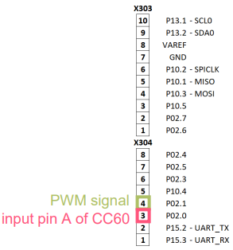
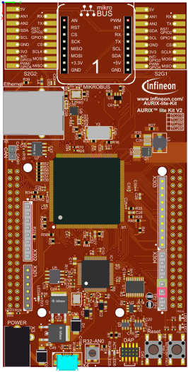
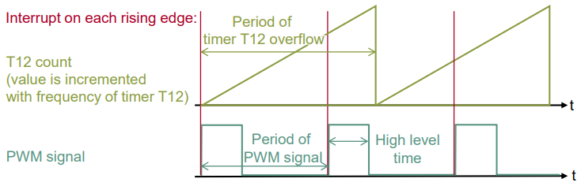
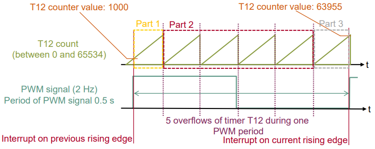
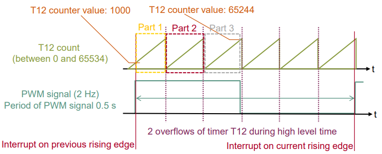
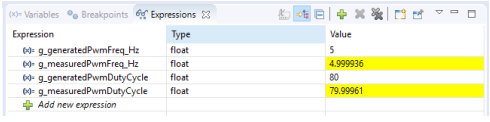

  

# CCU6_PWN_Capture_1_KIT_TC375_LK
The CCU6 unit is used to capture an external PWM signal and calculate its frequency and duty cycle.

## Device  
The device used in this example is AURIX&trade; TC37xTP_A-Step.

## Board  
The board used for testing is the AURIX&trade; TC375 lite Kit (KIT_A2G_TC375_LITE).

## Scope of work  
A simple PWM signal is generated by toggling a port pin. The resulting PWM frequency and duty cycle is measured by the Capture/Control Unit 6 (CCU6).

## Introduction  
The Capture/Compare Unit 6 (CCU6) is a high resolution 16 bit capture and compare unit specially designed for motor control purposes.

The CCU6 unit is made up of a timer T12 Block with three capture/compare channels and a timer T13 Block with one compare channel.

Among other features, the CCU6 has the capability to capture external input signals. In this example, the Input Capture Unit and the timer T12 of the CCU6 module are used to capture a PWM signal and calculate its frequency and duty cycle.

## Hardware setup  
This code example has been developed for the board KIT_A2G_TC375_LITE.

Connect the two pins P02.1 (PWM signal) and P02.0 (CC60 input) to each other.

 
 

## Implementation  

### Configuring the CCU6 Input Capture Unit
To properly configure the CCU6 module for capturing a PWM signal, the module itself and one of its channels need to be configured.

For the configuration of the module, the following steps are required:
- An instance of the structure *IfxCcu6_Icu_Config* needs to be created and default values are assigned to the configuration with the function *IfxCcu6_Icu_initModuleConfig()*
- For capturing a PWM signal, no changes to the default configuration are required, therefore the module can be initialized with the default configuration by calling the function *IfxCcu6_Icu_initModule()*
- After the successful initialization of the CCU6 module, its handle structure (*IfxCcu6_Icu*) contains the configured capture frequency of the timer. For further usage, this parameter is stored in the global variable *g_CCU6Frequency_Hz*

All used functions and structures can be found in the iLLD header *IfxCcu6_Icu.h*.

### Configure the CCU6 unit
Configuration of the CCU6 Timer is done by initializing an instance of the *IfxCcu6_Timer_Config* structure, which contains the following fields:
- *base* – a structure that allows to set:
  - *frequency* – input clock frequency in Hz of the timer module
  - *period* – 16-bit register that determines the maximum count value for the timer
- *timer* – a parameter that allows to choose which of the two timers to configure
- *interrupt1* – a structure that allows to set:
  - *priority* – priority of the generated interrupt by CCU6. It can be a value from 0 to 255, with 0 meaning interrupt is disabled, and 255 is the highest priority
  - *type of service* – defines the service provider responsible for handling the interrupt, which can be any of the available CPUs, or the DMA
- *trigger* – a structure for configuring the trigger, that allows to start Timer T13 in sync with Timer T12
  
The function *IfxCcu6_Timer_initModuleConfig()* fills the configuration structure with default values and *IfxCcu6_Timer_initModule()* function initializes the timer module with the user configuration. Both functions can be found in the iLLD header *IfxCcu6_Timer.h*.

For the configuration of the channel, an instance of the structure *IfxCcu6_Icu_ChannelConfig* is created and default values are assigned to the configuration with the function *IfxCcu6_Icu_initChannelConfig()*. Then, the following changes to the default configuration are required:
- *channelld* – Select the channel of timer T12. In this example, channel 0 is selected
- *channelMode* – Select the operating mode for the channel. In this example, the rising and falling edges of an external signal are captured using the double register capture mode
- *interrupt1* structure – Configure an interrupt by selecting the source, the service request output, its priority and the service provider. In this example, the CCU6 service request 0 is configured to trigger an interrupt on every rising edge at the input pin of capture/compare channel 0 (CC60). To calculate the duty cycle, a shadow register filled when a falling edge occurs, is used. Therefore, no interrupt is required for the falling edge
- *interrupt2* structure – Configure another interrupt similar to the previous, where the CCU6 service request 1 is configured to trigger an interrupt on every period match (match of the timer T12 counter value with the period value) 

**Note**: An interrupt is needed to capture the PWM frequency, while the other counts the number of timer overflows (for more details, see The Interrupt Service Routines (ISRs), Calculation example of the PWM frequency, Calculation example of the PWM frequency and Period calculation example sections).

- *trigger.extInputTrigger* - Select the internal start controlled by the run bit *T12R* by setting a null pointer (*NULL_PTR*) to this field
- *pins* – A structure to set the used port pins for the CCU6 configuration. Only CC60In with input mode *IfxPort_InputMode_pullUp* is selected
- *multiInputCaptureEnabled* – Disable the multiple input capture mode

After the initialization of the channel with the user configuration (which is applied by calling the function *IfxCcu6_Icu_initChannel()*), the capture process is started by setting the run bit *T12RS* through the function *IfxCcu6_Icu_startCapture()*.

All functions and structures used for the configuration of the CCU6 channel can be found in the iLLD header *IfxCcu6_Icu.h*.

### The Interrupt Service Routines (ISRs)
For capturing of PWM signals with the CCU6 module, two ISRs are required:
- *CCU6_period_match_isr* - Interrupt on every period match, used for counting the timer overflows
- *CCU6_edge_detection_isr* - Interrupt on every rising edge at the input pin of capture/compare channel 0, used to calculate
  - the time between two rising edges and the PWM frequency
  - the time between a rising edge and the falling edge and the PWM duty cycle

The method implementing each ISR needs to be assigned a *priority* via the macro *IFX_INTERRUPT(isr, vectabNum, priority)*.

When the rising edge is detected at the input pin of capture/compare channel 0 (CC60), the interrupt handler (*CCU6_edge_detection_isr()*) is triggered.

The interrupt status flags of the CC60 interrupt have to be cleared inside the ISR.

The PWM frequency is calculated by dividing the CCU6 capture frequency (*g_CCU6Frequency_Hz*) by the total amount of increments of the timer T12 (the time between two rising edges).

The PWM duty cycle is calculated as a percentage value between the amount of increments of the timer T12 between the rising and falling edge (high level time) and the total amount of increments between two rising edges (period).

An overflow of timer T12 triggers the second interrupt (*CCU6_period_match_isr()*) which is used for counting:
- the overflows between two rising edges for PWM frequency calculation
- the overflows between the rising edge and the falling edge for PWM duty cycle calculation

### Calculation example of the PWM frequency
Background knowledge:
- Maximum value of timer T12 is *65534* (16 bit – 1; default configuration, configured inside function *IfxCcu6_Icu_initModuleConfig()*) 
- Frequency of timer T12 is 781250 Hz (stored inside variable *g_CCU6Frequency_Hz*; default configuration), which means that the value of timer T12 is incremented every *1.28 µs* (1 / *781250 Hz*)
- Overflow of timer T12 occurs after ≈ *0.084 s* (65534 * 1.28 µs)
- The total amount of increments can be calculated by comparing the current value of timer T12 with the value of timer T12 one PWM period ago e.g. *1000*

 

Example for 2 Hz PWM signal with 50% duty cycle:
- Period time of 2 Hz signal is *0.5 s*
- High level time is *0.25 s* (period * duty cycle)
- Within *0.5 s*, the timer T12 is incremented *390625* times (0.5 s / 1.28 µs) and has *5* overflows
- Within *0.25 s*, the timer T12 is incremented *195312* times (0.25 s / 1.28 µs) and has *2* overflows
- Parameters available inside the ISR:
  - Counter value of timer T12 one period ago: *1000*
  - Current counter value of timer T12: *63955*
  - Counter value when the falling edge occured: *65244*
  - Amount of overflows during one PWM period: *5*
  - Amount of overflows during PWM high level time: *2*
- Calculation of total amount of increments:
  - Increments before the first overflow: 65534 – 1000 = *64534*
  - Increments during the second and the last overflow: (5 - 1) * 65534 = *262136*
  - Increments after the last overflow: *63955*
  - Total amount of increments: *64534 + 262136 + 63955 = 390625*
- Calculation of increments during high level time:
  - Increments before the first overflow: 65534 – 1000 = *64534*
  - Increments during the second and the last overflow: (2 - 1) * 65534 = *65534*
  - Increments after the last overflow: *65244*
  - Total amount of increments: *64534 + 65534 + 65244 = 195312*
- Calculation of the PWM frequency by dividing the frequency of timer T12 by the total amount of increments during one PWM period:
  - 781250 Hz / 390625 = *2 Hz*
- Duty cycle (increments during high level time / increments during total period) = 195312 / 390625 = *50%*

### Period calculation example
Part 1: 64534 increments before the first overflow: 65534 - 1000 = 64534 (Maximum value of T12 - counter value at rising edge = total increments)

Part 2: 262136 increments between the first and last overflow: 
  4 * 65534 = 262136 (4 overflows * maximum value of T12 = total increments)

Part 3: 63955 increments after the last overflow: 63955 (counter value at rising edge)

Total increments between two rising edges: 64534 + 262136 + 63955 = 390625

 

### High Level time calculation example
Part 1: 64534 increments before the first overflow: 65534 - 1000 = 64534 (Maximum value of T12 - counter value at rising edge = total increments)

Part 2: 65534 increments between the first and last (before falling edge) overflow: 
  1 * 65534 = 65534 (1 overflows * maximum value of T12 = total increments)

Part 3: 63955 increments after the last overflow: 63955 (counter value at rising edge)

Total increments between the rising and falling edges: 64534 + 65534 + 65244 = 195312

### Generation of PWM signal
After setting the port pin P02.1 as push-pull output (*IfxPort_setPinMode()*), a simple PWM signal is generated by toggling a pin with the function *generate_PWM_signal()*.

The state of the output port pin P02.1 is toggled by calling the function *IfxPort_setPinState()* with the parameters *IfxPort_State_high* and *IfxPort_State_low*.

For changing the frequency and duty cycle of the generated PWM signal the global parameter *g_generatedPwmFreq_Hz* and *g_generatedPwmDutyCycle* can be modified. 

Depending on the frequency and duty cycle (set to 80%), two timeout values are calculated by software and passed to the *wait()* function. The two wait() function calls are succeeding the two calls of the function *IfxPort_setPinState()*.

The parameters and functions used for the port pin control and timing are provided by the two iLLD headers *IfxPort.h* and *Bsp.h*.

## Compiling and programming  
Before testing this code example:  
- Power the board through the dedicated power connector
- Connect the board to the PC through the USB interface  
- Build the project using the dedicated Build button  or by right-clicking the project name and selecting "Build Project"  
- To flash the device and immediately run the program, click on the dedicated Flash button 

## Run and Test
After code compilation and flashing the device, perform the following steps:
1. Connect the two pins P02.1 (PWM signal) and P02.0 (CC60 input) to each other
2. Check the parameter *g_measuredPwmFreq_Hz* in the debugger (the debug session should be suspended previously). Its value should be similar to the parameter *g_generatedPwmFreq_Hz*
3. Change the parameter *g_generatedPwmFreq_Hz* and check if *g_measuredPwmFreq_Hz* changes accordingly
4. Check the parameter *g_measuredPwmDutyCycle* in the debugger (the debug session should be suspended previously). Its value should be similar to the parameter *g_generatedPwmDutyCycle*
5. Change the parameter *g_generatedDutyCycle* and check if *g_measuredDutyCycle* changes accordingly

## References  

AURIX&trade; Development Studio is available online:  
- <https://www.infineon.com/aurixdevelopmentstudio>  
- Use the "Import..." function to get access to more code examples  

More code examples can be found on the GIT repository:  
- <https://github.com/Infineon/AURIX_code_examples>  

For additional trainings, visit our webpage:  
- <https://www.infineon.com/aurix-expert-training>  

For questions and support, use the AURIX&trade; Forum:  
- <https://community.infineon.com/t5/AURIX/bd-p/AURIX>  