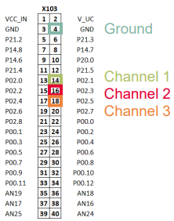
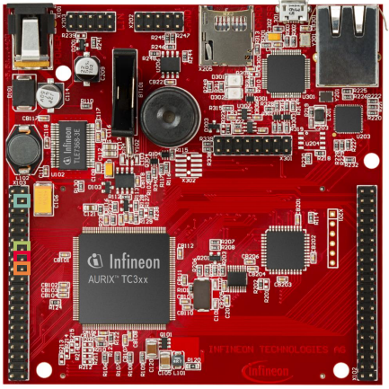
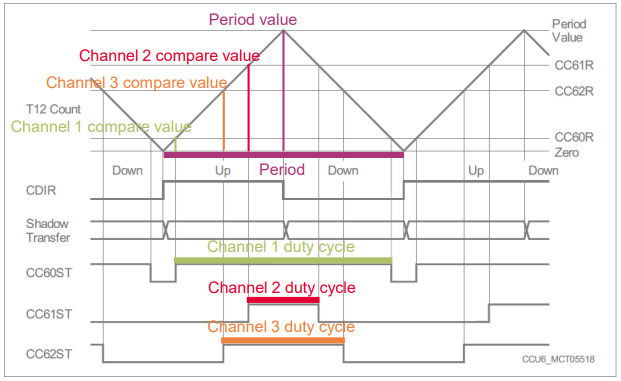
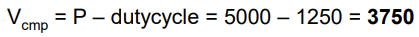
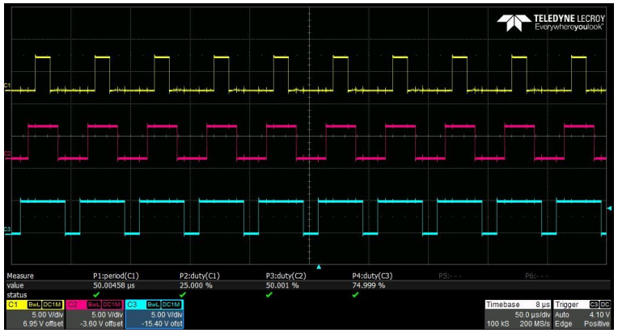

  

# CCU6_PWN_Generation_1_KIT_TC397_TFT
Three center aligned Pulse Width Modulated (PWM) signals with fixed frequency and different duty cycles are generated using CCU6.

## Device  
The device used in this example is AURIX&trade; TC39xTP_A-Step.

## Board  
The board used for testing is the AURIX&trade; TC397 TFT (KIT_AURIX_TC397_5V_TFT).

## Scope of work  
The code example uses the Timer T12 of CCU6 and its three compare modules to generate three PWM signals with a frequency of 20 kHz and different duty cycles (25%, 50% and 75%). T12 is configured to count up and down and the three signals are center aligned.

The generated PWM signals are sent to the pins available on the board and can be observed with an oscilloscope.

## Introduction  
The Capture/Compare Unit 6 (CCU6) is a 16-bit capture and compare unit specially designed for motor control purposes.

CCU6 contains multiple timer modules. Their count values are compared with reference values in order to generate PWM signals.

Timer 12 (T12) is provided with three comparators. Up to three synchronized PWM signals can be generated. These signals can be center aligned or edge aligned.

## Hardware setup  
This code example has been developed for the board KIT_A2G_TC397_5V_TFT.

Three oscilloscope probes are needed to observe the generated PWM signals. These need to be connected to the three output port pins.

 
 

## Implementation  

### Duty cycle and period
In this example, center-aligned PWM signals are generated. Therefore, the timer must be configured to count up and down, as shown in the figure below.

The compare values are in inverse relation to the duty cycle values.

When the compare value is equal to zero, the duty cycle is equal to 100%.

When the compare value is equal to the period, the duty cycle is equal to 0%.

### Disabling and enabling global interrupts
Interrupts should be *temporarily disabled* during the initialization phase using the function *IfxCpu_disableInterrupts()*. This is needed in order to avoid preemption caused by peripherals which have not been configured yet.

Interrupts are then *re-enabled* using the function *IfxCpu_restoreInterrupts()* at the end of the initialization phase, which also restores the initial state of the interrupts.

The above functions are provided by the iLLD header *IfxCpu.h*.

### The Interrupt Service Routines (ISRs)
For capturing of PWM signals with the CCU6 module, two ISRs are required:
- *CCU6_period_match_isr* - Interrupt on every period match, used for counting the timer overflows
- *CCU6_edge_detection_isr* - Interrupt on every rising edge at the input pin of capture/compare channel 0, used to calculate
  - the time between two rising edges and the PWM frequency
  - the time between a rising edge and the falling edge and the PWM duty cycle

The method implementing each ISR needs to be assigned a *priority* via the macro *IFX_INTERRUPT(isr, vectabNum, priority)*.

When the rising edge is detected at the input pin of capture/compare channel 0 (CC60), the interrupt handler (*CCU6_edge_detection_isr()*) is triggered.

The interrupt status flags of the CC60 interrupt have to be cleared inside the ISR.

The PWM frequency is calculated by dividing the CCU6 capture frequency (*g_CCU6Frequency_Hz*) by the total amount of increments of the timer T12 (the time between two rising edges).

The PWM duty cycle is calculated as a percentage value between the amount of increments of the timer T12 between the rising and falling edge (high level time) and the total amount of increments between two rising edges (period).

An overflow of timer T12 triggers the second interrupt (*CCU6_period_match_isr()*) which is used for counting:
- the overflows between two rising edges for PWM frequency calculation
- the overflows between the rising edge and the falling edge for PWM duty cycle calculation

### Configuring the CCU6
To properly configure the CCU6 module for generating PWM signals with the iLLDs, a timer and the PWM High/Low driver need to be configured.

The functions and structures used to configure the timer and the driver can be found in the iLLD header *IfxCcu6_PwmHl.h*.

### Configuring the Timer
To properly configure the timer to generate PWM signals, an instance of the structure *IfxCcu6_TimerWithTrigger_Config* is created.

Firstly, default values are assigned to the timer configuration via the function *IfxCcu6_TimerWithTrigger_initConfig()*.

Out of this structure, the following parameters are changed:
- the frequency of the PWM signals, which needs to be set to the desired value
- the timer count mode, which must be set to *IfxStdIf_Timer_CountDir_upAndDown* in order to enable the generation of center-aligned PWM signals

To apply the configuration, the function *IfxCcu6_TimerWithTrigger_init()* is finally used.

### Configuring the PWM High/Low driver
In the driver configuration the output pins and the duty cycles are set. Furthermore, the compare modules of the three channels are configured.

To configure the driver, an instance of the structure *IfxCcu6_PwmHl_Config* is first initialized with default values using the function *IfxCcu6_PwmHl_initConfig()*. The previously configured timer is then assigned to it, together with the desired output pins.

Since the PwmHl library supports the use of multiple compare channels, it is also necessary to specify the number of used channels (*config.base.channelCount = 3*).

The user configuration is applied with the function *IfxCcu6_PwmHl_init()* and the alignment mode of the generated PWM signals is then set with the function *IfxCcu6_PwmHl_setMode()*, passing the parameter *Ifx_Pwm_Mode_centerAligned*.

It is important to execute the last two instructions in the right order, because the function *IfxCcu6_PwmHl_init()* always resets the mode to the default value.

The compare values for the three channels responsible for generating the desired duty cycles need to be calculated and passed as an array of the type *Ifx_TimerValue* to the *IfxCcu6_PwmHl* driver using the function *update()*.

This last function updates only the internal state of the driver, but not the timer. For this reason, it is necessary to update the timer manually with the function *IfxCcu6_TimerWithTrigger_applyUpdate()*, which enables the transfer of the compare values to the three channels.

Finally, the timer and the generation of the PWM signals can be started using the function *IfxCcu6_TimerWithTrigger_run()*.

### Duty cycle calculation example
**Target**: Find the correct compare value Vcmp to produce a PWM signal with period P = 50 microseconds and 25% duty cycle.
- CCU6 module base frequency FCC6 = 100 MHz
- Desired PWM period T = 50 microseconds which corresponds to a frequency of FPWM = 20 kHz
- The period duration in ticks is P = FCC6 / FPWM = 100 MHz / 20 kHz = 5000 ticks. This is the number of ticks that the timer has to count to produce the desired period
- The desired duty-cycle is 25% of the period, which corresponds to 1250 ticks
- The duty-cycle is *inversely proportional* to the relative *compare value* as explained in the previous slide. Therefore, the compare value can be found with:

## Compiling and programming  
Before testing this code example:  
- Power the board through the dedicated power connector
- Connect the board to the PC through the USB interface  
- Build the project using the dedicated Build button  or by right-clicking the project name and selecting "Build Project"  
- To flash the device and immediately run the program, click on the dedicated Flash button 

## Run and Test
After code compilation and flashing the device, observe the oscilloscope screen.
Three center-aligned PWM signals can be observed, with the configured duty cycles and a period of 50 us each.

## References  

AURIX&trade; Development Studio is available online:  
- <https://www.infineon.com/aurixdevelopmentstudio>  
- Use the "Import..." function to get access to more code examples  

More code examples can be found on the GIT repository:  
- <https://github.com/Infineon/AURIX_code_examples>  

For additional trainings, visit our webpage:  
- <https://www.infineon.com/aurix-expert-training>  

For questions and support, use the AURIX&trade; Forum:  
- <https://community.infineon.com/t5/AURIX/bd-p/AURIX>  