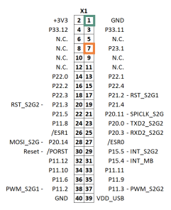
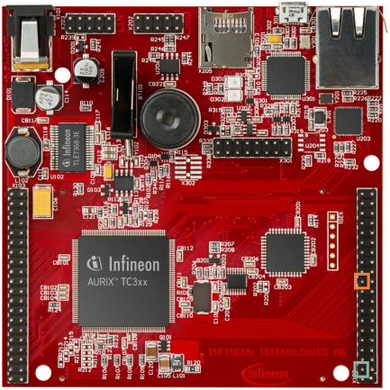
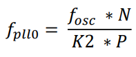
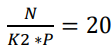
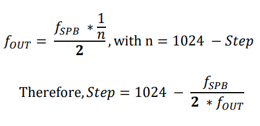
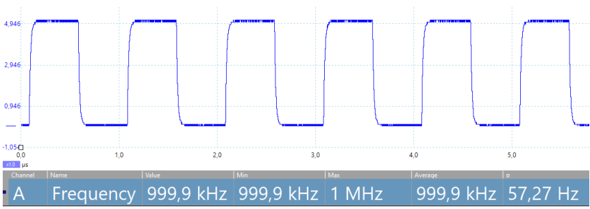

  

# CCU_Clock_1_KIT_TC397_TFT
The clock system is configured based on a PLL frequency of 200 MHz and the clock signal is provided at an external port pin.

## Device  
The device used in this example is AURIX&trade; TC39xTP_A-Step.

## Board  
The board used for testing is the AURIX&trade; TC397 TFT (KIT_A2G_TC397_5V_TFT).

## Scope of work  
The Clock Control Unit (CCU) is used to configure the PLL clock. This clock signal is routed to an external clock output pin, which can be observed with an oscilloscope.

## Introduction  
The Clock Control Unit (CCU) controls the clock system and contains different blocks:
- Basic clock generation
- Clock speed upscaling
- Clock distribution
- Individual clock configuration

The Clock Generation Unit (CGU) is part of the CCU and allows a flexible clock generation.

Phase Lock Loops (PLLs) are provided for upscaling the clock frequency from an internal or external oscillator.

The System Peripheral Bus (SPB) is used to enable the Fractional Divider (FDR) to divide the source clock.

**Note**: For backward compatibility, some of the registers and functions have the prefix „SCU“ (System Control Unit). In AURIX&trade; TC2xx, the clocking system was a part of the System Control Unit.

## Hardware setup  
This code example has been developed for the board KIT_A2G_TC397_5V_TFT.

An oscilloscope is needed to observe the clock at the pin P23.1. Connect the clock and the ground to the oscilloscope.

  

## Implementation  

### Configuring Clock Control Unit
Configuration of the Clock Control Unit (CCU) is done once in the setup phase by calling the initialization function *initCcuClock()*, which contains the following steps:
- Create an instance of the IfxScuCcu_Config structure which contains the CCU configuration
- Initialize the configuration by calling the iLLD function *IfxScuCcu_initConfig()*
- Set the PLL dividers (N, P, K2) to get the desired PLL frequency (see PLL divider calculation example section) (the desired frequency is 200 MHz for this example)
- Initialize the CCU with the iLLD function *IfxScuCcu_init()*
- Set SPB frequency to the desired value by calling the function *IfxScuCcu_setSpbFrequency()* (SPB frequency is 100 MHz for this example)

The *initCcuClock()* function is contained in the *CCU_Clock.h*, while the other functions are part of the iLLD header *IfxScuCcu.h*.

### PLL divider calculation example
The PLL frequency (fpll0) is defined according to the following formula:  
  
where the oscillator’s frequency (fOSC) is 20 MHz (dependent on hardware).

In this example fpll0 = 20 MHz, therefore . To obtain this value, N should be set to 20, P to 1 and K2 to 2 (P = 1 and K2 = 2 are the defaults values).

**Note**: For selecting appropriate values for the dividers, please consult the User Manual.

### Configuring the Clock output
Configuration of the clock output is done once in the setup phase by calling the initialization function *configOutputCcuClock()*, which contains the following steps:
- Call the iLLD function *IfxScuWdt_clearSafetyEndinitInline()* to disable the Safety Endinit protection in order to modify the SCU register
- Set *SCU_CCUCON0.B.CLKSEL* to 0x1 to select the clock source
- Set *SCU_EXTCON.B.EN0* and *SCU_EXTCON.B.SEL0* to enable and select output frequency (fOUT) as external source (*SCU_EXTCON.B.EN0* = 0x1, *SCU_EXTCON.B.SEL0* = 0x0)
- Set *SCU_FDR.B.STEP* to the desired reload value (see Step Value calculation example section) and *SCU_FDR.B.DM* to choose the normal divider mode
- Call the iLLD function *IfxScuWdt_setSafetyEndinitInline()* to re-enable the Safety Endinit protection

The functions *IfxScuWdt_clearSafetyEndinitInline()* and *IfxScuWdt_setSafetyEndinitInline()* are contained in iLLD header *IfxScuWdt.h*.

### Configuring the port pin
Configuration of the port pin is done as well in the function *configOutputCcuClock()* with the following steps:
- Call the iLLD function *IfxPort_setPinMode()* with *IfxPort_Mode_outputPushPullAlt6* as parameter to select CCU external clock as output
- Set pin pad driver to increase pin‘s speed by calling the iLLD function *IfxPort_setPinPadDriver()* and setting *IfxPort_PadDriver_cmosAutomotiveSpeed1* as parameter

The functions *IfxPort_setPinMode()* and *IfxPort_setPinPadDriver()* are contained in iLLD header *IfxPort.h*.

### Step Value calculation example
The Step Value in normal divider mode is defined according to the following formula:  
  
In this example, the desired external frequency value (fOUT) is 1 MHz, and fSPB is 100 MHz.  
After calculation, the Step Value is 974 (0x3CE).

## Compiling and programming  
Before testing this code example:  
- Power the board through the dedicated power connector
- Connect the board to the PC through the USB interface  
- Build the project using the dedicated Build button  or by right-clicking the project name and selecting "Build Project"  
- To flash the device and immediately run the program, click on the dedicated Flash button 

## Run and Test
After code compilation and flashing the device, perform the following steps:

- Connect the oscilloscope to the board via port pin P23.1 and ground
- Observe the desired clock on the oscilloscope’s screen

  

## References  

AURIX&trade; Development Studio is available online:  
- <https://www.infineon.com/aurixdevelopmentstudio>  
- Use the "Import..." function to get access to more code examples  

More code examples can be found on the GIT repository:  
- <https://github.com/Infineon/AURIX_code_examples>  

For additional trainings, visit our webpage:  
- <https://www.infineon.com/aurix-expert-training>  

For questions and support, use the AURIX&trade; Forum:  
- <https://community.infineon.com/t5/AURIX/bd-p/AURIX>  