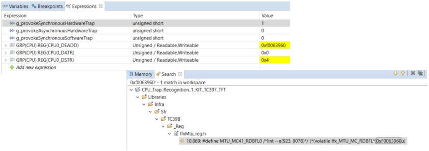

  

# CPU_Trap_Recognition_1_KIT_TC397_TFT
This example shows how to identify the root cause of a trap.

## Device  
The device used in this example is AURIX&trade; TC39xTP_A-Step.

## Board  
The board used for testing is the AURIX&trade; TC397 TFT (KIT_A2G_TC397_5V_TFT).

## Scope of work  
The tutorial describes what types of traps are supported by the AURIX&trade; microcontroller, their root causes and how to identify them. AURIX&trade; architecture supports different types of traps. Three different traps can be provoked with this example and the tutorial guides the user through the needed steps to observe the root cause of each trap.

## Introduction  
A trap occurs as a result of an event such as a Non-Maskable Interrupt (NMI), an instruction exception, a memory management exception or an illegal access. Traps are always active; they cannot be disabled by software.

The TriCore&trade; architecture specifies eight general classes for traps. Each trap class has its own trap handler. Within each class, specific traps are distinguished by a Trap Identification Number (TIN).

Traps can be further classified as synchronous or asynchronous, and as hardware or software generated.

Three different combinations of trap types are supported:
- Synchronous and hardware generated
- Asynchronous and hardware generated
- Synchronous and software generated

## Hardware setup  
This code example has been developed for the board KIT_A2G_TC397_5V_TFT.

  

## Implementation  

### Supported traps
The following table provides an overview about all supported traps and their types:

  

Please refer to the TriCore&trade; TC1.6.2 core architecture manual and the AURIX&trade; TC3xx User’s Manual for detailed information about each trap.

### Trap types
**Synchronous traps**:
- Synchronous traps are associated with the execution or attempted execution of specific instructions or with attempts to access a virtual address that requires the intervention of the memory-management system
- The trap is triggered and serviced immediately

**Asynchronous traps**:
- Since asynchronous traps are associated with hardware conditions, they are similar to interrupts
- They are routed via the trap vector
- Some asynchronous traps are triggered indirectly from instructions, that have been previously executed, but the direct association with the instructions causing the trap is lost

**Hardware traps**:
- Hardware traps are generated in response to exception conditions detected by the hardware
- In most, but not all cases, the exception conditions are associated with the attempted execution of a particular instruction

**Software traps**:
- Software traps are generated as an intentional result of executing a system call or an assertion instruction

### Trap handling
When a trap occurs, a trap identifier is generated by hardware. The trap identifier has two components that can be used to determine more information about the trap and why it was caused (refer to Supported traps):
- The Trap Class Number (TCN)
- The Trap Identification Number (TIN)

In most cases, the debugger will stop the code execution within one of the trap handlers (implemented in the iLLD header *IfxCpu_Trap.c*).

An instance of the structure *IfxCpu_Trap* is declared within each trap handler. When a trap occurs, the instance provides four information fields about the trap:
- *tCpu*: Which CPU caused the trap
- *tClass*: TCN, Class of the trap (refer to Supported traps)
- *tId*: TIN, Id of the trap (refer to Supported traps)
- *tAddr*: Return Address (RA) (refer to the next section)

### Return Address
The Return Address (RA) might help to locate the specific line of code which caused the trap.

The return address, which is stored in the instance of the IfxCpu_Trap structure, is read from the return address register A[11].

Depending on the *trap type*, the return address is different:
- For most of the *synchronous* traps, the return address is the 32-bit Program Counter (PC) of the instruction that caused the trap. (The PC holds the address of the instruction which is currently running when the core is halted.) 
- On a *System Call (SYS)* trap, triggered by the SYSCALL instruction, the return address points to the instruction immediately following SYSCALL
- A *Free Context List Depletion (FCD)* trap is generated after a context save operation that causes the free context list becoming “almost empty”. The responsible for the FCD trap can be a hardware interrupt or a trap handler. The operation responsible for the context save normally is completed before the FCD trap is executed. Because of this, the return address of the FCD trap is the first instruction of the trap/interrupt/called routine or the instruction following a Save Lower Context (SVLCX) or Begin Interrupt Service Routine (BISR) instruction
- For an *asynchronous* trap, the return address is the address of the instruction that would have been executed next, if the asynchronous trap had not been triggered

### Additional debug information
The bit field ERROR_ADDRESS of the *Data Error Address Register (DEADD)* contains the trap address information for the data memory. The content of the DEADD register is valid if the *Data Synchronous Trap Register (DSTR)* or the *Data Asynchronous Trap Register (DATR)* register are non-zero (depending on the trap type). The bit fields in the DSTR and the DATR registers can provide additional information about the trap (refer to the AURIX&trade; TC3xx User’s Manual) :
- These information are valid in case traps such as:
  - *Data Address Alignment (ALN)*
  - *Data Access Synchronous Error (DSE)*
  - *Data Access Asynchronous Error (DAE)*
  - *Invalid Local Memory Address (MEM)*
  - *Memory Protection Write (MPW)*
  - *Memory Protection Read (MPR)*
  - *Memory Protection Peripheral Access (MPP)*
  - *Memory Protection Null Address (MPN)*

The *Program Memory Interface Synchronous Trap Register (PSTR)* contains synchronous trap information for the program memory system. The register is updated with trap information for *Program Fetch Synchronous Error traps (PSE)*.

The *Program (or Data) Integrity Error Address Register (PIEAR / DIEAR)* and the *Program (or Data) Integrity Error Trap Register (PIETR / DIETR)* can be interrogated to determine the source of the *Program (or Data) Memory Integrity Error (PIE / DIE)* more precisely.

### Trap provocation
Three different combinations of trap types can be provoked in this example:
- Synchronous Hardware trap
- Asynchronous Hardware trap
- Synchronous Software trap

The trap provocation is implemented in the function *run_trap_provocation()* and can be started by setting one of the three *g_provokeXYTrap (X = Synchronous / Asynchronous; Y = Hardware / Software)* variables.

The implemented code for the first two traps is based on the MTU_MBIST_1 and SMU_IR_Alarm_1 examples. For further information on the code, please refer to the specific tutorials.

The third trap is provoked by using two instructions: *__mtcr()* (Move To Core Register) and *trapv* (assembly code). For further information on these instructions, please refer to the TriCore&trade; TC1.6.2 core architecture manual - Instruction set manual.

**Note**: *__mtcr()* is an intrinsic function of the Tasking compiler, which moves contents of a data register to the addressed Core Special Function Register (CSFR). *__mtcr()* performs a Move to Core Register (*MTCR*) TriCore&trade; instruction and is followed by an *ISYNC* instruction.

For a better understanding of the trap behavior, the required code instructions used to avoid the cause of each trap, are implemented and can be activated by setting the *AVOID_PROVOCATION* macro to true.

## Compiling and programming  
Before testing this code example:  
- Power the board through the dedicated power connector
- Connect the board to the PC through the USB interface  
- Build the project using the dedicated Build button  or by right-clicking the project name and selecting "Build Project"  
- To flash the device and immediately run the program, click on the dedicated Flash button 

## Run and Test
After code compilation and flashing the device, perform the following steps:
- Add the three variables “*g_provokeSynchronousHardwareTrap*”, “*g_provokeAsynchronousHardwareTrap*” and “*g_provokeSynchronousSoftwareTrap*” in the Expressions window of the debugger
- Add the three registers DEADD, DATR and DSTR in the Expressions window of the debugger

  

### 1.1 Synchronous hardware trap
Provoke the synchronous hardware trap by setting the value of “*g_provokeSynchronousHardwareTrap*” in the “Expressions” window to “1”.

Press the “Resume” button to start the program.

Observe the following information:
- The debugger stopped in the *IfxCpu_Trap_busError()* function (*IfxCpu_Trap.c*)
- The “Variables” window of the debugger displays the “*trapWatch*” structure and the value of its parameters
- The trap is provoked by CPU0, it is a trap of class 4, the trap id is 2 and the Return Address (RA) is 0x80000036 (2147483702 10)
- It is a Data Access Synchronous Error (Trap table, class 4 and tin 2)

### 1.2 Synchronous hardware trap 
Observe the following information:
- The call stack in the “Debug” window displays the function which was called before the trap occurred (in this case the function *run_trap_provocation()*, the address displayed behind this function equals the Return Address (RA))
- By clicking on this function, the debugger jumps to the specific code line in the *CPU_Trap_Recognition.c* file and to the corresponding assembly line in the “Disassembly” window. The address of the assembly line equals the Return Address (RA)

 

### 1.3 Synchronous hardware trap 
Observe the following additional information:
- The *LBE* bit field in the *DSTR* register is set (Load Bus Error - Data load from bus causing error, refer to AURIX&trade; TC3xx User’s Manual)
- The *DEADD* register displays the address 0xf0063960, which is the address of the modified register that caused the trap
- By running a file search (Search -> File) for the address, the search finds the specific *RDBFL0* register which equals the modified *MBIST* DMA register

 

### 2.1 Asynchronous hardware trap 
Restart the program by pressing the “Restart” button in the debugger.

Provoke the asynchronous hardware trap by setting the value of *“g_provokeAsynchronousHardwareTrap”* in the “Expressions” window to “1”.

Press the “Resume” button to start the program.

Observe the following information:
- The debugger stopped in the *IfxCpu_Trap_busError()* function (*IfxCpu_Trap.c*)
- The “Variables” window of the debugger displays the “*trapWatch*” structure and the values of its parameters
- The trap is provoked by CPU0, it is a trap of class 4, the trap id is 3 and the Return Address (RA) is 0x80000024 (2147483684 10)
- It is a Data Access Asynchronous Error (Trap table, class 4 and tin 3)

### 2.2 Asynchronous hardware trap 
Observe the following information:
- The call stack in the “Debug” window displays the function which was called before the trap occurred (in this case the function *run_trap_provocation()*, the address displayed behind this function equals the Return Address (RA))
- By clicking on this function, the debugger jumps to the specific code line in the *CPU_Trap_Recognition.c* file and to the corresponding assembly line in the “Disassembly” window. The address of the assembly line equals the return address
- Because it is an asynchronous trap, the specific code line is not pointing to the line which is causing the trap. It is the code line of the instruction that would have been executed next, if the asynchronous trap had not been triggered
- Since there is no other instruction within the function *run_trap_provocation()*, it is impossible to find the line of code by using the Return Address (RA) in this example

 

### 2.3 Asynchronous hardware trap 
Due to the fact that the Return Address (RA) cannot be used, the following information might help to locate the cause of the trap:
- The *SBE* bit field in the *DATR* register is set (Store Bus Error - Data store to bus causing error, refer to AURIX&trade; TC3xx User’s Manual)
- The *DEADD* register displays the address 0xf003682c, which is the address of the modified register that caused the trap
- By running a file search (Search -> File) for the address, the search finds the specific *SMU_AGC* register which equals the modified register. The name of the modified register helps to find the code line which is causing the trap (By using another search for “AGC”)

 

### 3.1 Synchronous software trap 
Restart the program by pressing the “Restart” button in the debugger.

Provoke the synchronous software trap by setting the value of *“g_provokeSynchronousSoftwareTrap”* in the “Expressions” window to “1”.

Press the “Resume” button to start the program.

Observe the following information:
- The debugger stopped in the *IfxCpu_Trap_assertion()* function (*IfxCpu_Trap.c*)
- The “Variables” window of the debugger displays the “*trapWatch*” structure and the value of its parameters
- The trap is provoked by CPU0, it is a trap of class 5, the trap id is 1 and the Return Address (RA) is 0x80000086 (2147483782 10)
- It is an Arithmetic Overflow Error (Trap table, class 5 and tin 1)

### 3.2 Synchronous software trap
Observe the following information:
- The call stack in the “Debug” window displays the function which was called before the trap occurred (in this case the function *run_trap_provocation()*, the address displayed behind this function equals the Return Address (RA))
- By clicking on this function, the debugger jumps to the specific code line in the *CPU_Trap_Recognition.c* file and to the corresponding assembly line in the “Disassembly” window. The address of the assembly line equals the Return Address (RA)

 

## References  

AURIX&trade; Development Studio is available online:  
- <https://www.infineon.com/aurixdevelopmentstudio>  
- Use the "Import..." function to get access to more code examples  

More code examples can be found on the GIT repository:  
- <https://github.com/Infineon/AURIX_code_examples>  

For additional trainings, visit our webpage:  
- <https://www.infineon.com/aurix-expert-training>  

For questions and support, use the AURIX&trade; Forum:  
- <https://community.infineon.com/t5/AURIX/bd-p/AURIX>  