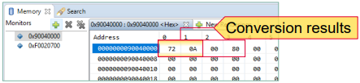

  

# DMA_ADC_Transfer_1_KIT_TC397_TFT
The DMA is used to transfer ADC measurements results to LMURAM.

## Device  
The device used in this example is AURIX&trade; TC39xTP_A-Step.

## Board  
The board used for testing is the AURIX&trade; TC397 TFT (KIT_AURIX_TC397_5V_TFT).

## Scope of work  
At the end of an analog-to-digital conversion of the Enhanced Versatile Analog-to-Digital Converter (EVADC) module, an interrupt is triggered, which starts the data transfer of the converted ADC results via DMA to the LMURAM. The ADC conversion is started manually via a command of a serial monitor.

## Introduction  
The Direct Memory Access (DMA) transfers data from data source locations to data destination locations without intervention of the CPU or other on-chip devices.

A DMA channel performs transactions. One transaction is made of transfers. One transfer is made of up to 16 moves. This structure divides the data into several parts and increases the application’s efficiency.

A DMA move is an operation that always consists of two parts:
- A DMA read move that loads DMA read move data from a source module to the DMA
- A DMA write move that stores DMA write move data from the DMA to a destination module

A transaction can be interrupted, however once a transfer is started, it cannot be interrupted.

A move operation (8-bit, 16-bit, 32-bit, 64-bit, 128-bit or 256-bit):
1. Loads data from the data source into the DMA controller
2. Puts data from the DMA controller to a data destination

Any DMA move engine can service a DMA request from any of the 128 DMA channels. Channel 127 has the highest priority.

Example:
- 1024 words (32-bit per word) transaction can be composed of 256 transfers of 4 DMA word moves, or 128 transfers of 8 DMA word moves

The Enhanced Versatile Analog-to-Digital Converter module (EVADC) of the AURIX&trade; TC39x comprises 12 independent analog to digital converters. Each, converting with a resolution up to 12-bit.

Several request sources can request an Analog/Digital conversion following different configurations. A conversion can be requested to be done once or repeatedly.

Interrupts can be generated once conversions are finished.

## Hardware setup  
This code example has been developed for the board KIT_A2G_TC397_5V_TFT.

The board should be connected to the PC via USB, in order to allow the UART connection.

 

## Implementation  

### Application use case

The DMA_ADC_Transfer_1 example works as follows:
1. The user sends a ‘1’ character via a serial monitor
2. This triggers an Analog/Digital conversion
3. Once the conversion is done and the result written in the EVADC result register, an interrupt is triggered
4. This interrupt calls a DMA transaction, since the DMA is configured as the Interrupt Service Provider for this ADC interrupt
5. Once the transaction is finished, an interrupt is triggered by the DMA and handled by the CPU, to send a feedback message to the user on the serial monitor

This sequence can be repeated at any time. 

### Configuration of the ADC

For this example, the configuration of *one group* using *one single channel* is sufficient.

In *init_EVADC()*, the Analog-to-Digital converter is initialized and configured with the following steps:
- An EVADC module configuration structure is filled with default values using the function *IfxEvadc_Adc_initModuleConfig()*
- The EVADC module is initialized using the function *IfxEvadc_Adc_initModule()*
- An EVADC group configuration structure is filled with default values using the function *IfxEvadc_Adc_initGroupConfig()*
- The group configuration is changed specifying several parameters, such as group ID, master, calibration startup etc.
- The EVADC group is initialized using the function *IfxEvadc_Adc_initGroup()*
- An EVADC channel configuration structure is filled with default values through the function *IfxEvadc_Adc_initChannelConfig()*
- The channel configuration is changed by specifying :
  - *channelId* the channel ID
  - *resultRegister* the result register where to store the result
  - *resultPriority* to trigger an interrupt every time a result is generated after a conversion; this is set equal to the DMA channel to be triggered
  - *resultServProvider* the Interrupt service provider: in this case, the DMA
- The EVADC channel is initialized using the function *IfxEvadc_Adc_initChannel()*
- The configured queue is started (empty) with the function *IfxEvadc_Adc_startQueue()*

To do the conversion only once after being triggered, the channel is added to the queue when requested by the user, through the *IfxEvadc_Adc_addToQueue()* function inside *read_EVADC()*.

The *read_EVADC()* function is starting the measurement and conversion of the analog values by adding the configured channel (with no refill option specified) to the queue with the function *IfxEvadc_Adc_addToQueue()*. 
The *read_EVADC()* function is called from the while loop inside the *Cpu0_Main.c* file only if the correct character (‘*1*’) is read by UART.

 

### Configuration of the DMA

The needed transaction is configured in the *init_DMA()* function. Here, the number of transfers per transaction and the size of the word moves are defined.  
In this example, we want to transfer a *32-bit result register* from the EVADC. A *single transaction* with *one transfer* made of one *32-bit word move* is fitting.

All of the above can be achieved with a *single DMA channel* (in this case: channel 1).

The data source and destination locations are also set in the same function.
Additionally, the DMA channel is configured in such a way, that the source and destination addresses are not incremented after the transaction, since we always want to transfer from the same result register to the same location in the LMURAM. 
This is configured via the *destinationAddressCircularRange* and *sourceAddressCircularRange* parameters.

 

An interrupt on the DMA channel is configured in order to send a feedback to the user via UART when a transaction is completed. This service is provided by the CPU0.

### Configuration of the UART

In this tutorial, the UART connection is used to make the debugging more convenient and easier to understand. 

The function *init_UART()* is initializing the UART communication.

The iLLD function *IfxAsclin_Asc_initModuleConfig()* fills the configuration structure *ascConf* with the default values. 
Then, the parameters are set to their correct value, depending on the needed connection: baudrate, Tx and Rx buffer size, Tx and Rx pin configuration etc.

Finally, *IfxAsclin_Asc_initModule()* initializes the module with the user configuration.

## Compiling and programming  
Before testing this code example:  
- Power the board through the dedicated power connector
- Connect the board to the PC through the USB interface  
- Build the project using the dedicated Build button  or by right-clicking the project name and selecting "Build Project"  
- To flash the device and immediately run the program, click on the dedicated Flash button 

## Run and Test
For this training, a serial monitor is required for visualiwing the values. The monitor can be opened inside the AURIX&trade; Development Studio using the following icon:

  

The serial monitor must be configured with the following parameters to enable the communication between the board and the 
PC:
-  Speed (baud): 115200
-  Data bits: 8
-  Stop bit: 1

After code compilation and flashing the device, perform the following steps:
- Connect the board to the PC
- Open the serial monitor with the appropriate COM port and settings
- Send ‘1’ and pause the debugger
- The successful DMA transfer can be observed with the debugger by adding the below address in the memory view at the same time (the byte values are shown in Little-Endian order):
  - Check the memory at the LMURAM address 0x90040000

  - It matches the result of the EVADC peripheral result register*
  
- Send ‘1’ again to start another conversion

*80000A72h to 00000A72Fh because Valid Flag (VF, bit 31) is reset to 0 after reading the EVADC result register

## References  

AURIX&trade; Development Studio is available online:  
- <https://www.infineon.com/aurixdevelopmentstudio>  
- Use the "Import..." function to get access to more code examples  

More code examples can be found on the GIT repository:  
- <https://github.com/Infineon/AURIX_code_examples>  

For additional trainings, visit our webpage:  
- <https://www.infineon.com/aurix-expert-training>  

For questions and support, use the AURIX&trade; Forum:  
- <https://community.infineon.com/t5/AURIX/bd-p/AURIX>  