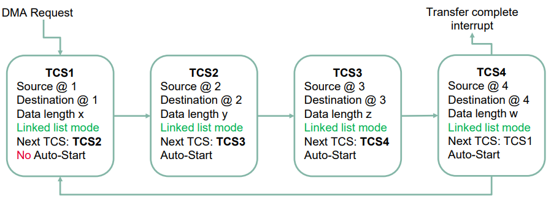
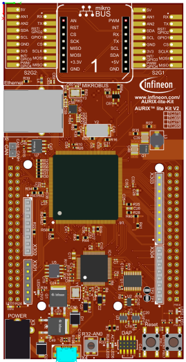
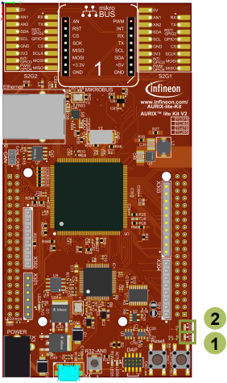

  

# DMA_Linked_List_Mode_1_KIT_TC375_LK
DMA Linked Lists are used to execute a series of DMA transactions without CPU intervention.

## Device  
The device used in this example is AURIX™ TC37xTP_A-Step.

## Board  
The board used for testing is the AURIX™ TC375 lite Kit (KIT_A2G_TC375_LITE).

## Scope of work  
In this training, four DMA transactions are configured in DMA Linked List mode.  
Triggering one DMA transaction leads to the execution of all DMA transactions consecutively.  
An interrupt is triggered at the completion of the last DMA transaction.  
If DMA has correctly transferred the data, the LED driven by port pin 00.6 toggles and a new cycle starts again. Otherwise, the LED driven by port pin 00.5 turns ON and no more DMA transfers are done.

## Introduction  
The Direct Memory Access (DMA) moves data from source locations to destination locations *without* the intervention of the CPU or any other on-chip devices.

Among other features, the DMA has the capability to execute a series of DMA transactions by the same DMA channel; this is ensured by the Linked List operations.

A DMA transaction in Linked List mode can be configured to *auto-start*.

A typical DMA Linked List use case is illustrated in the figure below
- Several DMA transactions are configured and stored in RAM
- Configure DMA channel with the first Transaction Control Set (TCS1)
- Set a HW or SW DMA Channel request
- All configured DMA transactions will be executed consecutively
- Trigger an interrupt after the completion of the last DMA transaction 

 

## Hardware setup  
This code example has been developed for the board KIT_A2G_TC375_LITE.

 

## Implementation  

### Initialization phase
The initialization phase is ensured by the initDmaLinkedList() function as following:

#### DMA module initialization
Create the DMA module configuration: 
- *IfxDma_Dma_Config dmaConfig*;
- *IfxDma_Dma_initModuleConfig(&dmaConfig, &MODULE_DMA)*;

Initialize the DMA software module:
- *IfxDma_Dma g_dma*;
- *fxDma_Dma_initModule(&g_dma, &dmaConfig)*; 

The functions described above are provided by the iLLD header *IfxDma_Dma.h*.

#### DMA Channel Configuration
Create the DMA channel default configuration:
- *IfxDma_Dma_ChannelConfig cfg*;
- *IfxDma_Dma_initChannelConfig(&cfg, &g_dma)*;

DMA Linked List configuration:
- Channel selection: 
  - *cfg.channelId = IfxDma_ChannelId_0*;
- Number of DMA transfers in the DMA transaction (16 DMA transfers per DMA transaction):
  - *cfg.transferCount = NUM_TRANSFERED_WORDS*;
- Channel move data width (one DMA move = 32 bit ):
  - *cfg.moveSize = IfxDma_ChannelMoveSize_32bit*;
- Channel trigger mode (one DMA transaction or one DMA transfer per trigger request ):
  - *cfg.requestMode = IfxDma_ChannelRequestMode_completeTransactionPerRequest*;
  
The functions described above are provided by the iLLD header *IfxDma_Dma.h*.

DMA Linked List configuration (Cont.):
- Channel operation mode (DMA Linked List mode):
  - *cfg.shadowControl = IfxDma_ChannelShadow_linkedList*;
- Source and Destination buffers addresses of each DMA transaction:
  - *cfg.sourceAddress = g_source[i]*;
  - *cfg.destinationAddress = g_destination[i]*;
- Address of the next Transaction Control Set (TCS) in the DMA Linked List:
  - *cfg.shadowAddress = (uint32)&g_linkedList[(i + 1) % NUM_LINKED_LIST_ITEMS]*;
- Enable channel interrupt for the last DMA transaction:
  - *cfg.channelInterruptEnabled = TRUE*;
- Store the configuration into RAM memory in a transaction control set format:
  - *IfxDma_Dma_initLinkedListEntry((void *)&g_linkedList[i], &cfg)*;
- Configure DMA channel registers with the first DMA transaction parameters (*if i == 0*):
  - *IfxDma_Dma_initChannel(&g_chn, &cfg)*;
- Enable Auto-Start feature for the subsequent DMA transactions (*if i != 0*):
  - *g_linkedList[i].CHCSR.B.SCH = 1*;

The functions described above are provided by the iLLD header *IfxDma_Dma.h*.

####  DMA Channel Interrupt configuration
Get the DMA Channel Interrupt configuration register:
- *g_dmaCh0Src = IfxDma_Dma_getSrcPointer(&g_chn)*;

Set Interrupt Service Provider (CPU0) and Priority (50):
- *IfxSrc_init(g_dmaCh0Src, IfxSrc_Tos_cpu0, ISR_PRIORITY_DMA_CH0)*;

Enable Interrupt:
- *IfxSrc_enable(g_dmaCh0Src)*;

The function *IfxDma_Dma_getSrcPointer()* is provided by the iLLD header *IfxDma_Dma.h*.  
*IfxSrc_init()* and *IfxSrc_enable()* functions are provided by the iLLD header *IfxSrc.h*.

#### LEDs Configuration
LEDs definition to be user friendly (Pre-processor defines):
- *#define PASS_LED     &MODULE_P00,6*
- *#define FAIL_LED     &MODULE_P00,5*

Configure port pins connected to LEDs in push-pull output mode:
- *IfxPort_setPinMode(PASS_LED, IfxPort_Mode_outputPushPullGeneral)*;
- *IfxPort_setPinMode(FAIL_LED, IfxPort_Mode_outputPushPullGeneral)*;

Switch off LEDs (initial state):
- *IfxPort_setPinHigh(PASS_LED)*;
- *IfxPort_setPinHigh(FAIL_LED)*;

The functions described above are provided by the iLLD header *IfxPort.h*.

### Transfer phase

The data transfer phase is launched by calling the *startDmaLinkedListTransfer()* function and it includes the following:
1. Fill the DMA source buffers with data to be sent
2. Trigger a software DMA request:
   - *IfxDma_Dma_startChannelTransaction(&g_chn)*;

The function *IfxDma_Dma_startChannelTransaction()* is provided by the iLLD header *IfxDma_Dma.h*.

### Interrupt Service Routine
The Interrupt Service Routine (ISR) is a user function executed when the interrupt is triggered.  
In this example, the DMA channel interrupt is triggered after the completion of the last DMA transaction of the linked list.  
The implemented ISR *dmaCh0ISR* ensures the following:
Compare destination buffers to source buffers
- In case of a data mismatch :
  - Switch On FAIL_LED: 
    - *IfxPort_setPinLow(FAIL_LED)*
  - Switch Off PASS_LED: 
    - *IfxPort_setPinHigh(PASS_LED)*
- In case of a data match:
  - Toggle PASS_LED: 
    - *IfxPort_togglePin(PASS_LED)*
  - Clear Destination buffers
  - Trigger a new transfer request:
    - *startDmaLinkedListTransfer()*

**Note**: One-second delay is added between every DMA transfer operation. The delay is ensured by *wait()* function and based on STM Timer.

## Compiling and programming  
Before testing this code example:  
- Power the board through the dedicated power connector
- Connect the board to the PC through the USB interface  
- Build the project using the dedicated Build button  or by right-clicking the project name and selecting "Build Project"  
- To flash the device and immediately run the program, click on the dedicated Flash button 

## Run and Test
After code compilation and flashing the device, observe the LEDs’ behavior:

Execution error:
- LED1 (1) is On
- LED2 (2) is Off 

No Execution error:
- LED1 (1) is Off
- LED2 (2) is toggling every *one second* approximately

 

## References  

AURIX™ Development Studio is available online:  
- <https://www.infineon.com/aurixdevelopmentstudio>  
- Use the "Import..." function to get access to more code examples  

More code examples can be found on the GIT repository:  
- <https://github.com/Infineon/AURIX_code_examples>  

For additional trainings, visit our webpage:  
- <https://www.infineon.com/aurix-expert-training>  

For questions and support, use the AURIX&trade; Forum:  
- <https://community.infineon.com/t5/AURIX/bd-p/AURIX>  