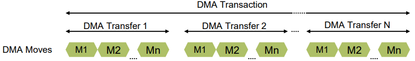
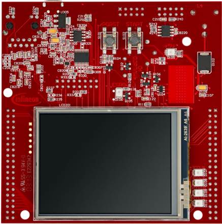
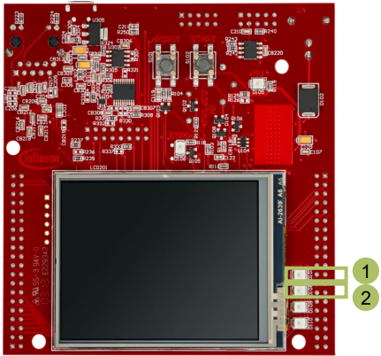

  

# DMA_Mem_to_Mem_1_KIT_TC397_TFT
The DMA is used to transfer ten words (32-bit) of data from one memory location to another without any CPU load.

## Device  
The device used in this example is AURIX&trade; TC39xTP_A-Step.

## Board  
The board used for testing is the AURIX&trade; TC397 TFT (KIT_A2G_TC397_5V_TFT).

## Scope of work  
The transfer of data is triggered by SW. The source is the Data Scratch Pad SRAM of CPU0 (DSPR0) and the destination is the Distributed Local Memory Unit (DLMU RAM). At the end of the transactions, the data is verified by comparing the source and destination buffers. The success of the data transfer is signaled through the LED connected to pin 0 of port 13. Otherwise, the LED connected to pin 1 of port 13 is used. The same cycle is repeated each second.

## Introduction  
The Direct Memory Access (DMA) unit is a module which can execute data transfers from a source memory to a destination memory without any CPU load.

The DMA controller mainly supports:
- Two move engines for the parallel execution of DMA requests
- Individually programmable DMA channels (up to 128)
  - DMA Channel 127 has the highest priority
- DMA requests can be triggered by Hardware or Software
  - Any peripheral that can trigger an interrupt can initiate a DMA transfer

DMA Move, Transfer, Transaction:

  

A *DMA Move* is a Bus read *and* write operation
- Supported data widths for DMA read & write moves: 8, 16, 32, 64, 128 or 256-bit

A *DMA Transfer* consists of a configurable number of DMA moves 
- It can be composed of 1, 2, 3, 4, 5, 8, 9 or 16 DMA moves

A *DMA Transaction* consists of several (at least one) DMA Transfers
- It is possible to trigger the full DMA transaction or each DMA transfer of the transaction in order

**Note**: 
- A *DMA Transfer* is an *un-interruptable* DMA operation
- Long *DMA Transfers* can block pending DMA Channels with *higher* priority

## Hardware setup  
This code example has been developed for the board KIT_A2G_TC397_5V_TFT.

  

## Implementation  

### Specify data storage for Source and Destination buffers
The *__at* Tasking compiler attribute is used to declare data buffers in specific memory locations:
- Source data buffer in DSPR0: *uint32 g_dataForDmaTransfer[DATA_ARRAY_LENGTH] __at(0x70000000);*

- Destination data buffer in LMURAM (non cached memory): *uint32 g_dmaLmuDestination[DATA_ARRAY_LENGTH] __at(0xB0000000);*

All used iLLD functions for initializing and controlling DMA transfers are provided by the *IfxDma_Dma.h* header file.

### DMA configuration
Before the first DMA data transfer can be requested and executed, the DMA module has to be initialized. The following steps are done inside *initDMA()*:
1. Load default module configuration into DMA configuration structure: *IfxDma_Dma_initModuleConfig(&g_DMA.dmaConfig, &MODULE_DMA)*
2. Apply default configuration on DMA hardware module: *IfxDma_Dma_initModule(&g_DMA.dmaHandle, &g_DMA.dmaConfig)*
3. Load the DMA default channel configuration: *IfxDma_Dma_initChannelConfig(&g_DMA.dmaChNCfg, &g_DMA.dmaHandle)*
4. Modify the channel configuration to fit the use case:
   - *DMA Channel ID*: 0 
   - *DMA Move data width*: 32-bit
   - *DMA Transfer count*: 10
   - *DMA Transaction request mode*: Complete the transaction on each request
5. Apply configuration to DMA hardware channel in DMARAM: *IfxDma_Dma_initChannel(&g_DMA.dmaChannel, &g_DMA.dmaChNCfg)*

### LEDs Configuration and Control
To provide status signals, two LEDs of the Application Kit board are used:  
Failure signal, LED driven by port 13 pin 1: *#define LED_DMA_FAILURE &MODULE_P13,1*  
Success signal, LED driven by port 13 pin 0: *#define LED_DMA_SUCCESS &MODULE_P13,0*

1. Set each used Port Pin as push-pull output with the *IfxPort_setPinMode()* iLLD function
2. The LEDs are low active: 
   - Switch On LED: *IfxPort_setPinLow()*
   - Switch Off LED : *IfxPort_setPinHigh()*

**Note**: Two wrapper functions are implemented (*turnLEDOn()* & *turnLEDOff()*) to switch On/Off LEDs, e.g. *turnLEDOn(LED_DMA_SUCCESS)*. 

All port functions used to initialize and switch LEDs‘ state are provided in the iLLD header file *IfxPort.h*.

### Request and verify a DMA data transfer
The following steps are done inside *runDMA()*, based on the previous described DMA configuration:
1. Set the DMA source and destination buffers beginning addresses:
   - Source buffer: *g_DMA.pSourceAddressForDmaTransfer*
   - Destination buffer: *g_DMA.pDestinationAddressForDmaTransfer*
2. Trigger a DMA Software request:
   - *IfxDma_Dma_startChannelTransaction()*
3. Poll for the DMA Channel end transfer flag to be set:
   - *IfxDma_Dma_getAndClearChannelInterrupt()*
4. Verify each copied data byte (this is not an iLLD provided function):
   - *verifyDMACopiedData()*
5. Set status LED according to the result

**Note**: *runDMA()* is called inside the infinite loop of the main function and executed every one second (the STM timer is used to ensure the one second delay).

## Compiling and programming  
Before testing this code example:  
- Power the board through the dedicated power connector
- Connect the board to the PC through the USB interface  
- Build the project using the dedicated Build button  or by right-clicking the project name and selecting "Build Project"  
- To flash the device and immediately run the program, click on the dedicated Flash button 

## Run and Test   
LED signal interpretation after code compilation and device flashing:
- If a data mismatch is detected after the last DMA Transaction only FAILURE LED (1) will be ON
- Otherwise only SUCCESS LED (2) will be ON
- The user can watch the evolution of *successfulDmaTransaction* and *failedDmaTransaction* parameters of the global variable *g_DMA*:
  - *g_DMA.successfulDmaTransaction* increments in case of a successful DMA transaction
  - *g_DMA.failedDmaTransaction* increments in case of a failing DMA transaction 

  

## References  

AURIX&trade; Development Studio is available online:  
- <https://www.infineon.com/aurixdevelopmentstudio>  
- Use the "Import..." function to get access to more code examples  

More code examples can be found on the GIT repository:  
- <https://github.com/Infineon/AURIX_code_examples>  

For additional trainings, visit our webpage:  
- <https://www.infineon.com/aurix-expert-training>  

For questions and support, use the AURIX&trade; Forum:  
- <https://community.infineon.com/t5/AURIX/bd-p/AURIX>  