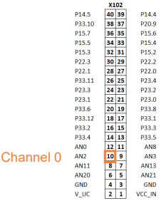
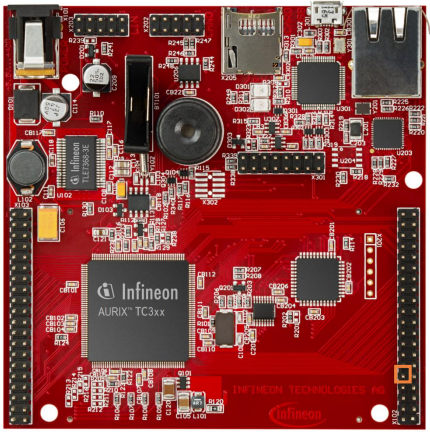
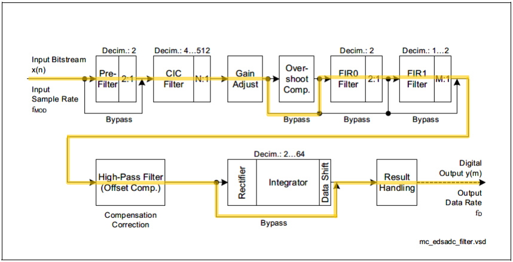
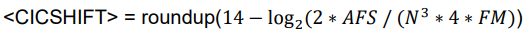
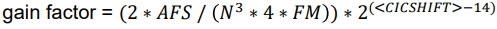
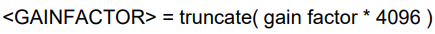
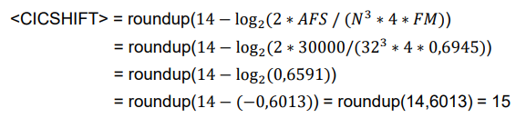
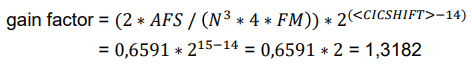
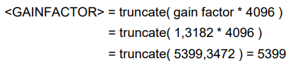
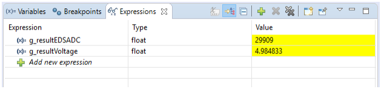

  

# EDSADC_1_KIT_TC397_TFT
The EDSADC is used to convert an external signal to a stream of discrete digital values.

## Device  
The device used in this example is AURIX&trade; TC39xTP_A-Step.

## Board  
The board used for testing is the AURIX&trade; TC397 TFT (KIT_AURIX_TC397_5V_TFT).

## Scope of work  
The Enhanced Delta-Sigma ADC (EDSADC) continuously measures an external signal on channel 0, connected to port pin AN2. It converts the analog signal to a data stream and then a global variable is updated to the current conversion result.

## Introduction  
The Enhanced Delta-Sigma Analog-to-Digital Converter module (EDSADC) of the AURIX&trade; TC39x provides a set of up to 14 analog input channels.

Each converter channel is controlled by a dedicated set of registers, which enables the independent operation of the channels.

The results of each channel can be stored in a channel-specific result register. They are signed values stored in a 16-bit two’s complement format.

To compensate manufacturing tolerances and adjust the channel to the selected decimation rate, a calibration algorithm is executed automatically by hardware.

The calibration algorithm can be enabled both during the initialization phase and during operation.

## Hardware setup  
This code example has been developed for the board KIT_A2G_TC397_5V_TFT.

The signal to be measured has to be connected to channel 0 of the EDSADC (port pin AN2).

 

 

## Implementation  

### Configuration of the EDSADC module
Configuration of the EDSADC module is done once in the setup phase by calling the initialization function *init_EDSADC()*, which contains the following steps:
- EDSADC module configuration
- EDSADC channel configuration

#### EDSADC module configuration
To configure the EDSADC module, the following steps are done:
1. The module configuration is filled with default values using an instance of the structure *IfxEdsadc_Edsadc_Config* and the function *IfxEdsadc_Edsadc_initModuleConfig()*
2. The modulator clock is set to be generated independently of the Phase Synchronizer signal
3. The EDSADC module is then initialized with the function *IfxEdsadc_Edsadc_initModule()*

#### EDSADC channel configuration
To configure the EDSADC channel, the following steps are done:
1. The channel configuration is created with an instance of the structure *IfxEdsadc_Edsadc_ChannelConfig* and filled with default values using the function *IfxEdsadc_Edsadc_initChannelConfig()*
2. The comb filter decimation factor and start value are set
3. The FIR filters in the filter chain are enabled (as shown in Configured filter chain section) and the trigger for starting the calibration during the initialization phase is set
4. The modulator is configured by setting its frequency and internally connecting the negative input to the ground, in order to configure the conversion in single-ended mode
5. The channel ID is selected and the calculated Cascated Integrator Comb (CIC) filter‘s shift and gain factor are set
6. The intended full-scale value is set (by default, it is set to 25000 after reset)
7. Finally, the channel is initialized with the function *IfxEdsadc_Edsadc_initChannel()* and the conversion is started using the function *IfxEdsadc_Edsadc_startScan()*

All the previous functions are provided by the iLLD header *IfxEdsadc_Edsadc.h*.

### Configured filter chain

 

### Factors calculation
To achieve a correct calibration, the values for the CIC shift and gain factor must be calculated according to the intended full-scale value and the selected decimation factor.

The value for the CIC shift is determined by the formula:

 

where 
- N is the selected decimation factor
- AFS is the intended calibrated full-scale value (it refers to the analog full-scale 𝑉𝐼𝑁 = 𝑉𝐴𝑅𝐸𝐹)
- FM is the modulator gain factor (when using the on-chip modulator FM = 0,6945)

The gap that comes from the rounding in the above formula is closed by computing the corresponding gain correction factor:

 

That is then multiplied by 4096 and truncated to be stored in the GAINFACTOR bitfield of GAINCORR register:

 

### Example calculation
For example, using the on-chip modulator (thus FM = 0,6945), selecting a decimation factor N = 32 and an intended full-scale value AFS = 30000

The value for the CIC shift is determined by the formula:

And the gain correction factor:

 

Which gives a GAINFACTOR bitfield of:

 

### The conversion function
The *run_EDSADC()* function is called in the while loop and continuously converts the analog voltage level on channel 0 to a digital value.

The function *IfxEdsadc_Edsadc_getMainResult()* from the iLLD header *IfxEdsadc_Edsadc.h* is used to get the latest analog to digital conversion. The digital result of EDSADC is stored in two’s complement format.

Finally, the voltage value is calculated scaling the EDSADC raw value to the range 0 – 5V, considering the intended full-scale value set in the configuration

## Compiling and programming  
Before testing this code example:  
- Power the board through the dedicated power connector
- Connect the board to the PC through the USB interface  
- Build the project using the dedicated Build button  or by right-clicking the project name and selecting "Build Project"  
- To flash the device and immediately run the program, click on the dedicated Flash button 

## Run and Test
After code compilation and flashing the device, perform the following steps:
- The signal to be measured (0 V to +5 V) should be connected to the port pin AN2
- In order to get the global variable in a stable state, the debugger should be paused or a breakpoint should be inserted in the function *run_EDSADC()*
- The measured value can be watched through the debugger in the *g_resultEDSADC* variable and the converted value in the *g_resultVoltage* variable

## References  

AURIX&trade; Development Studio is available online:  
- <https://www.infineon.com/aurixdevelopmentstudio>  
- Use the "Import..." function to get access to more code examples  

More code examples can be found on the GIT repository:  
- <https://github.com/Infineon/AURIX_code_examples>  

For additional trainings, visit our webpage:  
- <https://www.infineon.com/aurix-expert-training>  

For questions and support, use the AURIX&trade; Forum:  
- <https://community.infineon.com/t5/AURIX/bd-p/AURIX>  