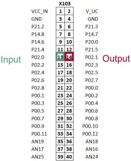
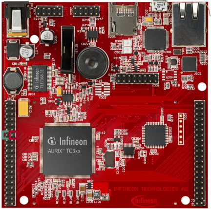

  

# ERU_Interrupt_1_KIT_TC397_TFT
A Shell is used to parse a command line and call the corresponding command execution. The ASCLIN module is used to interface with the Shell through the USB port via UART.  

## Device  
The device used in this example is AURIX&trade; TC39xTP_A-Step.

## Board  
The board used for testing is the AURIX&trade; TC397 TFT (KIT_A2G_TC397_5V_TFT).

## Scope of work  
The code example uses the External Request Unit (ERU) to generate an interrupt for each falling and rising edge at the input pin P02.0. The falling and rising edges are generated with pin P02.1. If an interrupt occurs, an LED will be toggled.

## Introduction  
The External Request Unit (ERU) is a versatile event and pattern detection unit.

Its main task is the generation of interrupts based on selectable trigger events at different inputs, e.g. to generate external interrupt requests if an edge occurs at an input pin.

The detected events can also be used by other modules to trigger or to gate module specific actions.

## Hardware setup  
This code example has been developed for the board KIT_A2G_TC397_5V_TFT.

The two pins P02.0 and P02.1 have to be connected to each other.

  

  

## Implementation  

To generate an interrupt via falling and rising edges on an input pin, a few configuration steps are required:
- Initialize external request pin (*IfxScuEru_initReqPin()*)
- Select which edge should trigger the interrupt (*IfxScuEru_enableRisingEdgeDetection()* and/or *IfxScuEru_enableFallingEdgeDetection()*)
- Enable generation of trigger events with the function *IfxScuEru_enableTriggerPulse()*
- Choose the output channel by selecting the Output Gating Unit (OGUz) and the trigger pulse output (TRxz)
  - An event from the Event Trigger Logic (ETL0) triggers the OGU0 (signal TRx0). The function *IfxScuEru_connectTrigger()* determines the output channel for the trigger event
- Select the condition to generate an interrupt with the function *IfxScuEru_setInterruptGatingPattern()*
- Configure and enable the service request with the functions *IfxSrc_init()* and *IfxSrc_enable()*

The functions above are provided by the iLLD headers *IfxScuEru.h* and *IfxSrc.h*.

The below figures from the AURIX&trade; TC3xx User’s Manual illustrate the configuration steps that were followed in this example :

 

### The Interrupt Service Routine (ISR)

Blinking an LED is implemented inside an ISR triggered by the ERU which generates interrupt requests according to its configuration.

The method implementing the ISR needs to be assigned a priority via the macro *IFX_INTERRUPT(isr, vectabNum, priority)*.

When triggered, the ISR blinks the LED by toggling the state of the connected pin using the function *IfxPort_setPinState()*.

## Compiling and programming  
Before testing this code example:  
- Power the board through the dedicated power connector
- Connect the board to the PC through the USB interface  
- Build the project using the dedicated Build button  or by right-clicking the project name and selecting "Build Project"  
- To flash the device and immediately run the program, click on the dedicated Flash button 

## Run and Test   

After code compilation and flashing the device, perform the following steps:

1. Connect the two pins P02.0 and P02.1 to each other. P02.1 is used to generate the falling and rising edges by toggling the state from high to low. P32.0 is the input of the ERU which generates the interrupts on falling and rising edges
2. Toggle the P02.1 pin state via the value of the variable *LEDstate* of the structure *g_ERUconfig* with the debugger
3. Check LED D107 (1) is changing state when the variable is modified

## References  

AURIX&trade; Development Studio is available online:  
- <https://www.infineon.com/aurixdevelopmentstudio>  
- Use the "Import..." function to get access to more code examples  

More code examples can be found on the GIT repository:  
- <https://github.com/Infineon/AURIX_code_examples>  

For additional trainings, visit our webpage:  
- <https://www.infineon.com/aurix-expert-training>  

For questions and support, use the AURIX&trade; Forum:  
- <https://community.infineon.com/t5/AURIX/bd-p/AURIX> 