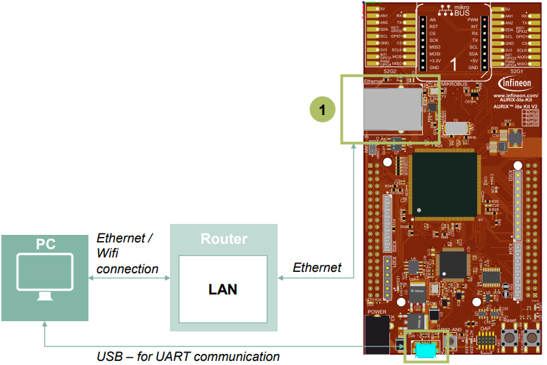
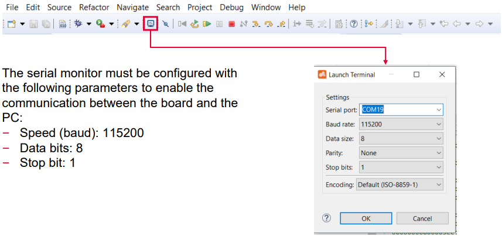

  

# Ethernet_1_KIT_TC375_LK
The Gigabit Ethernet Media Access Controller (GETH) module and the Lightweight IP (LwIP) stack are used to implement a network echo application.

## Device  
The device used in this example is AURIX&trade; TC37xTP_A-Step.

## Board  
The board used for testing is the AURIX&trade; TC375 LK (KIT_A2G_TC375_LK).

## Scope of work  
The TCP/IP protocol provided by the Lightweight IP (LwIP) is used to exchange strings between the board and a remote client terminal.  
The board obtains an IP address and publishes its hostname using the DHCP protocol.  
The System Timer Module (STM) is used to update the internal LwIP timers. The Asynchronous/Synchronous Interface (ASCLIN) module is used for debug logging.

## Introduction  
The Gigabit Ethernet Media Access Controller (GETH) implements a data link layer according to IEEE-802.3 standard, allowing the board to connect to a Local Area Network (LAN) through the onboard Ethernet PHY interface.

The PHY is the physical interface transceiver, which implements the physical layer and is an external integrated circuit mounted on the board.

Higher level protocols like the Internet Protocol (IP), the Transmission Control Protocol (TCP) and the Dynamic Host Configuration Protocol (DHCP) are implemented by software.

The following table relates the ISO/OSI model levels with their implementation in this training.

 

## Hardware setup  
This code example has been developed for the board KIT_A2G_TC375_LITE.

The network interface (1) is used for this example. The board needs to be connected with an Ethernet cable to a LAN with an enabled DHCP server.

The PC needs to be connected to the same network as the board.

  

## Implementation  

### Link between LwIP and the GETH module
To enable the LwIP stack to use the GETH module as network hardware, it is needed to implement the necessary drivers according to the LwIP interfaces. The driver implementation is contained in the folder *Libraries/Ethernet/lwip/port*.

### Configuration of LwIP
LwIP is configured by means of macros, which can be found in the file *Configurations/lwipopts.h*.

This project makes use of the TCP protocol (enabled by default) and uses the LwIP “raw” API (Netconn and Socket APIs are disabled, macros *LWIP_NETCONN* and *LWIP_SOCKET*).

The DHCP Protocol is used to obtain an IP address by a DHCP server in the network (macro *LWIP_DHCP*).

Operating System support by the LwIP is disabled, a single thread will be used (macro *NO_SYS*).

### Initialization of GETH module
The Gigabit Ethernet module is enabled with the function *IfxGeth_enableModule()* from the iLLD *IfxGeth_Eth.h*.

### Initialization of LwIP
LwIP is initialized calling the function *Ifx_Lwip_init()* from the driver implementation *Ifx_Lwip.h*.

### LwIP operation
LwIP stack functions and protocols are triggered by its internal timers, which need to be regularly increased. LwIP timers are increased every millisecond by an ISR (*updateLwIPStackISR()*) triggered by the STM module.

After updating the timers, the LwIP can execute its active protocols (e.g. DHCP, TCP, ARP) calling the function *Ifx_Lwip_pollTimerFlags()* and read the received data (function *Ifx_Lwip_pollReceiveFlags()*).

### Debugging through UART interface
In this tutorial, the UART connection is used to make the debugging more convenient and easier to understand.
- The LwIP macro *LWIP_PLATFORM_DIAG*, which is used by the debug macro *LWIP_DEBUG* to print a debug message, has been redefined in the LwIP driver implementation (file *Libraries/Ethernet/lwip/port/include/arch/cc.h*) to use UART communication through the AURIX&trade; ASCLIN module
- Any debug message and state message can be read by connecting the board through a serial terminal

### The Echo application
The application layer, which implements the “Echo“ logic, is contained in the file *Echo.c*.

The implementation is based on the LwIP RAW (or native) API, which allows the maximum performance and lowest memory footprint. On the other side the RAW API is not thread safe, and shall not be used from multiple threads. The RAW API execution is driven by callback functions which are invoked when application-related events occur.

The following callbacks function are registered at initialization time:
- *echoAccept()*: Executed every time a new network connection is established
- *echoRecv()*: Executed every time data is received from the remote client
- *echoSent()*: Executed every time data is successfully sent to the remote client
- *echoError()*: Executed in case of an unrecoverable network error
- *echoPoll()*: Executed periodically according to the LwIP internal TCP timer

The state of every Echo session is stored in the *EchoSession* structure. In particular, it contains the following information:
- The *EchoSession.state* parameter, which describes if the session is currently initializing (*ES_ACCEPTED*), already receiving data (*ES_RECEIVING*), or is going to be disposed (*ES_CLOSING*)
- A pointer to the TCP control block which was assigned to this session (*EchoSession.pcb*). This represents the TCP connection managed by LwIP, which is used to send and receive data
- A pointer to a chain of packet buffers (*EchoSession.p*) that stores the raw data sent by the remote client which has been received and saved in memory by LwIP, but has not been yet processed by the Echo implementation
- The processed data (*EchoSession.storage*) which is waiting to be sent back to the remote client, and the index of the next free position where the new received data can be written to (*EchoSession.nextFreeStoragePos*)

## Compiling and programming  
Before testing this code example:  
- Power the board through the dedicated power connector
- Connect the board to the PC through the USB interface  
- Build the project using the dedicated Build button  or by right-clicking the project name and selecting "Build Project"  
- To flash the device and immediately run the program, click on the dedicated Flash button 

## Run and Test   
For this training, a serial monitor is required for communicating with the device. The monitor can be opened inside the AURIX&trade; Development Studio using the following icon:

After code compilation and flashing the device, perform the following steps:
- Ensure that the connections presented in the Hardware Setup section are established
- Open a connection with the board using the serial terminal with the previous configuration
- Resume the debug session and observe the terminal output to verify the board was successful in obtaining an IP address from the DHCP server:

- Connect to the board using a protocol which supports ASCII characters. For this example *PuTTY* is used, which supports data streams of RAW characters.

- Press “Open” to establish a network connection with the board
- The board sends the Infineon Logo and waits for an input

- Write any text and press “Enter”: the board receives it and sends it back through the network

## References  

AURIX&trade; Development Studio is available online:  
- <https://www.infineon.com/aurixdevelopmentstudio>  
- Use the "Import..." function to get access to more code examples  

More code examples can be found on the GIT repository:  
- <https://github.com/Infineon/AURIX_code_examples>  

For additional trainings, visit our webpage:  
- <https://www.infineon.com/aurix-expert-training>  

For questions and support, use the AURIX&trade; Forum:  
- <https://community.infineon.com/t5/AURIX/bd-p/AURIX>  