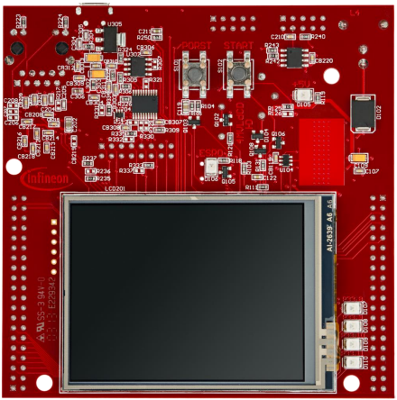
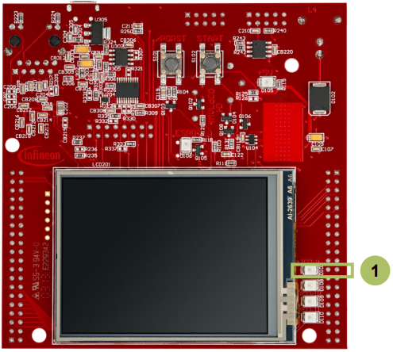

  

# FCE_CRC_1_KIT_TC397_TFT
The FCE module is used to calculate the CRC of a message with a CRC32 algorithm.

## Device  
The device used in this example is AURIX&trade; TC39xTP_A-Step.

## Board  
The board used for testing is the AURIX&trade; TC397 TFT (KIT_A2G_TC397_5V_TFT).

## Scope of work  
This training shows how to configure the FCE to calculate CRC of a known message with a CRC32 algorithm. The FCE interrupt is enabled to report execution errors. Any CRC kernel calculation error is indicated by switching ON an LED.

## Introduction  
The Flexible CRC Engine (FCE) provides a parallel implementation of Cyclic Redundancy Code (CRC) algorithms.

FCE module supported algorithms:
- IEEE 802.3 Ethernet CRC32 polynomial (used in this example)
- AUTOSAR safety polynomial CRC32P4
- CCITT CRC16 polynomial
- SAE J1850 CRC8 polynomial

CRC algorithms are used to calculate message signatures that can be used to check message integrity during transport over communication.

## Hardware setup  
This code example has been developed for the board KIT_A2G_TC397_5V_TFT.
 
 

## Implementation  

### Initialization
The initialization of the module is done via *init_FCE_CRC()*, which contains:
- the FCE module initialization, using the function *IfxFce_Crc_initModule()*
- the CRC algorithm initialization, using the function *IfxFce_Crc_initCrc()*

### Execution
The execution is started with the function *run_FCE_CRC()*, which calculates CRC32 algorithm using *IfxFce_Crc_calculateCrc()* function.
All functions, needed for using the FCE CRC calculation, are provided by the iLLD header *IfxFce_Crc.h*.

### FCE Error Interrupt Service Routine
The ISR will be executed in case of a CRC calculation error. It scans the kernel status register and checks if the error flag is set.

### Configure and control the LED
An LED is configured to be switched on/off by the controlling port pin to which it is connected using methods from the iLLD header *IfxPort.h*.

In the setup phase, the port pin of the LED has to be configured as push-pull output using the function *IfxPort_setPinMode()*.

If CRC calculation errors occur, the LED is switched on using the function *IfxPort_setPinLow()*.

## Compiling and programming  
Before testing this code example:  
- Power the board through the dedicated power connector
- Connect the board to the PC through the USB interface  
- Build the project using the dedicated Build button  or by right-clicking the project name and selecting "Build Project"  
- To flash the device and immediately run the program, click on the dedicated Flash button 

## Run and Test
After code compilation and flashing the device, observe the LED behavior.

The LED1 (1) should be switched Off if the CRC algorithm calculation is correct (Result = Expected).

## References  

AURIX&trade; Development Studio is available online:  
- <https://www.infineon.com/aurixdevelopmentstudio>  
- Use the "Import..." function to get access to more code examples  

More code examples can be found on the GIT repository:  
- <https://github.com/Infineon/AURIX_code_examples>  

For additional trainings, visit our webpage:  
- <https://www.infineon.com/aurix-expert-training>  

For questions and support, use the AURIX&trade; Forum:  
- <https://community.infineon.com/t5/AURIX/bd-p/AURIX>  