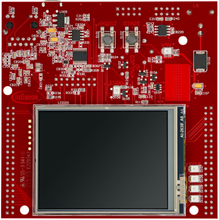

  

# Flash_Programming_1_KIT_TC397_TFT
This example shows how to flash the Program Flash memory and the Data Flash memory. 

## Device  
The device used in this example is AURIX&trade; TC39xTP_A-Step.

## Board  
The board used for testing is the AURIX&trade; TC397 TFT (KIT_A2G_TC397_5V_TFT).

## Scope of work  
In this example, 64 Bytes of the Program Flash memory (PFLASH) are flashed and verified afterwards. Furthermore, 64 Bytes of the Data Flash memory (DFLASH) are flashed and verified.  
Before any write operation, the flash memories are erased. If the flash operation is successful, an LED for each tested memory is turned ON.

## Introduction  
The Data Memory Unit (DMU) controls command sequences executed on the Program and Data Flash memories (PFLASH and DFLASH), interfacing with the Flash Standard Interface (FSI) and the Program Flash Interface (PFI).

The FSI executes erase, program and verify operations on all flash memories.

The PFI provides a unique point-to-point fast connection for each PFLASH bank to a CPU.

The AURIX&trade; TC39x device features:
- 6 Program Flash Banks (PFx)
- 2 Data Flash Banks (DFx)

The AURIX&trade; TC3xx devices feature PFLASH Banks PFx based on the same sector structure. PFx banks may vary in size:
- 3 Mbyte Program Flash Bank
- 2 Mbyte Program Flash Bank
- 1 Mbyte Program Flash Bank

AURIX&trade; TC39x features five Program Flash banks (PF0..PF4) with dimension of 3 Mbyte and one Program Flash bank (PF5) with dimension of 1 Mbyte. Each Program Flash bank is divided into Physical Sectors with dimension of 1024 Kbytes and each Physical Sector is divided into 64 Logical Sectors with dimension of 16 Kbytes.

AURIX&trade; TC39x features two Data Flash banks, DFLASH0 and DFLASH1. Both include multiple EEPROM sectors commonly used for EEPROM emulation. Only DFLASH0 includes User Configuration Blocks (UCBs) for data protection and a Configuration Sector (CFS), which is not directly accessible by the user.

The DFLASH EEPROM can be either configured in single ended mode (default) or in complement sensing. Depending on the selected mode, the size of each sector is set to 4 Kbytes and respectively 2 Kbytes.

The minimum amount of data that can be programmed in a flash memory is a page :
- Program Flash pages are made of 32 Bytes
- Data Flash pages are made of 8 Bytes

A page can be programmed only after an erase operation.

The smallest unit on which an erase operation can be performed is a Logical Sector.

AURIX&trade; TC39x Program Flash memory :

 

AURIX&trade; TC39x Data Flash memory :

 

All the flash operations are performed with command sequences.

The DMU has a Command Sequence Interpreter (CSI) to process command sequences.

A minimum sequence of commands for programming the Program Flash memory or the Data Flash memory, is the following:
- Erase the Logical Sectors to be programmed afterwards
- Wait until the flash memory is ready (not busy)
- Enter page mode
- Wait until the flash memory is ready (not busy)
- Load data to be written in a page
- Write the page
- Wait until the flash memory is ready (not busy)

**Note**: Code that performs PFLASH programming or erasing should not be executed from the same PFLASH.

## Hardware setup  
This code example has been developed for the board KIT_A2G_TC397_5V_TFT.
 
 

## Implementation  

### Flashing the Program Flash memory
To perform PFLASH programming, it is recommended to run the code from a memory location different from the PFLASH that is going to be programmed.
For this reason, before starting the flash operations, the erase and program routines are copied in the Program Scratch-Pad SRAM (PSPR) of the CPU0 by the function *copyFunctionsToPSPR()*. 
This uses the *memcpy()* function from the standard c library *string.h* and assigns a function pointer to the new memory location.

Then, the actual flash programming operations start by erasing the involved Logical Sectors.

### Erase of Logical Sectors
To perform an erase operation, writes have to be enabled on the PFLASH by clearing the EndInit Protection bit, done through the function *IfxScuWdt_clearSafetyEndinitInline()*.  
Then, the erase command sequence for one or more consecutive Logical Sectors can be executed through the *IfxFlash_eraseMultipleSectors()* function, executed from the PSPR by the function pointer *eraseSectors()*.  
Finally, the EndInit Protection bit must be set again through the function *IfxScuWdt_setSafetyEndinitInline()*.  
The function *IfxFlash_waitUnbusy()*, called by the function pointer *waitUnbusy()*, stalls until the sector is erased and the PFLASH is ready again.

### Write operations
After erasing the needed Logical Sectors, the write operations can start.

The function *IfxFlash_enterPageMode()* called from the PSPR by the function pointer *enterPageMode()* is used to enter page mode.  
The function *waitUnbusy()* is used to stall until the PFLASH is ready and then, the data that has to be written in a page is loaded calling repetitively the function *IfxFlash_loadPage2X32()*, executed from the PSPR with the function pointer *load2X32bits()*.

The loaded page is then written by calling the function pointer writePage(), which executes the *IfxFlash_writePage()* function from the PSPR (before and after the write operation, the EndInit Protection bit is cleared and respectively set). 
Finally, *waitUnbusy()* is called to wait until the page has been written and the PFLASH is ready again then, the write process can be repeated until all the required data has been successfully written in the PFLASH.

After the flashing operations, the data is read from the PFLASH exploiting the macro *MEM(address)*, and, if it is correct, an LED is turned on.

All the functions used for executing the command sequences for the flashing operations can be found in the iLLD header *IfxFlash.h*, while the function pointers are declared and assigned in the *Flash_Programming.c* file.

### Flashing the Data Flash memory
The procedure for flashing the Data Flash memory is the same used for flashing the Program Flash memory, but in this case the functions for executing the command sequences for erasing, waiting, loading and writing can be called directly from the PFLASH, thus copying them into the PSPR is not needed.

After the flashing operations, the data is read from the DFLASH exploiting the macro *MEM(address)*, and, if it is correct, an LED is turned on.

### Configure and control the LEDs
Two LEDs are configured using methods from the iLLD header *IfxPort.h*.

The port pins to which the LEDs are connected are configured as push-pull output using the function *IfxPort_setPinMode()*.

To turn on and off the LEDs, the function *IfxPort_setPinState()* is used.

## Compiling and programming  
Before testing this code example:  
- Power the board through the dedicated power connector
- Connect the board to the PC through the USB interface  
- Build the project using the dedicated Build button  or by right-clicking the project name and selecting "Build Project"  
- To flash the device and immediately run the program, click on the dedicated Flash button 

## Run and Test
After code compilation and flashing the device, observe the behavior of the LEDs.

Check that LED1 (1) and LED2 (2) are turned on:
- LED1 is turned on to indicate that the PFLASH memory was correctly written
- LED2 is turned on to indicate that the DFLASH memory was correctly written

Check the actual PFLASH memory as an additional test:
- Set two breakpoints in the *Flash_Programming.c* file inside the *writeProgramFlash()* function:
  - After calling the *eraseFlash()* function
  - After calling the *writeFlash()* function
- Run the debugger
- In the memory view, add the address 0xA00E0000
- Resume the debugger and check that when it stops at the first breakpoint, the PFLASH is erased (the memory viewer will show either 0s or 0xEEEEEEEE because it cannot read the erased memory)
- Resume the debugger again and check that when it stops at the second breakpoint, the PFLASH is correctly programmed

Check the actual DFLASH memory as an additional test:
- Set two breakpoints in the *Flash_Programming.c* file inside the *writeDataFlash()* function:
  - After calling the *IfxFlash_eraseMultipleSectors()* function
  - After the for loop for writing the DFLASH
- Run the debugger
- In the memory view, add the address 0xAF000000
- Resume the debugger and check that when it stops at the first breakpoint, the DFLASH is erased (the memory viewer will show either 0s or 0xEEEEEEEE because it cannot read the erased memory)
- Resume the debugger again and check that when it stops at the second breakpoint, the DFLASH is correctly programmed

## References  

AURIX&trade; Development Studio is available online:  
- <https://www.infineon.com/aurixdevelopmentstudio>  
- Use the "Import..." function to get access to more code examples  

More code examples can be found on the GIT repository:  
- <https://github.com/Infineon/AURIX_code_examples>  

For additional trainings, visit our webpage:  
- <https://www.infineon.com/aurix-expert-training>  

For questions and support, use the AURIX&trade; Forum:  
- <https://community.infineon.com/t5/AURIX/bd-p/AURIX>  