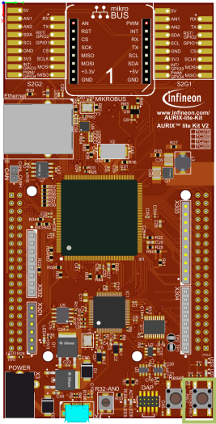
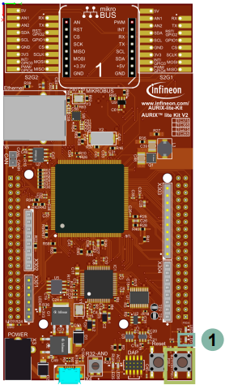

  

# GPIO_LED_Button_1_KIT_TC375_LK
A Shell is used to parse a command line and call the corresponding command execution. The ASCLIN module is used to interface with the Shell through the USB port via UART.  

## Device  
The device used in this example is AURIX&trade; TC37xTP_A-Step.

## Board  
The board used for testing is the AURIX&trade; TC375 lite Kit (KIT_A2G_TC375_LITE).

## Scope of work  
Upon pressure of a push button, an LED is turned on and the LED is turned off when releasing the button. One port pin is configured as input for checking the push button state and the other port pin is configured as output to control the LED.

## Introduction  
The port pins of AURIX&trade; can individually be configured either as input or as output.

When configured as input, the port pin has high impedance. Alternatively, an internal weak pull-up resistor or pull-down resistor can be selected.

As output the port pin can be configured in push-pull output state or open-drain state.

The state of a port pin can always be read back, independent whether a port pin is configured as input or output.

## Hardware setup  
This code example has been developed for the board KIT_A2G_TC375_LITE.

  

## Implementation  

### Configuring the port pins
The function *init_GPIOs()* configures one port pin to control an LED and one port pin to check the button’s state.
- The port pin with the connected LED is configured to push-pull output by calling the function *IfxPort_setPinMode()* with the function parameter *IfxPort_Mode_outputPushPullGeneral* (enumerated type value)
- The port pin connected to the push button is set to input direction with an internal weak pull-up by calling *IfxPort_setPinMode()* with the function parameter *IfxPort_Mode_inputPullUp*

All functions above are provided by the iLLD header *IfxPort.h*.

### Controlling the LED
The function *control_LED()* reads the state of the push button and, depending on the push button’s state, an LED is turned on or off:
- The port pin state is read by calling the function *IfxPort_getPinState()*
- The port pin with the connected LED is set to low or high by using the function *IfxPort_setPinState()*

All functions are provided by the iLLD header *IfxPort.h*.

## Compiling and programming  
Before testing this code example:  
- Power the board through the dedicated power connector
- Connect the board to the PC through the USB interface  
- Build the project using the dedicated Build button  or by right-clicking the project name and selecting "Build Project"  
- To flash the device and immediately run the program, click on the dedicated Flash button 

## Run and Test
After code compilation and flashing the device, you can observe the following behavior:
-  While the button is pressed, the LED (1) stays on

  

## References  

AURIX&trade; Development Studio is available online:  
- <https://www.infineon.com/aurixdevelopmentstudio>  
- Use the "Import..." function to get access to more code examples  

More code examples can be found on the GIT repository:  
- <https://github.com/Infineon/AURIX_code_examples>  

For additional trainings, visit our webpage:  
- <https://www.infineon.com/aurix-expert-training>  

For questions and support, use the AURIX&trade; Forum:  
- <https://community.infineon.com/t5/AURIX/bd-p/AURIX>  