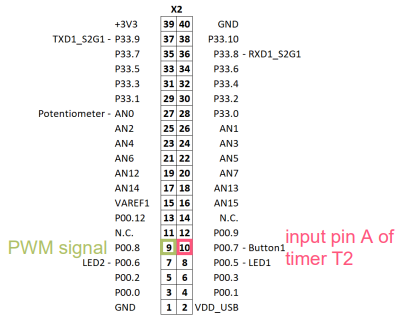
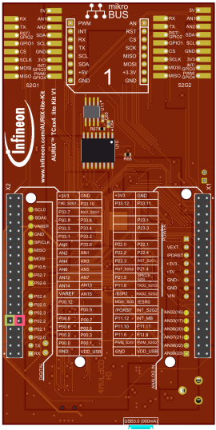
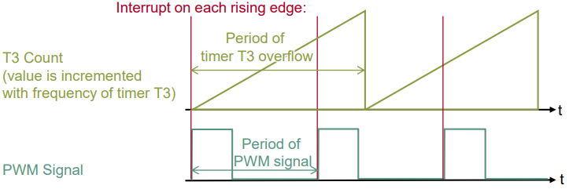
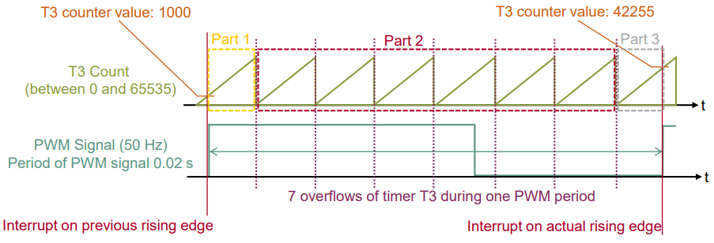
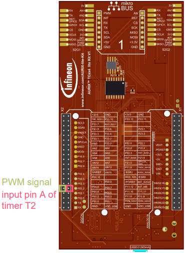

  

# GPT12_PWM_Capture_1_KIT_TC334_LK
The GPT12 unit is used to capture an external PWM signal and calculate the PWM frequency.

## Device  
The device used in this example is AURIX&trade; TC33xTP_A-Step.

## Board  
The board used for testing is the AURIX&trade; TC334 lite Kit (KIT_A2G_TC334_LITE).

## Scope of work  
GPT12 timers are configured in capture mode. The data from the captured PWM signal is used to calculate the PWM frequency in software. The frequency is then stored in a variable.

## Introduction  
The General Purpose Timer Unit (GPT12) is divided into two GPT blocks (GPT1 and GPT2).

Both timer blocks incorporate five 16-bit timers which can operate independently in several different modes.

Block GPT1 contains three timers/counters: the core timer T3 and two auxiliary timers T2 and T4.

All three timers of block GPT1 can run in Timer, Gated Timer, Counter or Incremental Interface Mode.

Additionally, timer T2 and T4 can be used as capture or reload registers for the core timer T3.

In this example, Timer T2 (Capture Mode) captures the value of timer T3 (Timer Mode).

## Hardware setup  
This code example has been developed for the board KIT_A2G_TC334_LITE.

Connect the two pins P00.8 (PWM signal) and P00.7 (GPT1 T2 input) to each other.

  
  

## Implementation  

### Configuration of the GPT12 Module
The function *init_GPT12_module()* is used to configure the two timers T2 and T3 of block GPT1 in Capture Mode, respectively Timer Mode. It contains the following steps:
- Enable GPT12 module by calling the function *IfxGpt12_enableModule()*
- Set the GPT1 prescaler with *IfxGpt12_setGpt1BlockPrescaler()*
- The functions *IfxGpt12_T3_setMode()* and *IfxGpt12_T2_setMode()* are called to configure the modes of both timers by using the enumerated values *IfxGpt12_Mode_timer* and *IfxGpt12_Mode_capture*
- Select port pin P00.7 (the James Bond pin) with the parameter *IfxGpt12_Input_A* and the function *IfxGpt12_T2_setInput()*
- The capture event is configured to be on the rising edge of the input pin with the function *IfxGpt12_T2_setCaptureInputMode()*
- *IfxGpt12_T3_run()* starts the core timer T3

The functions above are provided by the iLLD header *IfxGpt12.h*.

### Configuring the interrupt service routing for GPT1
The triggering of each interrupt service routine is activated by setting the service provider and the serial priority number in the Service Request Control (SRC) registers of both timers with the functions *IfxSrc_init()* and *IfxSrc_enable()*.

The pointers to the SRC registers are returned by the functions *IfxGpt12_T2_getSrc()* and *IfxGpt12_T3_getSrc()*.

The above-mentioned functions are provided by the iLLD header *IfxSrc.h*.

The method implementing the ISR needs to be assigned a priority via the macro *IFX_INTERRUPT(isr, vectabNum, priority)*.

### The Interrupt Service Routine (ISR)
Each rising edge on the input pin A of timer T2 triggers the ISR:
- Counter value of T3 is latched automatically to auxiliary timer T2
- Calculate PWM frequency by dividing the frequency of timer T3 by the total amount of increments of timer T2 (the time between two rising edges)
- The frequency calculation takes into account that an overflow of timer T3 might occur between two rising edges of the PWM signal (An overflow of timer T3 triggers a second interrupt which is used for counting the overflows between two rising edges)

 

### Calculation example
Background knowledge:
- Maximum value of timer T3 is *65535* (16 bit)
- Frequency of GPT12 module is 100 MHz
- Prescaler of GPT1 block is set to 4
- Timer T3 frequency is 100 MHz / 4 = *25 MHz*, which means the value of timer T3 will be incremented every *40 ns* (1 / 25 MHz)
- Overflow of timer T3 after ≈ *0.0026 s* (65535 * 40 ns) which equals ≈ 381 Hz
- The total amount of increments can be calculated by comparing the current value of timer T2 with the value of timer T2 one PWM period ago e.g. *1000*

### Calculation example
Example for 50 Hz PWM signal:
- Period time of 50 Hz signal *is 0.02 s*
- Within 0.02 s, the timer T3 is incremented *500000* times (0.02 s / 40 ns) and has 7 overflows
- Parameters available in the ISR:
  - Counter value of timer T2 one period ago: *1000*
  - Current counter value of timer T2: *42255*
  - Amount of overflows: *7*
- Calculation of total amount of increments:
  - Increments before first overflow: 65535 - 1000 = *64535*
  - Increments during the second and the last overflow: (7-1) * 65535 = *393210*
  - Increments after last overflow: *42255*
  - Total amount of increments: *64535 + 393210 + 42255 = 500000*
- Calculation of the PWM frequency by dividing the frequency of timer T3 by the total amount of increments during one PWM period:
  - 25 MHz / 500000 = *50 Hz*

Part 1: 64535 increments before first overflow: 65535 -1000 = 64535 (Max value of T3 – counter value at rising edge = total increments)  
Part 2: 393210 increments between the second and last overflow: 6 * 65535 = 393210 (6 overflows * max value of T3 = total increments)  
Part 3: 42255 increments after last overflow: 42255 (counter value at rising edge)  
Total increments between two rising edges: 64535 + 393210 + 42255 = 500000

 

### Generation of PWM signal
The generation of a simple PWM signal is done by toggling a pin within the function *generate_PWM_signal()*.

The state of the output port pin P00.8 is toggled by calling the function *IfxPort_setPinState()* with the parameters *IfxPort_State_high* and *IfxPort_State_low* provided by iLLD header *IfxPort.h*.

The period of the generated PWM signal can be adapted by changing the timeout parameter of the two *wait()* function calls (header *Bsp.h*).

For changing the frequency of the PWM signal the global parameter *g_generatedPwmFreq_Hz* can be modified.

The calculation of the two timeout values for toggling the pin state is done by software.

## Compiling and programming  
Before testing this code example:  
- Power the board through the dedicated power connector
- Connect the board to the PC through the USB interface  
- Build the project using the dedicated Build button  or by right-clicking the project name and selecting "Build Project"  
- To flash the device and immediately run the program, click on the dedicated Flash button 

## Run and Test
After code compilation and flashing the device, perform the following steps:
1. Connect the two pins P00.8 (PWM signal) and P00.7 (GPT1 T2 input) to each other
2. Check the parameter *g_measuredPwmFreq_Hz* in the debugger. Its value should be similar to the parameter *g_generatedPwmFreq_Hz* 
3. Change the parameter *g_generatedPwmFreq_Hz* and check if *g_measuredPwmFreq_Hz* changes accordingly 

  

## References  

AURIX&trade; Development Studio is available online:  
- <https://www.infineon.com/aurixdevelopmentstudio>  
- Use the "Import..." function to get access to more code examples  

More code examples can be found on the GIT repository:  
- <https://github.com/Infineon/AURIX_code_examples>  

For additional trainings, visit our webpage:  
- <https://www.infineon.com/aurix-expert-training>  

For questions and support, use the AURIX&trade; Forum:  
- <https://community.infineon.com/t5/AURIX/bd-p/AURIX>  