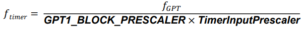

  

# GPT12_PWM_Generation_1_KIT_TC397_TFT
A pulse width modulated (PWM) signal with fixed frequency and a defined duty cycle is generated using GPT12.

## Device  
The device used in this example is AURIX&trade; TC39xTP_A-Step.

## Board  
The board used for testing is the AURIX&trade; TC397 TFT (KIT_A2G_TC397_5V_TFT).

## Scope of work  
The timer T3 of GPT1 is used in timer mode with its count direction configured to “down-counting”. On underflow of timer T3, the Output Toggle Latch (T3OTL) is toggled and the value of timer T2 or T4 is transferred into timer T3 depending on T3OTL value. The state of an LED is toggled in an interrupt service routine which is triggered by the timer T3.

## Introduction  
The General Purpose Timer Unit (GPT12) is made of two GPT blocks (GPT1 and GPT2).

Each block has a multifunctional timer structure which incorporates several 16-bit timers.

Block GPT1 contains three timers: the core timer T3 and two auxiliary timers T2 and T4.

All three timers of block GPT1 can run in one of four modes: Timer Mode, Gated Timer Mode, Counter Mode or Incremental Interface Mode.

## Hardware setup  
This code example has been developed for the board KIT_A2G_TC397_5V_TFT.

LED D107 (1) is used for this example.

  

## Implementation  

### Configure the GPT12 Module 
To generate a PWM signal with the GPT1 block, it is needed to:
- Enable the GPT12 module 
- Configure the frequency for the block GPT1 by setting the prescaler value (BPS1) of the divider
- Configure the frequency for the timer T3 by setting the prescaler value (T3I) of the divider
- Configure the timer T3 mode, direction and starting value
- Configure the two auxiliary timers (timer mode, reload input mode and reload values) to reload the timer T3

The above steps are detailed in the following slides.

Configuration of the GPT12 is done once in the function *initGpt12PWM()* by the following steps:
- Enable GPT12 module by calling the iLLD function *IfxGpt12_enableModule()*
- Set GPT1 prescaler with the iLLD function *IfxGpt12_setGpt1BlockPrescaler()*
- Configure the mode of timer T3 by using the iLLD function *IfxGpt12_T3_setMode()*
- Set the counting direction of the timer T3 by calling the iLLD function *IfxGpt12_T3_setTimerDirection()*
- Set the prescaler of timer T3 by calling the iLLD function *IfxGpt12_T3_setTimerPrescaler()*
- Set the timer value with the iLLD function *IfxGpt12_T3_setTimerValue()* and use an *uint16* number as parameter

The configuration functions above are provided by the iLLD header *IfxGpt12.h*.

### Reload Values calculation example
Calculating the correct reload value to generate a PWM signal, depending on the given frequency f and duty cycle, is done in the initialization function *initGpt12PWM()*:
- Get the GPT12 module base frequency 𝑓𝐺𝑃𝑇 by calling the iLLD function *IfxGpt12_getModuleFrequency()*
- Calculate the timer frequency with the following formula:

  

The GPT1 block prescaler is set to *IfxGpt12_Gpt1BlockPrescaler_32*, 𝑓𝐺𝑃𝑇 is divided by *32*
The timer prescaler is set to *IfxGpt12_TimerInputPrescaler_32*, 𝑓𝐺𝑃𝑇 is divided by *32*
- Calculate dutyUpTime and dutyDownTime with the following formulas:

 

### Configuring timers T2 and T4 to enable the reload of timer T3
Configurations of timers T2 and T4 are done once in the function *initGpt12Timer()* by the following steps:
- Configure timers T2 and T4 in reload mode by using the iLLD function *IfxGpt12_T2_setMode()* and *IfxGpt12_T4_setMode()*
- Set the trigger event for reload of timer T3 by using the iLLD functions *IfxGpt12_T2_setReloadInputMode()* and *IfxGpt12_T4_setReloadInputMode()*
- Set timer T2 value with the iLLD function *IfxGpt12_T2_setTimerValue()* and *dutyDownTime* as parameter
- Set timer T4 value with the iLLD function *IfxGpt12_T4_setTimerValue()* and *dutyUpTime* as parameter

### Starting timer T3
Finally, starting the timer T3 is done in the function *runGpt12PWM()* by calling the iLLD function *IfxGpt12_T3_run()*.

The above functions are provided by the iLLD header *IfxGpt12.h*.

### Configuring the interrupt for GPT12
Configuration of the interrupt is done once in the function *initGpt12Timer()* by the following steps:
- Get the address of timer T3 service request with the iLLD function *IfxGpt12_T3_getSrc()*
- Initialize GPT12 interrupt by calling *IfxSrc_init()* with a pointer to the address of the timer T3 service request, the interrupt provider and the interrupt priority number as parameters
- Enable GPT12 interrupt with the iLLD function *IfxSrc_enable()* and the pointer to the address of timer T3 service request as parameter

The function *IfxGpt12_T3_getSrc()* is provided by the header *IfxGpt12.h* and the functions *IfxSrc_init()* and *IfxSrc_enable()* are provided by the header *IfxSrc.h*.

### Configuring the LED
The LED is configured and toggled by controlling the port pin to which it is connected. 

In the setup phase, the port pin is configured in output push-pull mode using the function *IfxPort_setPinModeOutput()*.

### The Interrupt Service Routine (ISR)
The ISR implemented in this example calls the iLLD function *IfxPort_togglePin()* to toggle the LED‘s state.  
The interrupt is triggered every time the timer T3 generates an underflow.  
On underflow of timer T3, the Output Toggle Latch (T3OTL) is toggled and the value of timer T2 or T4 is transferred into timer T3 depending on T3OTL value. 

Both functions are provided by the iLLD header *IfxPort.h*.

## Compiling and programming  
Before testing this code example:  
- Power the board through the dedicated power connector
- Connect the board to the PC through the USB interface  
- Build the project using the dedicated Build button  or by right-clicking the project name and selecting "Build Project"  
- To flash the device and immediately run the program, click on the dedicated Flash button 

## Run and Test
After code compilation and flashing the device, observe the LED D107 (1), which should be blinking 2 times in a second.

  

## References  

AURIX&trade; Development Studio is available online:  
- <https://www.infineon.com/aurixdevelopmentstudio>  
- Use the "Import..." function to get access to more code examples  

More code examples can be found on the GIT repository:  
- <https://github.com/Infineon/AURIX_code_examples>  

For additional trainings, visit our webpage:  
- <https://www.infineon.com/aurix-expert-training>  

For questions and support, use the AURIX&trade; Forum:  
- <https://community.infineon.com/t5/AURIX/bd-p/AURIX>  