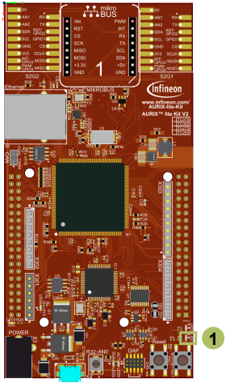

  

# GPT12_Timer_Concatenation_1_KIT_TC375_LK
A 32-bit timer is formed by the concatenation of two timers of the GPT12 module. On timer overflow an interrupt is generated, which toggles an LED.

## Device  
The device used in this example is AURIX&trade; TC37xTP_A-Step.

## Board  
The board used for testing is the AURIX&trade; TC375 lite Kit (KIT_A2G_TC375_LITE).

## Scope of work  
A 32-bit timer is formed by the concatenation of two 16-bit timers of the GPT12 module. When the 32-bit timer overflows, an interrupt is generated toggling an LED.

## Introduction  
The General Purpose Timer Unit GPT12 is divided into two GPT blocks (GPT1 and GPT2).

The GPT12 unit incorporates five 16-bit timers which may operate independently in several different modes.

Block GPT2 contains two timers/counter: the core timer T6 and one auxiliary timer T5.

Both timers of block GPT2 can run in Timer Mode, Gated Timer Mode or Counter Mode.

An additional Capture/Reload register (CAPREL) supports also capture and reload operation.

The timer T5 in Counter Mode and the timer T6 in Timer Mode are used together in this example.

## Hardware setup  
This code example has been developed for the board KIT_A2G_TC375_LITE.

LED1 (1) is used for this example.

  

## Implementation  

### Configure the GPT12 Module 
The function *init_GPT12_module()* is used to configure the two timers T5 and T6 of GPT2 for concatenated 32-bit operation. It contains the following steps:
- The GPT12 module is enabled by calling the function *IfxGpt12_enableModule()*
- GPT2 prescaler is set to *IfxGpt12_Gpt2BlockPrescaler_2* to get the highest possible frequency by calling *IfxGpt12_setGpt2BlockPrescaler()*
- The functions *IfxGpt12_T6_setMode()* and *IfxGpt12_T5_setMode()* are used to configure the modes of both timers. The core timer T6 is set to *IfxGpt12_Mode_timer* and the auxiliary timer T5 is set to *IfxGpt12_Mode_counter*
- Both the rising and falling edge of the Output Toggle Latch of timer T6 are selected as active transition with the function *IfxGpt12_T5_setCounterInputMode()*
- The function *IfxGpt12_T5_setRemoteControl()* configures the timer T5 to be activated by the run bit of core timer T6. *IfxGpt12_T6_run()* function starts timer T6 and implicitly timer T5, because the overflow of T6 is used as clock for T5

The functions above are provided by the iLLD header *IfxGpt12.h*.

### Configuring the interrupt service routing for block GPT2
The function *IfxGpt12_T5_getSrc()* returns the pointer to the service request control (SRC) register of timer T5.

The function *IfxGpt12_T6_getSrc()* returns the pointer to the SRC register of timer T6.

The above-mentioned pointers to the SRC registers are used to initialize and enable the ISRs by setting the service provider and the priority number. This is done via the functions *IfxSrc_init()* and *IfxSrc_enable()* provided by the iLLD header *IfxSrc.h*.

The method implementing the ISR needs to be assigned a priority via the macro *IFX_INTERRUPT(isr, vectabNum, priority)*.

### The Interrupt Service Routines (ISRs)
The incrementation of the counter values is different for both timers:
- The counter of timer T6 (Timer Mode) is incremented with the frequency of timer T6
- The counter of timer T5 (Counter Mode) is incremented by each overflow of timer T6

The overflow of each timer triggers an interrupt.

Each timer has associated its own Interrupt Service Routine.

The ISR of timer T6 is triggered after the overflow of the 16-bit timer value of timer T6.

Due to the timer concatenation, the ISR of timer T5 is triggered with the overflow of the 32-bit timer value. This ISR toggles an LED.

The 32-bit timer value is calculated in the ISR of T6 and is represented by *timerValueHIGH* (T5) and *timerValueLOW* (T6).

## Compiling and programming  
Before testing this code example:  
- Power the board through the dedicated power connector
- Connect the board to the PC through the USB interface  
- Build the project using the dedicated Build button  or by right-clicking the project name and selecting "Build Project"  
- To flash the device and immediately run the program, click on the dedicated Flash button 

## Run and Test
After code compilation and flashing the device, perform the following steps:

- Check if LED1 (1) is toggling its state every 86 seconds:
  - Maximum value of 32-bit timer is 4294967295
  - Frequency of GPT12 module is 100 MHz
  - Prescaler of GPT2 block is set to 2
  - Timer T6 frequency is 100 MHz / 2 = 50 MHz, which means the value of the 32-bit timer will be incremented each 20 ns (1 / 50 MHz)
  - Overflow of 32-bit timer after ≈ 86 s (4294967295 * 20 ns)
- Check in the debugger if parameter *g_timerValue32Bit* is incrementing

  

## References  

AURIX&trade; Development Studio is available online:  
- <https://www.infineon.com/aurixdevelopmentstudio>  
- Use the "Import..." function to get access to more code examples  

More code examples can be found on the GIT repository:  
- <https://github.com/Infineon/AURIX_code_examples>  

For additional trainings, visit our webpage:  
- <https://www.infineon.com/aurix-expert-training>  

For questions and support, use the AURIX&trade; Forum:  
- <https://community.infineon.com/t5/AURIX/bd-p/AURIX>  