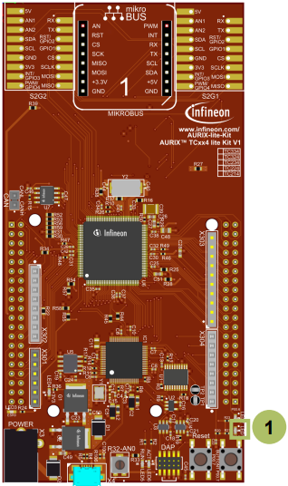
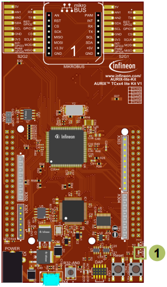

  

# GTM_ATOM_Interrupt_1_KIT_TC334_LK
The GTM ATOM is configured to trigger an interrupt every 500 ms. The interrupt toggles an LED.

## Device  
The device used in this example is AURIX&trade; TC33xTP_A-Step.

## Board  
The board used for testing is the AURIX&trade; TC334 lite Kit (KIT_A2G_TC334_LITE).

## Scope of work  
The Generic Timer Module triggers an interrupt every 500 ms. 

The state of the port pin, where the LED is connected, is toggled inside the Interrupt Service Routine (ISR).

## Introduction  
The Generic Timer Module (GTM) is a modular timer unit designed to accommodate many timer applications.

It has an in-built Advanced Router Unit (ARU) that can be used to exchange specific data between sub-modules without CPU interactions.

The ARU-connected Timer Output Module (ATOM), which is part of the GTM, is able to generate complex output signals without CPU interactions.

The Clock Management Unit (CMU) is responsible for clock generation of the GTM. The Configurable Clock Generation Subunit (CFGU) provides eight clock sources for the GTM submodules TIM, TBU, MON and ATOM.

## Hardware setup  
This code example has been developed for the board KIT_A2G_TC334_LITE.

LED1 (1) is used for this example.

  

## Implementation  

### Configuring the ATOM
The configuration of the ATOM is done once in the setup phase by calling the initialization function *initGtmAtom()* containing the following steps:
- Enable the GTM by calling the function *IfxGtm_enable()*
- The function *IfxGtm_Atom_Timer_initConfig()* initializes an instance of the structure *IfxGtm_Atom_Timer_Config* with its default values
- The *IfxGtm_Atom_Timer_Config* structure allows to set the following parameters to initialize the module:
  - *atom* – Select ATOM 0 
  - *timerChannel* – Select channel 0 of ATOM 0
  - *clock* – Select CMU clock 0
  - *base.frequency* – Set timer frequency to 2 Hz (interrupt every 500 ms)
  - *base.isrPriority* – Interrupt Service Routine priority
  - *base.isrProvider* – Interrupt Service Routine provider
- Set the CMU clock 0 frequency to 1 MHz with the function *IfxGtm_Cmu_SetClkFrequency()*
- Enable the CMU clock 0 by calling the function *IfxGtm_Cmu_enableClocks()*
- After clock configuration, the function IfxGtm_Atom_Timer_init() initializes and activates the ATOM with the user configuration
- Start the timer with the function *IfxGtm_Atom_Timer_run()*

All the functions used for the configuration of the ATOM are provided by the iLLD header *IfxGtm_Atom_Timer.h*.

### Configuring the LED
The LED configuration is also done in the function *initGtmAtom()*:
- Set the port pin mode to output and push-pull by calling the function *IfxPort_setPinModeOutput()*, provided by iLLD header *IfxPort.h*

### Interrupt Service Routine (ISR)
The ISR implemented in this example contains the following steps:
- Clear the timer event with the function *IfxGtm_Atom_Timer_acknowledgeTimerIrq()* in the iLLD header *IfxGtm_Atom_Timer.h*
- Change the LED state by calling the function *IfxPort_togglePin()* in the iLLD header *IfxPort.h*

## Compiling and programming  
Before testing this code example:  
- Power the board through the dedicated power connector
- Connect the board to the PC through the USB interface  
- Build the project using the dedicated Build button  or by right-clicking the project name and selecting "Build Project"  
- To flash the device and immediately run the program, click on the dedicated Flash button 

## Run and Test
After code compilation and flashing the device, observe the LED1 (1), which should be blinking.

  

## References  

AURIX&trade; Development Studio is available online:  
- <https://www.infineon.com/aurixdevelopmentstudio>  
- Use the "Import..." function to get access to more code examples  

More code examples can be found on the GIT repository:  
- <https://github.com/Infineon/AURIX_code_examples>  

For additional trainings, visit our webpage:  
- <https://www.infineon.com/aurix-expert-training>  

For questions and support, use the AURIX&trade; Forum:  
- <https://community.infineon.com/t5/AURIX/bd-p/AURIX>  