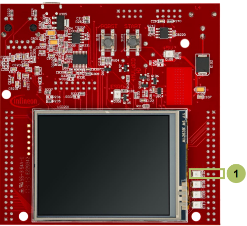
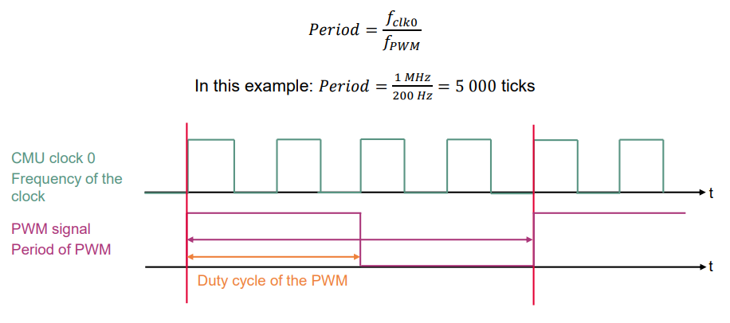

  

# GTM_ATOM_PWM_1_KIT_TC397_TFT
GTM ATOM is used to generate a PWM signal, which is driving the intensity of an LED.

## Device  
The device used in this example is AURIX&trade; TC39xTP_A-Step.

## Board  
The board used for testing is the AURIX&trade; TC397 TFT (KIT_A2G_TC397_5V_TFT).

## Scope of work  
The LED is driven by pin 0 of the port 13. The state of the pin is controlled by the PWM signal generated by the ATOM timer of GTM.

## Introduction  
The Generic Timer Module (GTM) is a modular timer unit designed to accommodate many timer applications.

It has an in-built Advanced Router Unit (ARU) that can be used to exchange specific data between sub-modules without CPU interaction.

The ARU-connected Timer Output Module (ATOM), which is part of the GTM, is able to generate complex output signals.

The Clock Management Unit (CMU) is responsible for clock generation of the GTM. The Configurable Clock Generation Subunit (CFGU) provides eight clock sources for the GTM submodules: TIM, TBU, MON and ATOM.
## Hardware setup  
This code example has been developed for the board KIT_A2G_TC397_5V_TFT.

LED D107 (1) is used for this example.

  

## Implementation  

### Configuring the ATOM
The configuration of the ATOM is done once in the setup phase by calling the initialization function *initGtmAtomPwm()* containing the following steps:
- Enable the GTM by calling the function *IfxGtm_enable()*
- Set the CMU clock 0 frequency to 1 MHz with the function *IfxGtm_Cmu_SetClkFrequency()*
- Enable the CMU clock 0 by calling the function *IfxGtm_Cmu_enableClocks()*

The function *IfxGtm_Atom_Pwm_initConfig()* initializes an instance of the structure *IfxGtm_Atom_Pwm_Config* with its default values.

- The *IfxGtm_Atom_Pwm_Config* structure allows to set the following parameters to initialize the module:
  - *atom* – Selection of the ATOM which is counting (ATOM 2 in this example) 
  - *atomChannel* – Selection of the channel which is driving the LED (Channel 5 in this example)
  - *period* – Setting of the period for the PWM signal to the desired value
  - *pin.outputPin* – Selection the LED as output pin
  - *synchronousUpdateEnable* – Enabling of Synchronous Update of the timer
- After configuration, the function *IfxGtm_Atom_Pwm_init()* initializes and activates the ATOM with the user configuration
- Start the PWM with the function *IfxGtm_Atom_Pwm_start()*

All the functions used for the configuration of the ATOM are provided by the iLLD header *IfxGtm_Atom_Pwm.h*.

### Setting the duty cycle
The setting of the duty cycle is done by calling the function *setDutyCycle()*, which contains the following steps:
- Set the *dutyCycle* parameters of the instance of the configuration structure to set the duty cycle for the PWM signal to the desired value
- Call the function *IfxGtm_Atom_Pwm_init()* to re-initialize and re-activate the ATOM with the new configuration

The functions *IfxGtm_Atom_Pwm_init()* is provided by the iLLD header *IfxGtm_Atom_Pwm.h*.

### Fading the LED
The fading of the LED is done in the function *fadeLED()* by repetitively adding or removing a step value to the duty cycle of the PWM.

### Calculation example
The CMU clock 0 frequency (fclk0) is set to 1 MHz in this example. The period value to have the desired PWM frequency (fPWM) is calculated with the following formula:

  

## Compiling and programming  
Before testing this code example:  
- Power the board through the dedicated power connector
- Connect the board to the PC through the USB interface  
- Build the project using the dedicated Build button  or by right-clicking the project name and selecting "Build Project"  
- To flash the device and immediately run the program, click on the dedicated Flash button 

## Run and Test
After code compilation and flashing the device, observe the LED D107 (1), which should be fading.

  

## References  

AURIX&trade; Development Studio is available online:  
- <https://www.infineon.com/aurixdevelopmentstudio>  
- Use the "Import..." function to get access to more code examples  

More code examples can be found on the GIT repository:  
- <https://github.com/Infineon/AURIX_code_examples>  

For additional trainings, visit our webpage:  
- <https://www.infineon.com/aurix-expert-training>  

For questions and support, use the AURIX&trade; Forum:  
- <https://community.infineon.com/t5/AURIX/bd-p/AURIX>  