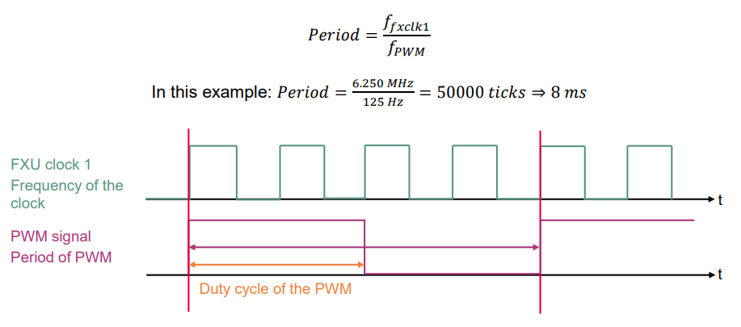

  

# GTM_TIM_Capture_1_KIT_TC397_TFT
The Timer Input Module (TIM) of the GTM is used to capture an external PWM signal and calculate the PWM signal frequency and duty cycle.

## Device  
The device used in this example is AURIX&trade; TC39xTP_A-Step.

## Board  
The board used for testing is the AURIX&trade; TC397 TFT (KIT_A2G_TC397_5V_TFT).

## Scope of work  
The TIM is used in capture mode. The data from the captured PWM signal is used to calculate the PWM signal frequency and duty cycle in software. The frequency and the duty cycle are then stored in variables.

## Introduction  

The Generic Timer Module (GTM) is a modular timer unit designed to accommodate many timer applications.

The Timer Input Module (TIM) is responsible for filtering and capturing input signals of the GTM.

The Clock Management Unit (CMU) is responsible for clock generation of the GTM. The Configurable Clock Generation Subunit (CFGU) provides eight clock sources for the GTM submodules: TIM, TBU, MON and ATOM.

The GTM has an in-built Timer Output Module (TOM) that can offer 16 independent channels to generate output signals.

The Clock Management Unit (CMU) is responsible for clock generation of the GTM. The Fixed Clock Generation (FXU) is one of its subunits and it provides five predefined non-configurable clocks for GTM modules, including the TOM.

## Hardware setup  
This code example has been developed for the board KIT_A2G_TC397_5V_TFT.

Connect the TIM input port pin P02.0 with the TOM output port pin P02.3.

 
  

## Implementation  

### Configuring the TIM
The configuration of the TIM is done by calling the initialization function *init_TIM()*, containing the following steps:
- Enable the GTM by calling the function *IfxGtm_enable()*
- Enable the CMU clock 0 by calling the function *IfxGtm_Cmu_enableClocks()*
- Initialize an instance of the *IfxGtm_Tim_In_Config* structure with the default parameters by calling the iLLD function *IfxGtm_Tim_In_initConfig()*
- The *IfxGtm_Tim_In_Config* structure allows the setting of multiple parameters in order to initialize the module, including the following:
  - *filter.inputPin* – Selection of the input port pin of the TIM (port pin P02.0 in this example) 
  - *filter.inputPinMode* – Selection of the input mode for the input port pin of the TIM (*IfxPort_InputMode_pulldown* in this example)
- After setting the configuration parameters, the function *IfxGtm_Tim_In_init()* applies the user configuration to the module

All the functions used for the configuration of the TIM are provided by the iLLD header *IfxGtm_Tim_In.h*.

### Configuring the TOM
The configuration of the TOM is done by calling the function *generate_PWM()* containing the following steps:
- Enable the FXU clocks by calling the function *IfxGtm_Cmu_enableClocks()*
- Initialize an instance of the structure *IfxGtm_Tom_Pwm_Config* with its default values by calling the function *IfxGtm_Tom_Pwm_initConfig()*
- The *IfxGtm_Tom_Pwm_Config* structure allows to set the following parameters to initialize the module:
  - *tom* – Selection of the TOM which is counting 
  - *tomChannel* – Selection of the channel which is driving the output port pin 
  - *period* – Setting of the period for the PWM signal to the desired value
  - *dutyCycle* – Setting of the duty cycle of the PWM signal to the desired value
  - *pin.outputPin* – Selection of the output port pin
  - *synchronousUpdateEnable* – Enabling of Synchronous Update of the timer
  - *clock* – Selection of the clock used for the generation of the PWM
- After setting the configuration parameters, the function *IfxGtm_Tom_Pwm_init()* applies the user configuration to the module
- Start the PWM with the function *IfxGtm_Tom_Pwm_start()*

All the functions used for the configuration of the TOM are provided by the iLLD header *IfxGtm_Tom_Pwm.h*.

### PWM generation example
The FXU clock 1 frequency (ffxclk1) is 6.250 MHz in this example. The period value to have the desired PWM frequency (fPWM) is calculated with the following formula:

 

### Measuring PWM frequency and duty cycle
The measurement of the PWM frequency and duty cycle is done by calling the function *measure_PWM()* containing the following steps:
- Update the measured PWM data by calling the iLLD function *IfxGtm_Tim_In_update()*
- Get the PWM period in seconds with the iLLD function *IfxGtm_Tim_In_getPeriodSecond()*
- Calculate the PWM frequency with the formula: frequency(Hz) = 1 / period(s)
- Get the PWM duty cycle by calling the iLLD function *IfxGtm_Tim_In_getDutyPercent()*

All the iLLD functions above are provided by the iLLD header *IfxGtm_Tim_In.h*.

## Compiling and programming  
Before testing this code example:  
- Power the board through the dedicated power connector
- Connect the board to the PC through the USB interface  
- Build the project using the dedicated Build button  or by right-clicking the project name and selecting "Build Project"  
- To flash the device and immediately run the program, click on the dedicated Flash button 

## Run and Test
After code compilation and flashing the device, perform the following steps:
- Add the variables *g_measuredPwmFreq_Hz* and *g_measuredPwmDutyCycle* to the Watch Expressions on the debugger
- Suspend the program to check the value of the variables

  

## References  

AURIX&trade; Development Studio is available online:  
- <https://www.infineon.com/aurixdevelopmentstudio>  
- Use the "Import..." function to get access to more code examples  

More code examples can be found on the GIT repository:  
- <https://github.com/Infineon/AURIX_code_examples>  

For additional trainings, visit our webpage:  
- <https://www.infineon.com/aurix-expert-training>  

For questions and support, use the AURIX&trade; Forum:  
- <https://community.infineon.com/t5/AURIX/bd-p/AURIX>  