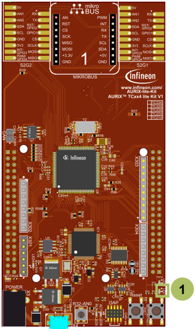
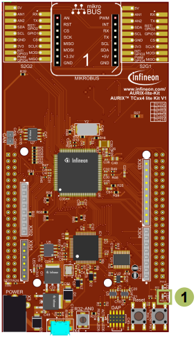

  

# GTM_TOM_Interrupt_1_KIT_TC334_LK
The GTM TOM is configured to trigger an interrupt every 500 ms. The interrupt toggles an LED.

## Device  
The device used in this example is AURIX&trade; TC33xTP_A-Step.

## Board  
The board used for testing is the AURIX&trade; TC334 lite Kit (KIT_A2G_TC334_LITE).

## Scope of work  
The Generic Timer Module triggers an interrupt every 500 ms.  
The state of the port pin, where the LED is connected, is toggled inside the Interrupt Service Routine (ISR).

## Introduction  
The Generic Timer Module (GTM) is a modular timer unit designed to accommodate many timer applications.

It has an in-built Timer Output Module (TOM) that offers up to 16 independent channels to generate output signals.

The Clock Management Unit (CMU) is responsible for clock generation of the GTM. The Fixed Clock Generation (FXU) is one of its subunits and it provides five predefined non-configurable clocks for GTM modules, including the TOM.

## Hardware setup  
This code example has been developed for the board KIT_A2G_TC334_LITE.

LED1 (1) is used for this example.

  

## Implementation  

### Configuring the TOM
The configuration of the TOM is done once in the setup phase by calling the initialization function *initGtmTom()* with the following steps:
- Enable the GTM by calling the function *IfxGtm_enable()*
- The function *IfxGtm_Tom_Timer_initConfig()* initializes an instance of the structure *IfxGtm_Tom_Timer_Config* with its default values
- The *IfxGtm_Tom_Timer_Config* structure allows to set the following parameters to initialize the module:
  - *tom* – Set TOM 1
  - *timerChannel* – Set channel 0 of TOM 1
  - *clock* – Select CMU clock 3
  - *base.frequency* – Set timer frequency to 2 Hz (Interrupt every 500 ms)
  - *base.isrPriority* – Interrupt Service Routine priority
  - *base.isrProvider* – Interrupt Service Routine provider

- Select the FXU clock 3 to divide the clock source by 4096 (*timerConfig.clock = IfxGtm_Tom_Ch_ClkSrc_cmuFxclk3*)
- Enable the FXU clocks by calling the function *IfxGtm_Cmu_enableClocks()*
- The function *IfxGtm_Tom_Timer_init()* initializes and activates the TOM with the given configuration

All the functions used for the configuration of the TOM are provided by the iLLD header *IfxGtm_Tom_Timer.h*.

### Configuring the LED
The LED configuration is done once in the function *initGtmTom()* by setting the port pin mode to output and push-pull by calling the function *IfxPort_setPinModeOutput()*, provided by iLLD header *IfxPort.h*.

### Interrupt Service Routine (ISR)
The ISR implemented in this example contains the following steps:
- Clear the timer event with the function *IfxGtm_Tom_Timer_acknowledgeTimerIrq()* (iLLD header *IfxGtm_Tom_Timer.h*)
- Change the LED state by calling the function *IfxPort_togglePin()* (iLLD header *IfxPort.h*)

## Compiling and programming  
Before testing this code example:  
- Power the board through the dedicated power connector
- Connect the board to the PC through the USB interface  
- Build the project using the dedicated Build button  or by right-clicking the project name and selecting "Build Project"  
- To flash the device and immediately run the program, click on the dedicated Flash button 

## Run and Test
After code compilation and flashing the device, observe the LED1 (1), which should be blinking.

  

## References  

AURIX&trade; Development Studio is available online:  
- <https://www.infineon.com/aurixdevelopmentstudio>  
- Use the "Import..." function to get access to more code examples  

More code examples can be found on the GIT repository:  
- <https://github.com/Infineon/AURIX_code_examples>  

For additional trainings, visit our webpage:  
- <https://www.infineon.com/aurix-expert-training>  

For questions and support, use the AURIX&trade; Forum:  
- <https://community.infineon.com/t5/AURIX/bd-p/AURIX>  