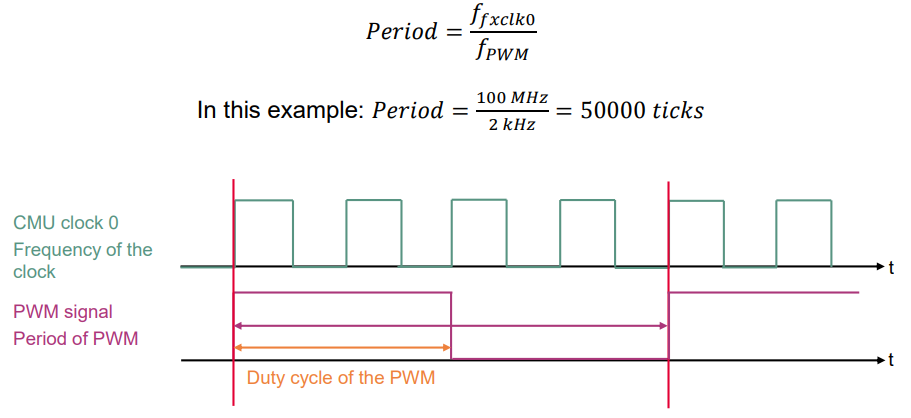
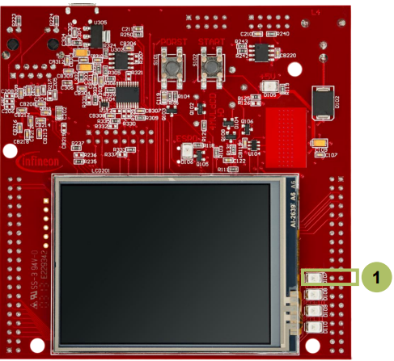

  

# GTM_TOM_PWM_1_KIT_TC397_TFT
GTM TOM is used to generate a PWM signal, which is driving the intensity of an LED.

## Device  
The device used in this example is AURIX&trade; TC39xTP_A-Step.

## Board  
The board used for testing is the AURIX&trade; TC397 TFT (KIT_A2G_TC397_5V_TFT).

## Scope of work  
The LED is driven by pin 0 of the port 13. The state of the pin is controlled by the PWM signal generated by the TOM timer of GTM.

## Introduction  
The Generic Timer Module (GTM) is a modular timer unit designed to accommodate many timer applications.

It has an in-built Timer Output Module (TOM) that can offer up to 16 independent channels to generate output signals.

The Clock Management Unit (CMU) is responsible for clock generation of the GTM. The Fixed Clock Generation (FXU) is one of its subunits and it provides five predefined non-configurable clocks for GTM modules, including the TOM.

## Hardware setup  
This code example has been developed for the board KIT_A2G_TC397_5V_TFT.

LED D107 (1) is used for this example.

  

## Implementation  

### Configuring the TOM
The configuration of the TOM is done by calling the initialization function *initGtmTomPwm()* containing the following steps:
- Enable the GTM by calling the function *IfxGtm_enable()*
- Enable the FXU clocks by calling the function *IfxGtm_Cmu_enableClocks()*

The function *IfxGtm_Tom_Pwm_initConfig()* initializes an instance of the structure *IfxGtm_Tom_Pwm_Config* with its default values.

The *IfxGtm_Tom_Pwm_Config* structure can be modified to set the following parameters to initialize the module:
- *tom* – Selection of the TOM which is counting (TOM 2 in this example) 
- *tomChannel* – Selection of the channel which is driving the LED (Channel 5 in this example)
- *period* – Setting of the period for the PWM signal to the desired value
- *pin.outputPin* – Selection of the LED as output pin
- *synchronousUpdateEnable* – Enabling of synchronous update of the timer

After configuration, the function *IfxGtm_Tom_Pwm_init()* initializes and activates the TOM with the user configuration.  
Start the PWM with the function *IfxGtm_Tom_Pwm_start()*.

### Setting the duty cycle
The setting of the duty cycle is done by calling the function *setDutyCycle()*, which contains the following steps:
- Set the *dutyCycle* parameters of the configuration structure to set the duty cycle of the PWM signal to the desired value
- Call the function *IfxGtm_Tom_Pwm_init()* to reconfigure the TOM with the new value of the duty cycle

All the functions used for the configuration of the TOM are provided by the iLLD header *IfxGtm_Tom_Pwm.h*.

### Fading the LED
The fading of the LED is done in the function *fadeLED()* by repeatedly adding or removing a step value to the duty cycle of the PWM.

### Calculation example
The FXU clock 0 frequency (ffxclk0) is 100 MHz. The period value to have the desired PWM frequency (fPWM) is calculated with the following formula:

## Compiling and programming  
Before testing this code example:  
- Power the board through the dedicated power connector
- Connect the board to the PC through the USB interface  
- Build the project using the dedicated Build button  or by right-clicking the project name and selecting "Build Project"  
- To flash the device and immediately run the program, click on the dedicated Flash button 

## Run and Test
After code compilation and flashing the device, observe the LED 107 (1), which should be fading.

  

## References  

AURIX&trade; Development Studio is available online:  
- <https://www.infineon.com/aurixdevelopmentstudio>  
- Use the "Import..." function to get access to more code examples  

More code examples can be found on the GIT repository:  
- <https://github.com/Infineon/AURIX_code_examples>  

For additional trainings, visit our webpage:  
- <https://www.infineon.com/aurix-expert-training>  

For questions and support, use the AURIX&trade; Forum:  
- <https://community.infineon.com/t5/AURIX/bd-p/AURIX>  