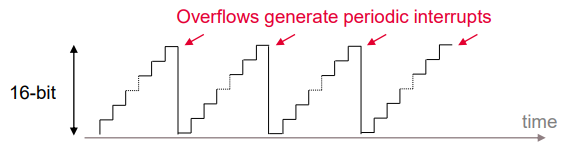
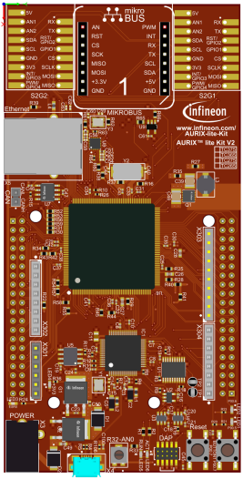
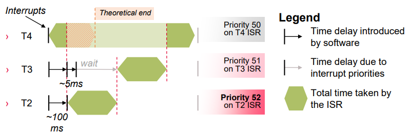
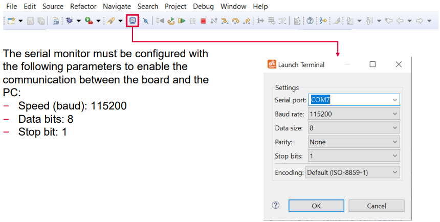
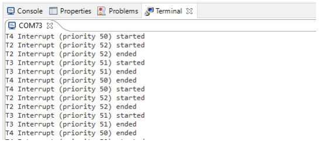

  

# Interrupt_Prio_1_KIT_TC375_LK
Three interrupts, with different priorities each, send a message on a terminal using UART communication.

## Device  
The device used in this example is AURIX&trade; TC37xTP_A-Step.

## Board  
The board used for testing is the AURIX&trade; TC375 lite Kit (KIT_A2G_TC375_LITE).

## Scope of work  
Each interrupt sends a message on a terminal when the ISR starts and ends. In this example, the interrupts are triggered by GPT12 module.

## Introduction  
The interrupt system in the AURIX&trade; TC3xx devices is implemented in the Interrupt Router (IR).

Interrupt Requests (or Service Requests) can be serviced either by the CPUs or by the DMA module (both called Service Providers).

An interrupt can be triggered by:
- Each module connected to the IR
- External peripherals
- Software via General Purpose Service Requests (GPSR)

Each Service Provider supports up to 255 service priority levels: 
- 0 to disable the interrupt
- 255 for highest priority

A triggered interrupt can be followed by an Interrupt Service Routine (ISR), a function which is called every time an interrupt is triggered.

Example of ISR configuration:
- Assign the ISR to a service provider and an interrupt priority *IFX_INTERRUPT(functionA, 0, ISR_Priority)*; 
- ISR implementation: *void functionA(void) { […] }*

By default, an ISR cannot be interrupted by any other interrupt. IR waits until the function is finished before servicing any pending interrupt

To allow interrupting the execution of ISRs by higher priority service requests, the following iLLD function must be added at the beginning of the ISR: *IfxCpu_enableInterrupts()*;

The *General Purpose Timer* (GPT12) module has very flexible multifunctional timer structures which can be used for timing, event counting, pulse width measurement, pulse generation, frequency multiplication, and other purposes.

The GPT12 module incorporates *five 16-bit timers* that are grouped into two timer blocks GPT1 and GPT2. Each timer can operate independently in a number of different modes such as Timer mode, Gated Timer mode, Counter mode, or can be concatenated with another timer of the same block.

In this example, the timers are used in timer mode:

## Hardware setup  
This code example has been developed for the board KIT_A2G_TC375_LITE.

  

## Implementation  

### Configure the Timers
Three timers are configured in order to periodically generate three different interrupts. The GPT12 module methods come from the iLLD header *IfxGPT12.h*.

First, the module is enabled via *IfxGpt12_enableModule()*.

All three timers are set in *timer mode* using the iLLD function: *IfxGpt12_Tx_setMode()*, where x = 1,2,3.

To improve the observability during the process of interrupts handling, the timers are set to the slowest frequency. This is done via the prescalers of both the GPT1 block and the individual timers:
- *IfxGpt12_setGpt1BlockPrescaler()*
  - with parameter *IfxGpt12_Gpt1BlockPrescaler_32* for fGPT/32
- *IfxGpt12_Tx_setTimerPrescaler()*
  - with parameter *IfxGpt12_TimerInputPrescaler_128* for fGPT1/128

  

- The timer with the lowest ISR priority, T4, is launched first
- The timers T2 and T3 are launched shortly after in order to ensure that the lowest priority ISR has already started
- All timers are running with the same frequency

  

- All cases are covered:
  - Higher prioritized ISR *interrupts* lower prioritized ISR already running
  - Lower prioritized ISR *waits* the end of higher prioritized ISR in case of simultaneous or belated trigger

### Configure the ASCLIN
In this tutorial, the UART connection is used to make the debugging more convenient and easier to understand. 

Configuration of the ASCLIN module for UART communication is done in the setup phase by initializing an instance of the *IfxAsclin_Asc_Config* structure with the following parameters:
- *baudrate* – structure to set the actual communication speed in bit/s
- *interrupt* – structure to set: 
 - interrupt priorities for transmit, receive and error events (*txPriority*, *rxPriority* and *erPriority*)
 - *typeOfService* – defines which service provider is responsible for handling the interrupt, which can be any of the available CPUs, or the DMA 
- *pins* – structure to set which GPIOs port pins are used for the communication
- *rxBuffer*, *rxBufferSize*, *txBuffer*, *txBufferSize* – to configure the buffers that will hold the incoming/outgoing data

The function *IfxAsclin_Asc_initModuleConfig()* fills the configuration structure with default values and *IfxAsclin_Asc_initModule()* initializes the module with the user configuration.

The standard interface is configured with the function *IfxAsclin_Asc_stdIfDPipeInit()*.

All the above functions can be found in the iLLD header *IfxAsclin_Asc.h*.

**Note**: Tx, Rx and Er interrupts have to be higher priority than GPT interrupts for a correct display.

## Compiling and programming  
Before testing this code example:  
- Power the board through the dedicated power connector
- Connect the board to the PC through the USB interface  
- Build the project using the dedicated Build button  or by right-clicking the project name and selecting "Build Project"  
- To flash the device and immediately run the program, click on the dedicated Flash button 

## Run and Test
For this training, a serial monitor is required for visualizing the interrupt prioritization process. The monitor can be opened inside the AURIX&trade; Development Studio using the following icon:

After code compilation and flashing the device, perform the following steps:
- The board must be connected to PC via the USB cable
- Open a serial monitor with the previous configuration and connect
- In the terminal, it can be observed when an interrupt starts and ends

  

**Note**: Interrupts with higher priority suspend the lower priority interrupts. The latter continue after the end of the higher priority interrupts.

## References  

AURIX&trade; Development Studio is available online:  
- <https://www.infineon.com/aurixdevelopmentstudio>  
- Use the "Import..." function to get access to more code examples  

More code examples can be found on the GIT repository:  
- <https://github.com/Infineon/AURIX_code_examples>  

For additional trainings, visit our webpage:  
- <https://www.infineon.com/aurix-expert-training>  

For questions and support, use the AURIX&trade; Forum:  
- <https://community.infineon.com/t5/AURIX/bd-p/AURIX>  