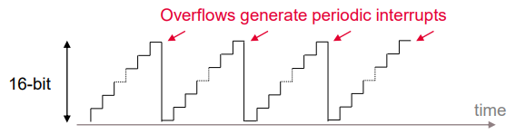
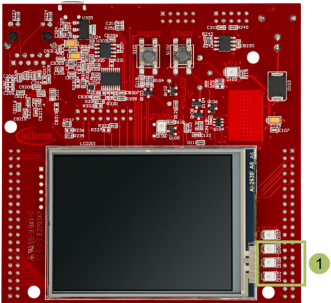
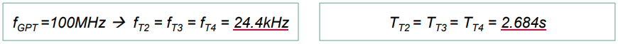
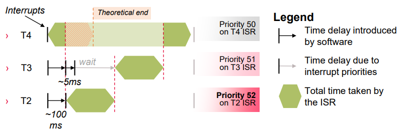
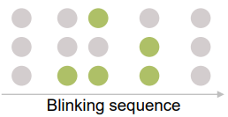
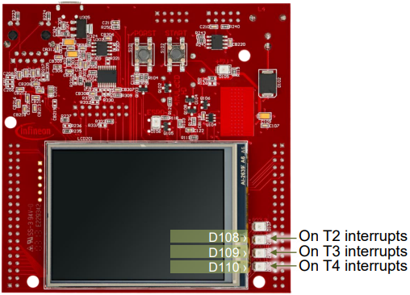

  

# Interrupt_Prio_1_KIT_TC397_TFT
Three interrupts with different priorities are used to toggle LEDs.

## Device  
The device used in this example is AURIX&trade; TC39xTP_A-Step.

## Board  
The board used for testing is the AURIX&trade; TC397 TFT (KIT_A2G_TC397_5V_TFT).

## Scope of work  
Each interrupt is configured to control the state of one LED. Based on their priority, the interrupts toggle the appropriate LED. In this example, the interrupts are triggered by GPT12 module.

## Introduction  
The interrupt system in the AURIX&trade; TC3xx devices is implemented in the Interrupt Router (IR).

Interrupt Requests (or Service Requests) can be serviced either by the CPUs or by the DMA module (both called Service Providers).

An interrupt can be triggered by:
- Each module connected to the IR
- External peripherals
- Software via General Purpose Service Requests (GPSR)

Each Service Provider supports up to 255 service priority levels: 
- 0 to disable the interrupt
- 255 for highest priority

A triggered interrupt can be followed by an Interrupt Service Routine (ISR), a function which is called every time an interrupt is triggered.

Example of ISR configuration:
- Assign the ISR to a service provider and an interrupt priority *IFX_INTERRUPT(functionA, 0, ISR_Priority)*; 
- ISR implementation: *void functionA(void) { […] }*

By default, an ISR cannot be interrupted by any other interrupt. IR waits until the function is finished before servicing any pending interrupt

To allow interrupting the execution of ISRs by higher priority service requests, the following iLLD function must be added at the beginning of the ISR: *IfxCpu_enableInterrupts()*;

The *General Purpose Timer* (GPT12) module has very flexible multifunctional timer structures which can be used for timing, event counting, pulse width measurement, pulse generation, frequency multiplication, and other purposes.

The GPT12 module incorporates *five 16-bit timers* that are grouped into two timer blocks GPT1 and GPT2. Each timer can operate independently in a number of different modes such as Timer mode, Gated Timer mode, Counter mode, or can be concatenated with another timer of the same block.

In this example, the timers are used in timer mode:

## Hardware setup  
This code example has been developed for the board KIT_A2G_TC397_5V_TFT.

The three LEDs that are used in this example are D108, D109 and D110 (1).

  

## Implementation  

### Configure the LEDs
The three LEDs blink by controlling the port pins to which they are connected, using methods from the iLLD header *IfxPort.h*.

In the setup phase, the port pins of the LEDs have to be configured to push-pull output mode using the function *IfxPort_setPinModeOutput()*. 

During program execution, the LEDs (low active) are switched on and off using the iLLD functions: 
- *IfxPort_setPinLow()* → switches on
- *IfxPort_setPinHigh()* → switches off

### Configure the Timers
Three timers are configured in order to periodically generate three different interrupts. The GPT12 module methods come from the iLLD header *IfxGPT12.h*.

First, the module is enabled via *IfxGpt12_enableModule()*.

All three timers are set in *timer mode* using the iLLD function: *IfxGpt12_Tx_setMode()*, where x = 1,2,3.

To improve the observability during the process of interrupts handling, the timers are set to the slowest frequency. This is done via the prescalers of both the GPT1 block and the individual timers:
- *IfxGpt12_setGpt1BlockPrescaler()*
  - with parameter *IfxGpt12_Gpt1BlockPrescaler_32* for fGPT/32
- *IfxGpt12_Tx_setTimerPrescaler()*
  - with parameter *IfxGpt12_TimerInputPrescaler_128* for fGPT1/128

  

- The timer with the lowest ISR priority, T4, is launched first
- The timers T2 and T3 are launched shortly after in order to ensure that the lowest priority ISR has already started
- All timers are running with the same frequency

  

- All cases are covered:
  - Higher prioritized ISR *interrupts* lower prioritized ISR already running
  - Lower prioritized ISR *waits* the end of higher prioritized ISR in case of simultaneous or belated trigger

## Compiling and programming  
Before testing this code example:  
- Power the board through the dedicated power connector
- Connect the board to the PC through the USB interface  
- Build the project using the dedicated Build button  or by right-clicking the project name and selecting "Build Project"  
- To flash the device and immediately run the program, click on the dedicated Flash button 

## Run and Test
After code compilation and flashing the device, observe the behavior of the LEDs:
- D108, D109 and D110 are blinking sequentially according to the priority level of their related timer interrupt
- The implemented priority are the following:
  - T2 ISR priority: 52
  - T3 ISR priority: 51
  - T4 ISR priority: 50

  

## References  

AURIX&trade; Development Studio is available online:  
- <https://www.infineon.com/aurixdevelopmentstudio>  
- Use the "Import..." function to get access to more code examples  

More code examples can be found on the GIT repository:  
- <https://github.com/Infineon/AURIX_code_examples>  

For additional trainings, visit our webpage:  
- <https://www.infineon.com/aurix-expert-training>  

For questions and support, use the AURIX&trade; Forum:  
- <https://community.infineon.com/t5/AURIX/bd-p/AURIX>  