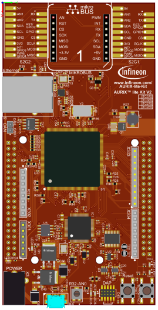
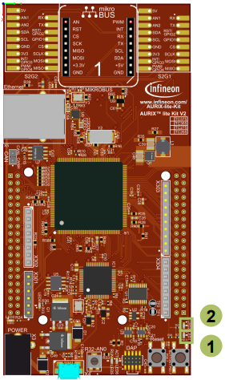

  

# MCMCAN_1_KIT_TC375_LK
MCMCAN is used to exchange data between two nodes, implemented in the same device using Loop-Back mode.

## Device  
The device used in this example is AURIX&trade; TC37xTP_A-Step.

## Board  
The board used for testing is the AURIX&trade; TC375 lite Kit (KIT_A2G_TC375_LITE).

## Scope of work  
A CAN message is sent from CAN node 0 to CAN node 1 using Loop-Back mode. After the CAN message transmission, an interrupt is generated and an LED is turned on to confirm successful message transmission. Once the CAN message is successfully received by the CAN node 1, an interrupt is generated. Inside the interrupt service routine the content of the received CAN message is compared to the content of the transmitted CAN message. In case of a success, another LED is turned on to confirm successful message reception.

## Introduction  
MCMCAN is the new CAN interface replacing MultiCAN+ module from the AURIX&trade; TC2xx family.

The MCMCAN module supports Classical CAN and CAN FD according to the ISO 11898-1 standard and Time Triggered CAN (TTCAN) according to the ISO 11898-4 standard.

The MCMCAN module consists of M_CAN as CAN nodes (in case of AURIX&trade; TC37x device, 4 nodes) which are CAN FD capable. Each CAN node communicates over two pins (TXD and RXD). Additionally, there is an internal Loop-Back Mode functionality available for test purposes.

A configurable Message RAM is used to store the messages to be transmitted or received. The message RAM is shared by all the CAN nodes within a MCMCAN module.

## Hardware setup  
This code example has been developed for the board KIT_A2G_TC375_LITE.

  

## Implementation  
**Application code can be separated into three segments:**
- Initialization of the MCMCAN module with the accompanying node and filter initialization, implemented in the *initMcmcan()* function
- Initialization of the pins that are connected to the LEDs. LEDs are used to verify the success of a CAN message transmission and reception. This is done inside the *initLeds()* function
- Transmission of the configured CAN message, implemented in the *transmitCanMessage()* function
**Additionally, two interrupt service routines (ISRs) are implemented:**
- On TX interrupt, the LED1 is turned on to indicate successful CAN message transmission (implemented in *canIsrTxHandler()*)
- On RX interrupt, the ISR verifies the received CAN message and turns on the LED2 to indicate successful reception (implemented in *canIsrRxHandler()*)

### MCMCAN module initialization
Initialization is performed in three phases:
- A default CAN module configuration is loaded into the configuration structure by using the function *IfxCan_Can_initModuleConfig()*. Afterwards, the initialization of the CAN module with the user configuration is done with the function *IfxCan_Can_initModule()*
- A default CAN node configuration is loaded into the configuration structure by using the function *IfxCan_Can_initNodeConfig()*. Initialization of the CAN nodes (CAN node 0 and 1) with the different CAN node ID values and definition of Loop-Back Mode usage for both nodes is done with the function *IfxCan_Can_initNode()*. CAN node 0 is defined as “source node” while CAN node 1 represents a “destination node”. Additionally, an interrupt configuration for both “source node” and “destination node” is done in this phase
- The configuration structure of the CAN filter assigns the CAN filter 0 to the receive 
buffer 0. The acceptance criteria in this case is the matching message ID value. Afterwards, the initialization of the CAN filter with the user configuration is done with the function *IfxCan_Can_setStandardFilter()*

All functions used for the MCMCAN module, node and filter initialization are declared in the iLLD header *IfxCan_Can.h*.

### Initialization of the pins connected to the LEDs
LEDs are used to verify the success of a CAN message transmission and reception. Before using the LEDs, the port pins to which the LEDs are connected must be configured.
- First step is to set the port pins to level “HIGH”; this keeps the LEDs turned off as a default state (*IfxPort_setPinHigh()* function)
- Second step is to set the port pins to push-pull output mode with the *IfxPort_setPinModeOutput()* function
- Finally, the pad driver strength is defined through the function *IfxPort_setPinPadDriver()*

All functions are declared in the iLLD header *IfxPort.h*.

### CAN message transmission
Before a CAN message is transmitted, two messages need to be initialized. TX message (message that will be transmitted) is initialized with the predefined content. RX message (message where the received CAN message will be stored) is initialized with some invalid data (after successful CAN transmission the data will be replaced with the valid data).
- Initialization of both TX and RX messages is done by using *IfxCan_Can_initMessage()*
- A CAN message is transmitted by using the *IfxCan_Can_sendMessage()* function. A CAN message will be continuously transmitted as long as the returned status is *IfxCan_Status_notSentBusy* (this status occurs if there is a pending transmit request) 

All functions are declared in the iLLD header *IfxCan_Can.h*.

### Interrupt Service Routines (ISRs)
Two interrupt services routines are implemented: one ISR that is triggered with the successful CAN message transmission and a second one that is triggered with the successful CAN message reception.
- TX interrupt service routine clears the pending interrupt flag with the *IfxCan_Node_clearInterruptFlag()* function and indicates that the CAN message has been transmitted successfully by turning on LED1
- RX interrupt service routine clears the pending interrupt flag by using *IfxCan_Node_clearInterruptFlag()* function and reads the received CAN message with the *IfxCan_Can_readMessage()* function. Afterwards, the received data is compared against the transmitted data. In case of success, the LED2 is turned on to indicate that the received message is correct

The function *IfxCan_Node_clearInterruptFlag()* is declared in the iLLD header *IfxCan.h* while the function *IfxCan_Can_readMessage()* is declared in the iLLD header *IfxCan_Can.h*.

## Compiling and programming  
Before testing this code example:  
- Power the board through the dedicated power connector
- Connect the board to the PC through the USB interface  
- Build the project using the dedicated Build button  or by right-clicking the project name and selecting "Build Project"  
- To flash the device and immediately run the program, click on the dedicated Flash button 

## Run and Test
After code compilation and flashing the device, perform the following steps:
- Check that LED1 (1) is turned on (successful CAN message transmission by CAN node 0)
- Check that LED2 (2) is turned on (successful CAN message reception by CAN node 1)

  

## References  

AURIX&trade; Development Studio is available online:  
- <https://www.infineon.com/aurixdevelopmentstudio>  
- Use the "Import..." function to get access to more code examples  

More code examples can be found on the GIT repository:  
- <https://github.com/Infineon/AURIX_code_examples>  

For additional trainings, visit our webpage:  
- <https://www.infineon.com/aurix-expert-training>  

For questions and support, use the AURIX&trade; Forum:  
- <https://community.infineon.com/t5/AURIX/bd-p/AURIX>  