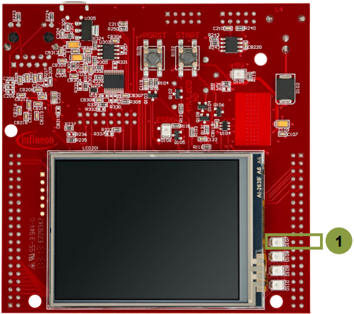
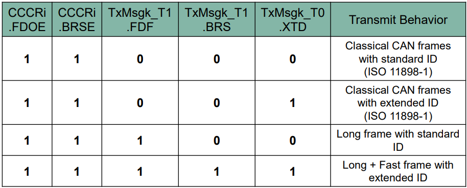
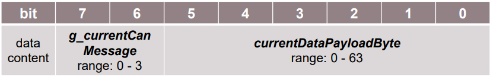

  

# MCMCAN_FD_1_KIT_TC397_TFT
MCMCAN in Flexible Data-Rate mode is used to exchange data between two nodes, implemented in the same device using Loop-Back mode.

## Device  
The device used in this example is AURIX&trade; TC39xTP_A-Step.

## Board  
The board used for testing is the AURIX&trade; TC397 TFT (KIT_A2G_TC397_5V_TFT).

## Scope of work  
The CAN messages are sent from CAN node 0 to CAN node 1 using Loop-Back mode. Both CAN nodes are set to CAN Flexible Data-rate mode (CAN FD). After each CAN message transmission and successful reception, an interrupt is generated. Inside the interrupt service routine, the content of the received CAN message is read. In case of the successful read operation, the received data is compared to the transmitted data. If all messages are received without any error detected, the LED is turned on to confirm successful message reception.

## Introduction  
MCMCAN is the new CAN interface replacing MultiCAN+ module from the AURIX&trade; TC2xx family.

The MCMCAN module supports Classical CAN and CAN FD according to the ISO 11898-1 standard and Time Triggered CAN (TTCAN) according to the ISO 11898-4 standard.

The MCMCAN module consists of M_CAN as CAN nodes (in case of AURIX&trade; TC39x device, 4 nodes) which are CAN FD capable. Each CAN node communicates over two pins (TXD and RXD). Additionally, there is an internal Loop-Back Mode functionality available for test purposes.

A configurable Message RAM is used to store the messages to be transmitted or received. The message RAM is shared by all the CAN nodes within an MCMCAN module.

## Hardware setup  
This code example has been developed for the board KIT_A2G_TC397_5V_TFT.

LED1 D107 is used for this example.

 

## Implementation  
This code example covers the following four different CAN FD use cases. The definition of these use cases is provided in the “*g_useCaseConf*” table.

 

Application code can be separated into four segments:
- Initialization of the MCMCAN module with the accompanying node and message objects initialization, implemented in the *initMcmcan()* function
- Initialization of the port pin connected to the LED (D107 on the board). The LED is used to verify the success of the CAN messages reception. This is done inside the *initLed()* function
- Transmission of the configured CAN messages, implemented in the *transmitCanMessage()* function
- Verification of the received CAN messages, implemented in the *verifyCanMessage()* function

An additional Interrupt Service Routine (ISR) is implemented:
- On RX interrupt, the ISR reads the received CAN message and, in case of no errors, increments the counter to indicate the number of successfully received CAN messages (implemented in *canIsrRxHandler()* function)

### MCMCAN module initialization
Initialization is performed as follows:
- A default CAN module configuration is loaded into the configuration structure by using the function *IfxCan_Can_initModuleConfig()*. Afterwards, the initialization of the CAN module with the user configuration is done with the function *IfxCan_Can_initModule()*
- A default CAN node configuration is loaded into the configuration structure by using the function *IfxCan_Can_initNodeConfig()*. Initialization of the CAN nodes (CAN node 0 and 1) with the different CAN node ID values and definition of Loop-Back Mode usage for both nodes is done with the function *IfxCan_Can_initNode()*. CAN node 0 is defined as “source node” while CAN node 1 represents a “destination node”. Both nodes are set to CAN FD long + fast frame mode. Dedicated TX buffer is used to transmit the CAN message, while the reception is handled by the RX FIFO 0 structure. Finally, upon the CAN message reception, the interrupt will be triggered

All functions used for the MCMCAN module and node initialization are declared in the iLLD header *IfxCan_Can.h*.

### Initialization of a pin connected to the LED
An LED is used to verify the success of a CAN message reception. Before using the LED, the port pin to which the LED is connected must be configured.
- First step is to set the port pin to level “HIGH”; this keeps the LED turned off as a default state (*IfxPort_setPinHigh()* function)
- Second step is to set the port pin to push-pull output mode with the *IfxPort_setPinModeOutput()* function
- Finally, the pad driver strength is defined through the function *IfxPort_setPinPadDriver()*

All functions are declared in the iLLD header *IfxPort.h*.

### Transmission of CAN messages
Before a CAN message is transmitted, two CAN messages (TX and RX) need to be initialized. The TX message is configured based on the current CAN FD use case (see the table above for more details). The TX message data content (data content that is transmitted) is initialized with the combination of current data payload byte and current CAN message value, using the following format:

 

The RX message (message where the received CAN message is stored) is initialized with the default configuration (after successful CAN transmission, the values are replaced with the valid content). Additionally, both the TX and RX message data content need to be invalidated. No additional CAN message is transmitted until the received data has been read by the interrupt service routine.

Initialization of both TX and RX messages is done by using *IfxCan_Can_initMessage()* function.

Invalidation of both TX and RX message data content by using the *memset()* function.

A CAN message is transmitted by using the *IfxCan_Can_sendMessage()* function. A CAN message will be continuously transmitted as long as the returned status is *IfxCan_Status_notSentBusy* (this status occurs if there is a pending transmit request).

The functions *IfxCan_Can_initMessage()* and *IfxCan_Can_sendMessage()* are declared in the iLLD header *IfxCan_Can.h*. The function *memset()* is declared in the standard C library header *string.h*.

### Verification of CAN messages
After successful reception of each CAN message, several checks are performed:
1. Message ID check (check that the received message ID matches the transmitted one). Verifies that both standard and extended IDs have been received
2. Message length check (check that the received message length matches the transmitted one). The check is covering both classical CAN and CAN FD frame sizes
3. Frame mode check (check that the received FD Format (FDF) and Bit Rate Switching (BRS) bit field values match with the transmitted ones)
4. Expected valid data check (check that the received data matches with the expected one). Both classical CAN and CAN FD data content is covered
5. Invalid data check (check that the invalid data has not been modified with the CAN transmission)

If no error has been observed, the *g_status* variable holds *CanCommunicationStatus_Success* value upon returning from the *verifyCanMessage()* function.

### Interrupt Service Routine (ISR)
An ISR is triggered by the successful CAN message reception.

RX interrupt service routine clears the pending interrupt flag by using *IfxCan_Node_clearInterruptFlag()* function and reads the received CAN message with the *IfxCan_Can_readMessage()* function. Once the received CAN message has been read, the global variable *g_isrRxCount* is incremented. This variable is used as a counter to indicate the number of successfully received CAN messages.

The functions *IfxCan_Node_clearInterruptFlag()* is declared in the iLLD header *IfxCan.h* while the function *IfxCan_Can_readMessage()* is declared in the iLLD header *IfxCan_Can.h*.

## Compiling and programming  
Before testing this code example:  
- Power the board through the dedicated power connector
- Connect the board to the PC through the USB interface  
- Build the project using the dedicated Build button  or by right-clicking the project name and selecting "Build Project"  
- To flash the device and immediately run the program, click on the dedicated Flash button 

## Run and Test
After code compilation and flashing the device, observe the following behavior:

Check that the LED D107 (1) is turned on (all CAN messages have been successfully received and all checks have been passed)

## References  

AURIX&trade; Development Studio is available online:  
- <https://www.infineon.com/aurixdevelopmentstudio>  
- Use the "Import..." function to get access to more code examples  

More code examples can be found on the GIT repository:  
- <https://github.com/Infineon/AURIX_code_examples>  

For additional trainings, visit our webpage:  
- <https://www.infineon.com/aurix-expert-training>  

For questions and support, use the AURIX&trade; Forum:  
- <https://community.infineon.com/t5/AURIX/bd-p/AURIX>  