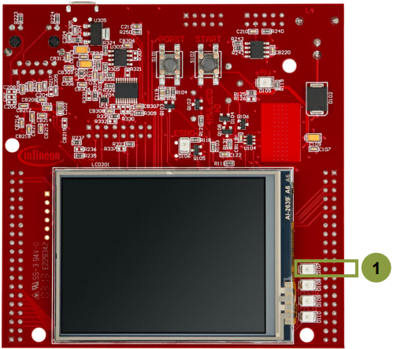
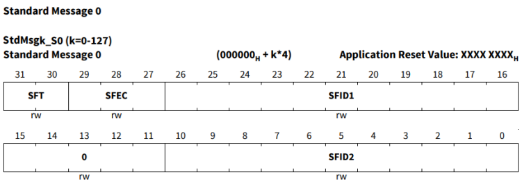
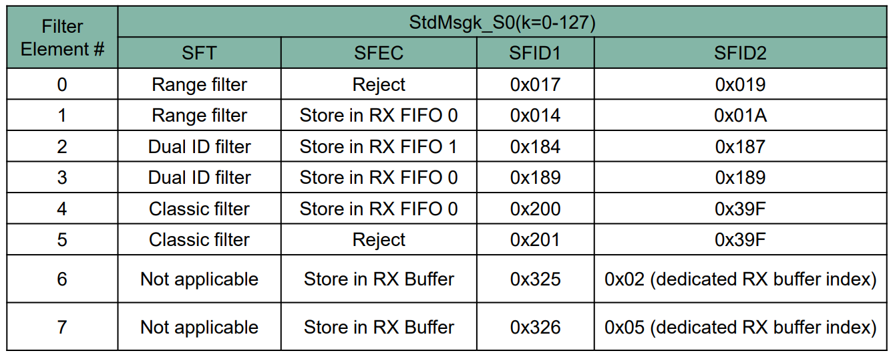
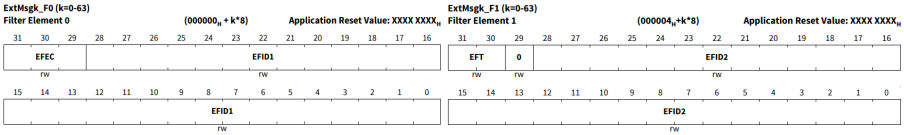
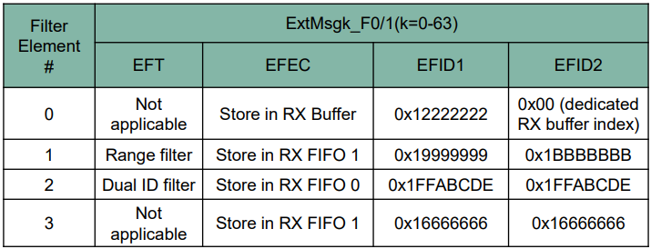
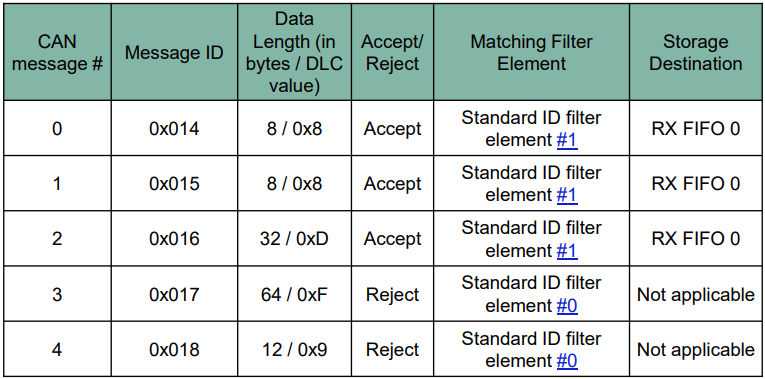
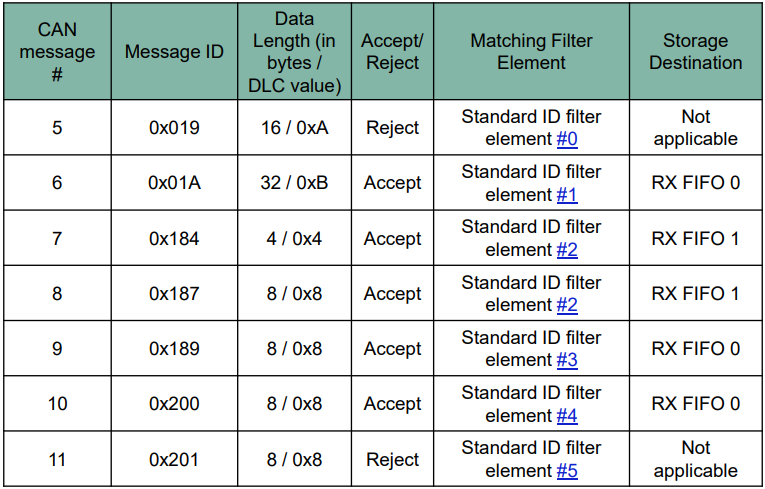
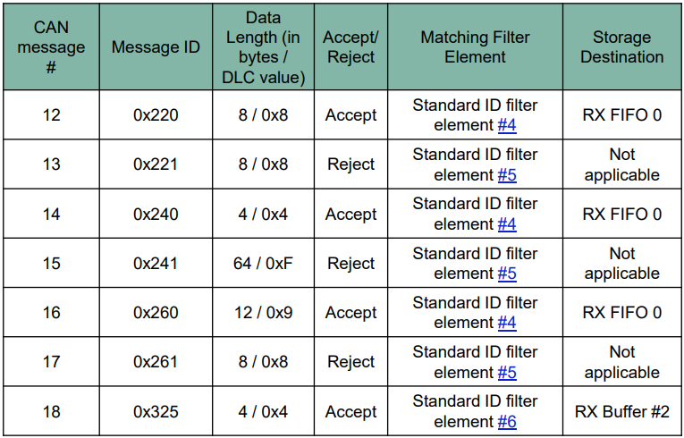
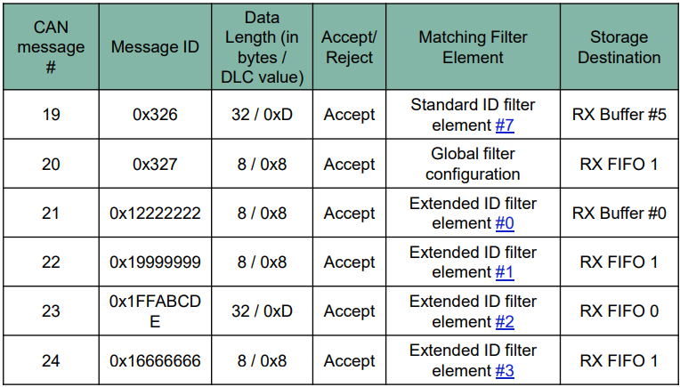
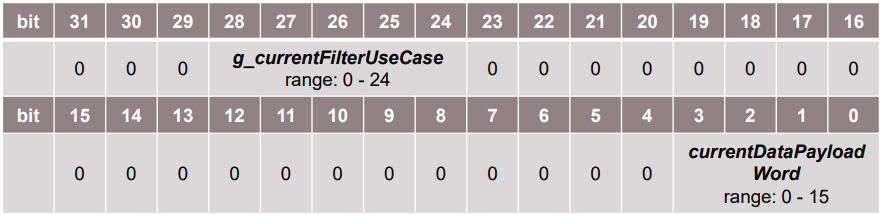

  

# MCMCAN_Filtering_1_KIT_TC397_TFT
The initialization and configuration of several filter modes are used to illustrate different acceptance filtering options.

## Device  
The device used in this example is AURIX&trade; TC39xTP_A-Step.

## Board  
The board used for testing is the AURIX&trade; TC397 TFT (KIT_A2G_TC397_5V_TFT).

## Scope of work  
The CAN messages are sent from CAN node 0 to CAN node 1 using Loop-Back mode. Each transmitted CAN message contains a different message ID and based on the filter configuration, the message is either accepted or rejected by CAN node 1. Messages that passed acceptance filtering are stored in RX FIFOs 0 and 1 or dedicated RX buffer based on the filter configuration. Upon storing the messages, the interrupt service routine is called and the content of the received CAN message is read. Once the content of all the received messages is read, the received data is compared to the transmitted data. If all messages are received without any error detected, an LED is turned on to confirm successful message reception.

## Introduction  
MCMCAN is the new CAN interface replacing MultiCAN+ module from the AURIX&trade; TC2xx family.

The MCMCAN module supports Classical CAN and CAN FD according to the ISO 11898-1 standard and Time Triggered CAN (TTCAN) according to the ISO 11898-4 standard.

The MCMCAN module consists of M_CAN as CAN nodes (in case of AURIX&trade; TC39x device, 4 nodes) which are CAN FD capable. Each CAN node communicates over two pins (TXD and RXD). Additionally, there is an internal Loop-Back Mode functionality available for test purposes.

A configurable Message RAM is used to store the messages to be transmitted or received. The message RAM is shared by all the CAN nodes within an MCMCAN module.

## Hardware setup  
This code example has been developed for the board KIT_A2G_TC397_5V_TFT.

LED1 D107 is used for this example.

 

## Implementation  
The MCMCAN module supports acceptance filtering in hardware by configuring two sets of acceptance filters, one for standard identifiers and one for extended identifiers. These filters can be assigned to the dedicated RX Buffers or to RX FIFOs 0,1.

The main features of the acceptance filtering are as follows:
- Each filter element can be configured as: 
  - Range filter [from - to]
  - Filter for one or two dedicated message IDs
  - Classic bit mask filter 
- Each filter element is configurable for acceptance or rejection filtering
- Each filter element can be enabled / disabled individually
- Filters are checked sequentially, execution stops with the first matching filter element 

In the User Manual, the flow for standard Message ID (11-bit Identifier) and extended Message ID (29-bit Identifier) filtering is described by figures.

To demonstrate acceptance filtering mechanisms, the following example of the potential application use case is given:
- Global filter requirements:
  - Reject remote frames with standard IDs
  - Reject remote frames with extended IDs
  - Accept non-matching messages with standard IDs and store them to RX FIFO 1
  - Reject non-matching messages with extended IDs 
- Standard ID filter requirements:
  - Reject messages with standard IDs in range [0x17-0x19] 
  - Accept messages with standard IDs in range [0x14-0x1A] and store them in RX FIFO 0
  - Accept messages with standard IDs 0x184 or 0x187 and store them in RX FIFO 1
  - Accept messages with standard ID 0x189 and store them in RX FIFO
  - Accept messages according to standard ID 0x200 and mask 0x39F and store them in RX FIFO 0
  - Reject messages according to standard ID 0x201 and mask 0x39F
  - Accept messages with standard ID 0x325 and store them in dedicated RX buffer at index 0x2
  - Accept messages with standard ID 0x326 and store them in dedicated RX buffer at index 0x5
- Extended ID filter requirements:
  - Accept messages with extended ID 0x12222222 and store them in dedicated RX buffer at index 0x0
  - Accept messages with extended IDs in range [0x19999999-0x1BBBBBBB] and store them in RX FIFO 1
  - Accept messages with extended ID 0x1FFABCDE and store them in RX FIFO 0
  - Accept messages with extended ID 0x16666666 and store them in RX FIFO 1

Based on the given requirements for this example, we can define the following global, standard ID, and extended ID filter elements configuration:  
*g_mcmcan.canNodeConfig.filterConfig.rejectRemoteFramesWithStandardId = TRUE;
g_mcmcan.canNodeConfig.filterConfig.rejectRemoteFramesWithExtendedId = TRUE;
g_mcmcan.canNodeConfig.filterConfig.standardFilterForNonMatchingFrames = IfxCan_NonMatchingFrame_acceptToRxFifo1;
g_mcmcan.canNodeConfig.filterConfig.extendedFilterForNonMatchingFrames = IfxCan_NonMatchingFrame_reject;*

The standard ID filter elements configuration:
- SFT: Standard Filter Type
- SFEC: Standard Filter Element Configuration 
- SFID1: Standard Filter ID 1
- SFID2: Standard Filter ID 2

 
 

The extended ID filter elements configuration:
- EFT: Extended Filter Type
- EFEC: Extended Filter Element Configuration
- EFID1: Extended Filter ID 1
- EFID2: Extended Filter ID 2

 

To validate the different acceptance filtering options, a set of 25 CAN messages is transmitted. All the CAN messages are acknowledged by the CAN node 1, but based on the acceptance filter configuration certain received CAN messages are accepted and stored while others are rejected accordingly.

 
 
 
 

Application code can be separated into four segments:
- Initialization of the MCMCAN module with the accompanying node and filter elements initialization, implemented in the *initMCMCAN()* function
- Initialization of the port pin connected to the LED (D107 on the board). The LED is used to verify the success of a CAN message reception. This is done inside the *initLed()* function
- Transmission of the configured CAN messages, implemented in the *transmitCanMessage()* function
- Verification of the received CAN messages, implemented in the *verifyCanMessage()* function

The additional Interrupt Service Routines (ISRs) are implemented:
- On dedicated RX buffer interrupt, the ISR reads the received CAN message (implemented by *canIsrRxBufferHandler()* function)
- On RX FIFO 0 interrupt, the ISR reads the received CAN message (implemented by *canIsrRxFifo0Handler()* function) 
- On RX FIFO 1 interrupt, the ISR reads the received CAN message (implemented by *canIsrRxFifo1Handler()* function)

### MCMCAN module initialization
Module initialization:
- A default CAN module configuration is loaded into the configuration structure by using the function *IfxCan_Can_initModuleConfig()*. Afterwards, the initialization of the CAN module with the user configuration is done with the function *IfxCan_Can_initModule()*

Source node initialization:
- A default CAN node configuration is loaded into the configuration structure by using the function *IfxCan_Can_initNodeConfig()*. Source node is configured as CAN node 0 operating in the Loop-Back Mode. CAN node 0 is set to CAN FD long + fast frame mode and the dedicated TX buffer is used to transmit the CAN messages. CAN node 0 is initialized by calling *IfxCan_Can_initNode()* function

Destination node initialization:
- A default CAN node configuration is loaded into the configuration structure by using the function *IfxCan_Can_initNodeConfig()*. Destination node is configured as CAN node 1 operating in the Loop-Back Mode. CAN node 1 is set to CAN FD long + fast frame mode and the dedicated RX buffers, RX FIFO 0 and RX FIFO 1 are used to receive the CAN messages. In case the message is accepted by the acceptance filtering, different interrupt service routines are triggered based on the received message storage destination. CAN node 1 is initialized by calling *IfxCan_Can_initNode()* function. Finally, standard and extended ID filter elements are initialized based on the configuration given previously. This is achieved by calling *IfxCan_Can_setStandardFilter()* and *IfxCan_Can_setExtendedFilter()* functions

All functions used for the MCMCAN module and node initialization are declared in the iLLD header *IfxCan_Can.h*.

### Initialization of a pin connected to the LED
An LED is used to verify the success of a CAN message reception. Before using the LED, the port pin to which the LED is connected must be configured.
- First step is to set the port pin to level “HIGH”; this keeps the LED turned off as a default state (*IfxPort_setPinHigh()* function)
- Second step is to set the port pin to push-pull output mode with the *IfxPort_setPinModeOutput()* function
- Finally, the pad driver strength is defined through the function *IfxPort_setPinPadDriver()*

All functions are declared in the iLLD header *IfxPort.h*.

### Transmission of CAN messages
Before a CAN message is transmitted, TX message needs to be initialized with the default configuration (*IfxCan_Can_initMessage()* function). Default configuration is then modified based on the current filter use case (see the table above for more details). Complete TX message data content (data content that is transmitted) is firstly invalidated (*memset()* function) and then initialized with the combination of current data payload word and current filter use case, using the following format:

 

The RX message (message where the received CAN message is stored) is initialized with the default configuration ((after successful acceptance filtering, the values are replaced with the valid content). Additionally, RX message parameters such as “*messageID*”, “*dataLengthCode*”, “*frameMode*”, and the RX message data content need to be invalidated (*memset()* function). 

After the complete initialization of the TX and RX messages and the message data content, the TX message is transmitted. A CAN message is transmitted by using the *IfxCan_Can_sendMessage()* function. A CAN message is continuously transmitted as long as the returned status is *IfxCan_Status_notSentBusy* (this status occurs if there is a pending transmit request). The following transmission is delayed by 1 ms using *wait()* function allowing the destination node to perform acceptance filtering and to store the received message before next transmission.

The functions *IfxCan_Can_initMessage()* and *IfxCan_Can_sendMessage()* are declared in the iLLD header *IfxCan_Can.h*. The function *memset()* is declared in the standard C library header *string.h*. The function *wait()* is declared in the iLLD header *Bsp.h*.

### Verification of CAN messages
After successful reception of each CAN message, several checks are performed. The expected result of each check depends if the message is expected to be accepted or rejected:
1. Message ID check (check that the received message ID matches the transmitted one). Verifies that both standard and extended IDs have been received
2. Message length check (check that the received message length matches the transmitted one). The check is covering both classical CAN and CAN FD frame sizes
3. Frame mode check (check that the received FD Format (FDF) and Bit Rate Switching (BRS) bit field values match with the expected ones)
4. Storage destination check (check that the received message storage destination matches the expected one)
5. Expected valid data check (check that the received data matches with the expected one). Both classical CAN and CAN FD data content is covered
6. Invalid data check (check that the invalid data has not been modified with the CAN transmission)

If no error has been observed, the *g_status* variable holds *CanCommunicationStatus_Success* value upon returning from the *verifyCanMessage()* function.

### Interrupt Service Routine (ISR)
The ISRs are triggered by the successful CAN message reception. Based on the received message storage destination, different ISRs are triggered, but they all share the same functionality:
- Clear the pending interrupt flag by using *IfxCan_Node_clearInterruptFlag()* function and read the received CAN message with the *IfxCan_Can_readMessage()* function

The functions *IfxCan_Node_clearInterruptFlag()* is declared in the iLLD header *IfxCan.h* while the function *IfxCan_Can_readMessage()* is declared in the iLLD header *IfxCan_Can.h*.

## Compiling and programming  
Before testing this code example:  
- Power the board through the dedicated power connector
- Connect the board to the PC through the USB interface  
- Build the project using the dedicated Build button  or by right-clicking the project name and selecting "Build Project"  
- To flash the device and immediately run the program, click on the dedicated Flash button 

## Run and Test
After code compilation and flashing the device, observe the following behavior:

Check that the LED D107 (1) is turned on (all CAN messages have been successfully received and all checks have been passed)

## References  

AURIX&trade; Development Studio is available online:  
- <https://www.infineon.com/aurixdevelopmentstudio>  
- Use the "Import..." function to get access to more code examples  

More code examples can be found on the GIT repository:  
- <https://github.com/Infineon/AURIX_code_examples>  

For additional trainings, visit our webpage:  
- <https://www.infineon.com/aurix-expert-training>  

For questions and support, use the AURIX&trade; Forum:  
- <https://community.infineon.com/t5/AURIX/bd-p/AURIX>  