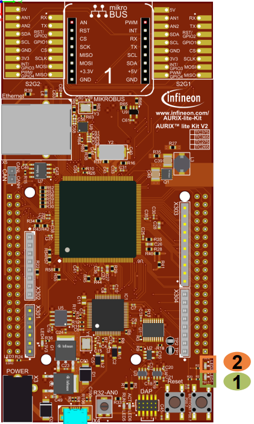

  

# MTU_MBIST_1_KIT_TC375_LK
The MBIST is used to assess the state of the memory.

## Device  
The device used in this example is AURIX&trade; TC37xTP_A-Step.

## Board  
The board used for testing is the AURIX&trade; TC375 lite Kit (KIT_A2G_TC375_LITE).

## Scope of work  
In this training the Memory Test Unit (MTU) is used to initialize and clear the content of an SRAM memory including its ECC code. Additionally, the Non-Destructive Test (NDT) is performed by Memory Built-in-Self-Test (MBIST) to verify the content of the same SRAM memory.
The SRAM of the DMA (DMARAM) is selected to be tested in this example.
In order to test the faulty scenario, this training provides the possibility to inject a single bit error in the memory.
The LEDs on the board are used to signal the correct or faulty behavior of the MBIST.

## Introduction  
The Memory Test Unit (MTU) controls and monitors the test, initialization and data integrity checking functions of the various internal memories in the AURIX&trade; TC3xx family of microcontrollers.
Each SRAM is provided with digital logic surrounding it, known as SRAM Support Hardware (SSH).
Each SSH block controls one or more internal memories, providing an unified interface for the control of ECC (Error Correction) and BIST (Built-in-Self-Test).
The SSH provides direct access to the memories, without involving the CPU.
The Memory Built-in-Self-Test (MBIST) is an MTU feature, which enables the verification of the integrity of internal SRAMs.

## Hardware setup  
This code example has been developed for the board KIT_A2G_TC375_LITE.

  

## Implementation  

### MBIST test implementation:
Execution of the MBIST test is ensured by the *test_MTU_MBIST()* function, containing the following steps:
1. MTU module is enabled: *IfxMtu_enableModule()* 
2. A check for UnCorrectable Error (UCE) alarm is performed: *get_MTU_MBIST_Errors()*
   - If an error is reported*, the UCE alarm status is cleared: *clear_MTU_MBIST_Errors()*
3. The SRAM to be tested is initialized using MTU: *IfxMtu_clearSram()*
4. Optionally, an error is injected before test execution (Please refer to the Correctable Error Injection)
5. The Non-Destructive Test (NDT) is triggered: *IfxMtu_runNonDestructiveInversionTest()*
6. After test completion, the *IfxMtu_runNonDestructiveInversionTest()* function returns whether the RAM content is correct or an error is detected

The functions used to enable the MTU, clear the SRAM and run the NDT are provided by the iLLD header *IfxMtu.h*, while the functions used to get and clear the UCE alarm status can be found in *MTU_MBIST.c*.

**Note**: In this training, the DMARAM is tested by calling *test_MTU_MBIST(IfxMtu_MbistSel_dma)* in the main function. It is possible to test any other SRAM memory *X* by calling *test_MTU_MBIST(IfxMtu_MbistSel_X)*.

*: After any System Reset: For each and every SSH in the system, the UCE alarm status in the SMU, the ECCD.UCERR (Consequently also SERR) and the FAULTSTS.OPERR[0] are set.

### Correctable Error Injection:
The error injection option can be enabled by setting the global variable *g_errorInjection* to *TRUE* in *MBIST_MTU.c* file.

Implementation steps:
1. Safety Endinit protection is cleared: *IfxScuWdt_clearSafetyEndinit()*
2. MBIST controller is enabled: *IfxMtu_enableMbistShell()*
3. Wait for the end of SRAM initialization, in case it is an auto-initialization memory: *IfxMtu_isAutoInitRunning()*
4. One memory address (e.g. 0x1F) is read: *IfxMtu_readSramAddress()*
5. Only one bit should be modified to inject a correctable error. DMARAM is *SECDED* (Single Error Correction, Double Error Detection) 
6. The updated memory is written back to the same address (0x1F): *IfxMtu_writeSramAddress()*
7. MBIST controller is disabled: *IfxMtu_disableMbistShell()*
8. Safety Endinit protection is restored: *IfxScuWdt_setSafetyEndinit()*

The functions above are provided by the iLLD headers *IfxMtu.h* and *IfxScuWdt.h*.

### LED initialization and control:
Two LEDs are used in this training to report the execution of the test
- *LED_PASS* : LED driven by port 00 pin 5
- *LED_FAIL* : LED driven by port 00 pin 6

Ports configuration in the right mode to control LEDs:
- *IfxPort_setPinMode()*

LEDs control (LEDs are low-level active)
- Switch On: *IfxPort_setPinLow()*
- Switch Off: *IfxPort_setPinHigh()*

The functions above are provided by the iLLD header *IfxPort.h*.

## Compiling and programming  
Before testing this code example:  
- Power the board through the dedicated power connector
- Connect the board to the PC through the USB interface  
- Build the project using the dedicated Build button  or by right-clicking the project name and selecting "Build Project"  
- To flash the device and immediately run the program, click on the dedicated Flash button 

## Run and Test
After code compilation and flashing the device, check the behavior of *LED_PASS* (1) and *LED_FAIL* (2):

  

## References  

AURIX&trade; Development Studio is available online:  
- <https://www.infineon.com/aurixdevelopmentstudio>  
- Use the "Import..." function to get access to more code examples  

More code examples can be found on the GIT repository:  
- <https://github.com/Infineon/AURIX_code_examples>  

For additional trainings, visit our webpage:  
- <https://www.infineon.com/aurix-expert-training>  

For questions and support, use the AURIX&trade; Forum:  
- <https://community.infineon.com/t5/AURIX/bd-p/AURIX>  