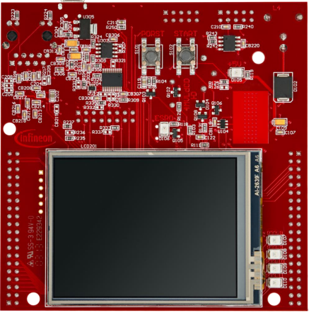
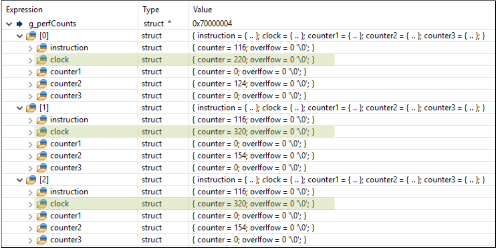

  

# Memory_Access_Performance_1_KIT_TC397_TFT
Data is stored and read back from different RAM locations while the access times are monitored using the CPU performance counters.

## Device  
The device used in this example is AURIX&trade; TC39xTP_A-Step.

## Board  
The board used for testing is the AURIX&trade; TC397 TFT (KIT_A2G_TC397_5V_TFT).

## Scope of work  
A routine is implemented to execute performance measurements using the CPU performance counters. The amount of required CPU clocks is evaluated for ten alternating write and read operations to different memories (DSPR0,DSPR1,LMU). 

## Introduction  
The microcontrollers of the AURIX&trade; TC3xx family have several CPU related volatile memories. Some are dedicated for a certain CPU e.g. the Program Scratch Pad RAM (PSPR), the Data Scratch Pad RAM (DSPR), PCACHE and DCACHE and some are used for general purpose such as the Local Memory Unit (LMU), where the access latency is typically higher.

A higher access latency is also expected if a certain CPU accesses the memory adjacent to another CPU via the SRI bus.

The latency in CPU clock cycles can be easily measured using the CPU performance counters.

## Hardware setup  
This code example has been developed for the board KIT_A2G_TC397_5V_TFT.

  

## Implementation  

### Defining global data fields within the different volatile memories
The global macro *BUFFERSIZE* defines the size of 10 elements for the data fields.

Alternate writes and reads are repeated ten times to determine the number of CPU clocks. 
The global array *g_DataLMU[BUFFERSIZE]* defines the data field in the LMU. Furthermore, the global array *g_DataDSPR0[BUFFERSIZE]* and *g_DataDSPR1[BUFFERSIZE]* define the data fields in the *DSPR0* and *DSPR1*. The compiler directive *#pragma* is used to force the compiler to put the global variables in the corresponding volatile memory.

### Sequence of memory performance measurements
A series of measurements is conducted by repeatedly invoking the function *accessData()* with different parameters inside the function *measurePerformance()*. The first argument is the data field where the write/read access goes to/comes from and the second argument is a container to store the results of the performance counter.

**Note**: For using the performance counters, the On-Chip Debug System has to be enabled. This is ensured by the debugger itself, therefore the example has to be tested within an active debug session.

### Executing write and read accesses
The function *IfxCpu_resetAndStartCounters()* starts the CPU performance counters. A parameter is specifying the counter mode:
- *Normal* mode: The counters start counting as soon as they are enabled and will keep counting until they are disabled
- *Task* mode: The counters will only count if the processor detected a debug event with the action to start the performance counters

A *for* loop is used to write the index value into the data field and read it back. The first parameter of the function *accessData()* is specified as volatile. This prevents the compiler from optimizing the assembler code in order to ensure that the index of the for loop is read back from the memory.

To ensure that the Store Buffer is flushed before starting the read operation, a *DSYNC* TriCore&trade; instruction is performed using the *__dsync()* intrinsic function.

The function *IfxCpu_stopCounters()* stops and returns the counters’ values.

Both the functions *IfxCpu_resetAndStartCounters()* and *IfxCpu_stopCounters()* are part of the Infineon low level drivers and are implemented in *IfxCpu.h*.

**Note**: In TriCore&trade; TC1.6.2P CPUs, store buffering is implemented to decouple memory write operations from CPU instruction execution, thus increasing their performance. All stores from the CPU are placed in the store buffer prior to being written to local memory or transferred via the bus system. Therefore, if there is a requirement that data is written to local memory prior to execution of a subsequent instruction, then a *DSYNC* instruction may be used to flush the store buffers. In this simple example, the *DSYNC* instruction is needed, otherwise the write-read operations can be “optimized” by the store buffer and the memory access timings will have the same value across different types of memories.

### Disabling the DCACHE
The CPU uses the DCACHE for data storage into the LMU. This is prevented by switching off the DCACHE usage. The macro *IFX_CFG_SSW_ENABLE_TRICORE0_DCACHE* is required to be set to zero.

The macro is configured inside the header file *Ifx_Cfg.h*. 

## Compiling and programming  
Before testing this code example:  
- Power the board through the dedicated power connector
- Connect the board to the PC through the USB interface  
- Build the project using the dedicated Build button  or by right-clicking the project name and selecting "Build Project"  
- To flash the device and immediately run the program, click on the dedicated Flash button 

## Run and Test   
After code compilation and flashing the device, check the amount of clocks representing the access latency in the debugger perspective:
- Add the global variable *g_perfCounts* to the Watch window and check the elements 0,1 and 2
- 0: CPU0 writes and reads to/from DSPR0
- 1: CPU0 writes and reads to/from DSPR1
- 2: CPU0 writes and reads to/from LMU

  

## References  

AURIX&trade; Development Studio is available online:  
- <https://www.infineon.com/aurixdevelopmentstudio>  
- Use the "Import..." function to get access to more code examples  

More code examples can be found on the GIT repository:  
- <https://github.com/Infineon/AURIX_code_examples>  

For additional trainings, visit our webpage:  
- <https://www.infineon.com/aurix-expert-training>  

For questions and support, use the AURIX&trade; Forum:  
- <https://community.infineon.com/t5/AURIX/bd-p/AURIX>  