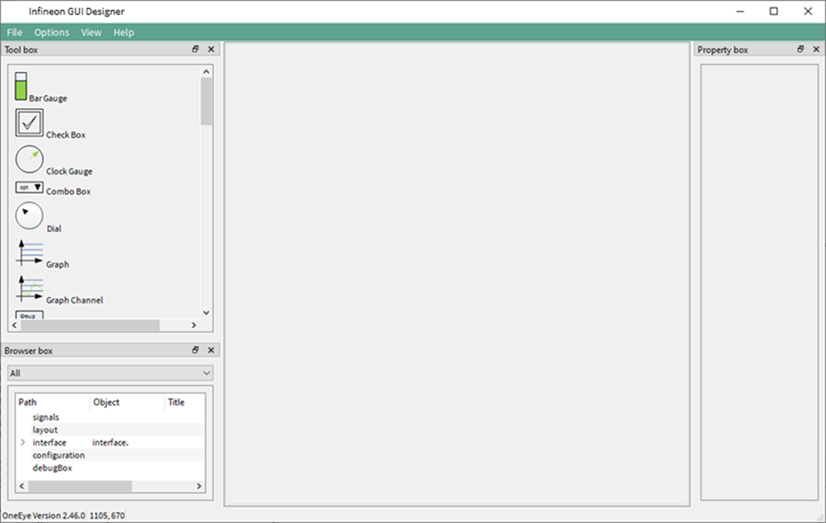
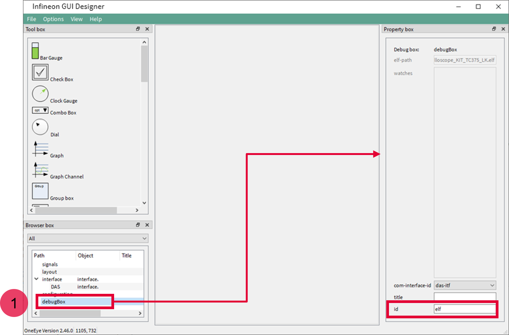
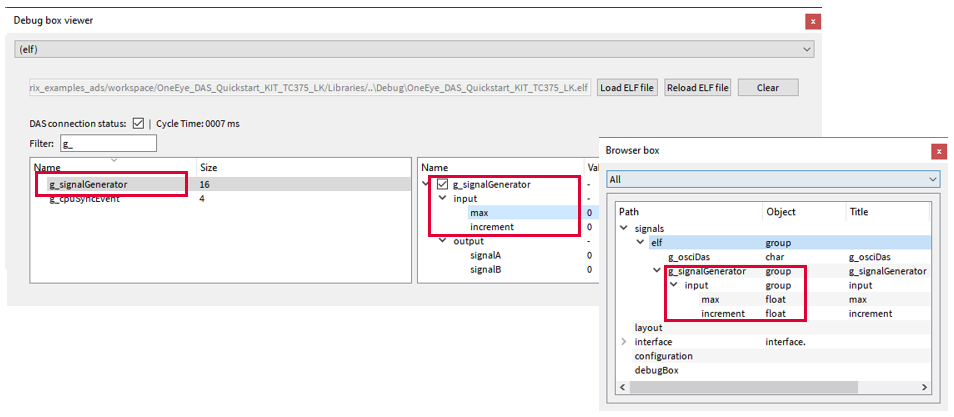
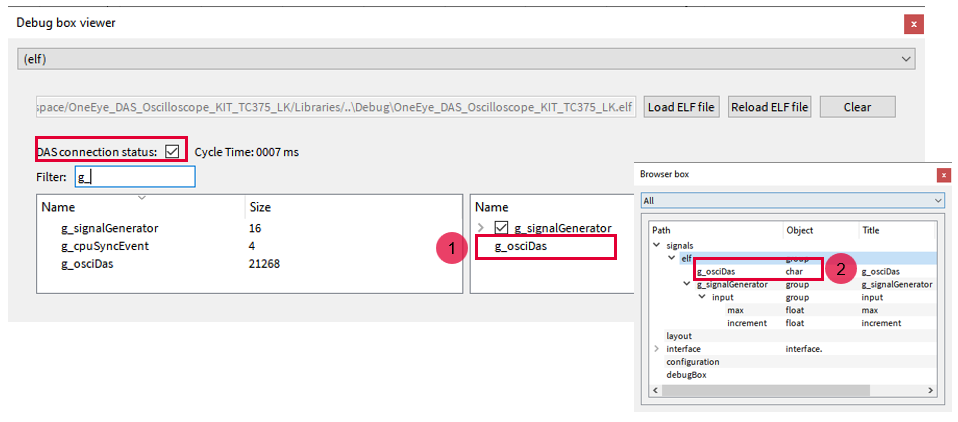
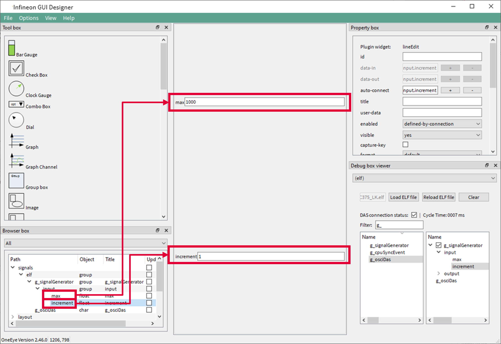
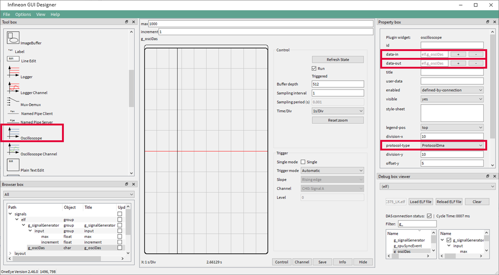
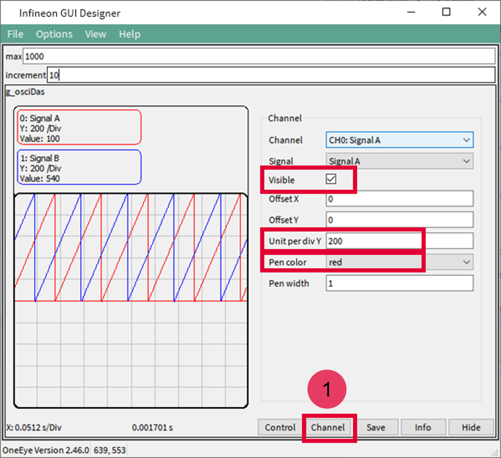
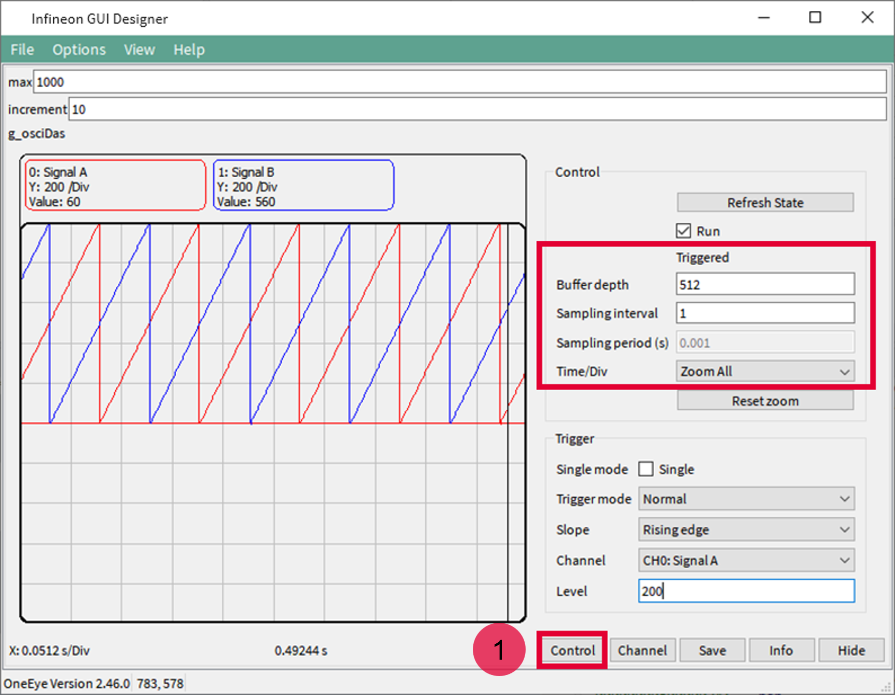
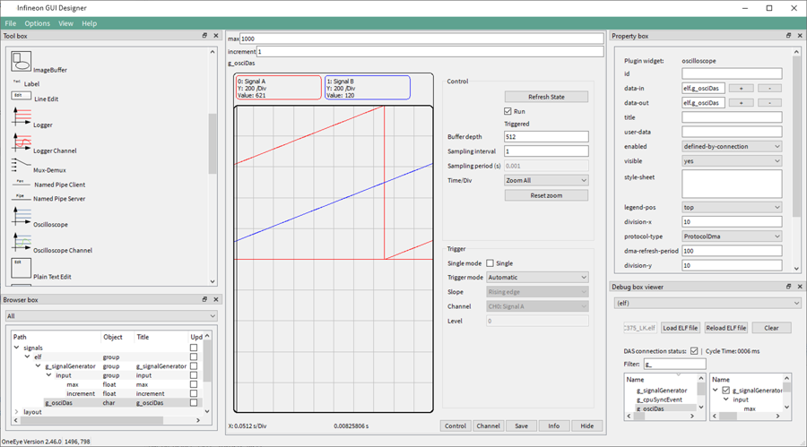

  

# OneEye_DAS_Oscilloscope_1_KIT_TC375_LK  
**Demonstrate how to implement the Infineon GUI Designer oscilloscope over the DAS interface**  

## Device  
The device used in this example is AURIX&trade; TC37xTP_A-Step.  

## Board  
The board used for testing is the AURIX&trade; TC375 lite Kit (KIT_A2G_TC375_LITE). 

## Scope of work  
After configuring the Infineon GUI Designer DAS interface, a Infineon GUI Designer oscilloscope is created with two signals. The signals are updated and sampled every millisecond. Infineon GUI Designer( is used to visualize the signal values.    

## Introduction  
**Infineon GUI Designer** is a GUI that enables the creation of interactive Graphical User Interface. Graphical elements can be drag from a toolbox and drop onto the GUI. The behavior of the created GUI can be customized. Different communication interfaces like UART, Ethernet, CAN, DAS can be used to interact with the embedded system.  

The **DAS** (Device Access Server) can be used in line with Infineon Microcontroller Starter Kits, Application Kits and DAP MiniWiggler to access the micro controller resources.  

**Recommendation**: It is recommended to go through some of the basic tutorials listed in the help embedded in Infineon GUI Designer( (Menu: Help &rarr; Infineon GUI Designer help). This enables a quicker ramp-up in the Infineon GUI Designer concept and ensure a nice journey with Infineon GUI Designer.  

## Hardware setup  
This code example has been developed for the board KIT_A2G_TC375_LITE.  

The board should be connected to the PC through the USB port.  

  

## Implementation - AURIX  
**Configuring the Infineon GUI Designer Oscilloscope**  

An Infineon GUI Designer oscilloscope (*Ifx_Osci*) is a special object that is recognized by Infineon GUI Designer. It enables streaming of data and controls the oscilloscope state.  
The Infineon GUI Designer oscilloscope is initialized with *Ifx_Osci_init()*.  

The *autoAddChannels* parameter enables to automatically add channels for each created oscilloscope signal. The sample period (samplePeriod) is set to 1ms and provides Infineon GUI Designer information about sample timing. The *triggerMode* is set to automatic, note that this value can be changed from the Infineon GUI Designer oscilloscope interface later.  
The *Ifx_Osci.h* file can be found in the Libraries\OneEye directory.  

**Adding signals to the oscilloscope**  

Oscilloscope signals are mainly pointers that the oscilloscope can use for data sampling. The signals are added using *Ifx_Osci_addSignal()*. The function takes as parameter the signal name displayed by the oscilloscope, the signal type which informs the oscilloscope how to read the pointer value and a source pointer to the data. The last parameter corresponds to the q format used in case of fix point data, or 0 if not used.  

**Starting the oscilloscope**  

The oscilloscope is started with *Ifx_Osci_start()*.  

**Configuring the signal generator**  

A signal generator is used to provide the user with some value to read / write. The signal generator does nothing more that incrementing two signals, *signalA* and *signalB*, stored in the structure *g_signalGenerator* up to a maximum value before resetting them.  
The initialization of the signal generator is done with *initSignals()*.  

**Running the signal generator and the oscilloscope**  

The signal generator is executed in the background loop every 1ms with *computeSignals()*. For that a deadline variable is initialized with *getDeadLine()* and periodically updated with *addTTime()* to obtain the 1ms period.  
The oscilloscope is run in the same background loop with *Ifx_Osci_step()*. This function handles the triggering, and sampling of data.  

**Note**: the call to *Ifx_Osci_step()* can be moved to an interrupt service routine if required by the application use case.  

## Compiling and programming  
Before testing this code example:  
- Connect the board to the PC through the USB interface  
- Build the project using the dedicated Build button  or by right-clicking the project name and selecting "Build Project"  
- To flash the device and immediately run the program, click on the dedicated Flash button   

## Run and Test   

For this training, the Infineon GUI Designer application is required for visualizing the values. Infineon GUI Designer can be opened inside the AURIX&trade; Development Studio using the following icon:  

  

Clicking the Infineon GUI Designer icon automatically opens the OneEye configuration for the active project. If no configuration exists, it is created by AURIX&trade; Development Studio.  

## Implementation - Infineon GUI Designer  

In this training, the OneEye configuration is provided inside the Libraries folder. The following steps are needed to configure the oscilloscope from a brand-new configuration.  

**Setup OneEye for editing**  

Select the Infineon GUI Designer menu *Options &rarr; Edit mode* (if not already checked) to enable the edit mode.    
Select the Infineon GUI Designer menu *View &rarr; Browser box*, *View &rarr; Property box* , *View &rarr; Tool box* (if not already checked) to display the browser, property box, and tool box.  

  

**Configuring the DAS interface**  

When the OneEye configuration is created by ADS, it is already setup with a DAS interface.  
Select the DAS interface in the Browser box (1).  

Notice the *system-key* {ADS} that enables the connection to the device in parallel with the ADS debugger  

  

**Create a debug box to get access to variables from the .elf file**  
A debugBox item is already setup by default when ADS creates the OneEye configuration, preconfigured with the *project.elf* file path.  
Select the DAS interface in the Browser box (1).  
Set the id property to *elf*, which enables to group variables into the signal tree later.  
**Note**: this value is not set by default by ADS.  

  

**Open the debug box viewer and connect to the device**  
Select the Infineon GUI Designer menu *View &rarr; Debug box viewer* (if not already checked) to display the debug box. Select the debug box with the id *(elf)* (1) if not yet selected by default.  
Note that the debug box enables the selection of the *.elf* file to be used to get information about the variables.  
The Filter field (2), enables to filter variables by name. E.g. in this example, entering *g_* will filter for global variables.  

To enable the connection with the microcontroller and have read / write access to variables, check the *DAS connection status* box (3).  

  

**Create signals for signal generator input parameters**  
In the debug box, search for the *g_signalGenerator* variable, right click on it and select *Add watch on: g_signalGenerator*. The watch should appear on the right side of the debug box. Watches are periodically polled for new values on the microcontroller.  
Expand the *g_signalGenerator* item on the right and right-click on the max and increment variables to create two signals with the option *Create signal for: …*.  

  

The created signals should appear in the browser box under the *signals.elf* group.  

**Create signals for the oscilloscope**  
In the debug box, search for the *g_osciDas* variable, right click on it and select *Create oscilloscope watch on: g_osciDas*. The watch should appear on the right side of the debug box (1). Watches are periodically polled for new values on the microcontroller.  
A signal is also automatically created to access the oscilloscope (2).  

  

The created signals should appear in the browser box under the *signals.elf* group.  

**Create edit fields for the generator input parameters**  
Drag and drop the signals *elf.g_signalGenerator.input.max* and *elf.g_signalGenerator.input.increment* from the browser box onto the layout to create default widget for them.  

  

**Create the oscilloscope widget**  
Drag and drop the oscilloscope widget from the toolbox onto the layout, set the oscilloscope properties data-in and data-out to *elf.g_osciDas*. Set the protocol-type property to ProtocolDma.  

  

**Test the oscilloscope**  
In the oscilloscope Channel tab, click on the Channel button (1) and check the visible check box for both CH0: Signal A and CH1: Signal B to display the two channels.  

Set the Unit per div Y to 200 for both CH0: Signal A and CH1: Signal B.  

Select the Pen color red for CH0: Signal A and blue for CH1: Signal B.  

The values for signalA and signalB should be changing in the oscilloscope, if it is not the case check that the *DAS connection status* is checked in the debug box viewer.  

One can change the max and increment values to change the generator behaviour.  

  

The oscilloscope Control tab provides configuration for the trigger and information about the oscilloscope state (armed, triggered, uploading).  
Click on the Control button (1) and set the Time/Div value to Zoom All to configure the horizontal scale to use the full screen of the oscilloscope window.  

The Buffer depth, configures the oscilloscope buffer depth, here 512 points are used to fill the buffer. This value can be changed within the limit set by the software.  

The Sampling interval provides the oscilloscope the information whether to sample at each interval (1) or not (>1).  

  

The final configuration should look like the following:  

  

**Advanced options**
Advanced configuration can be added to the file Ifx_Cfg.h or ifx_oe_cfg.h  to tune the oscilloscope capabilities, this includes:

- IFX_CFG_OE_OSCI_MAX_NUM_OF_SIGNALS: the maximum number of signals that can be declared by the user
- IFX_CFG_OE_OSCI_MAX_NUM_OF_CHANNELS: the maximum number of channels that can be buffered
- IFX_CFG_OE_OSCI_NUM_OF_SAMPLES: the maximum number of sample per channel

Note that the memory used by the oscilloscope is mainly defined by IFX_CFG_OE_OSCI_MAX_NUM_OF_CHANNELS * IFX_CFG_OE_OSCI_NUM_OF_SAMPLES * 4

Default values for the above-mentioned macros are provided in Library/OneEye/ifx_oe_oscicfg.h.

## References  

AURIX&trade; Development Studio is available online:  
- <https://www.infineon.com/aurixdevelopmentstudio>  
- Use the "Import..." function to get access to more code examples  

More code examples can be found on the GIT repository:  
- <https://github.com/Infineon/AURIX_code_examples>  

For additional trainings, visit our webpage:  
- <https://www.infineon.com/aurix-expert-training>  

For questions and support, use the AURIX&trade; Forum:  
- <https://community.infineon.com/t5/AURIX/bd-p/AURIX>  
