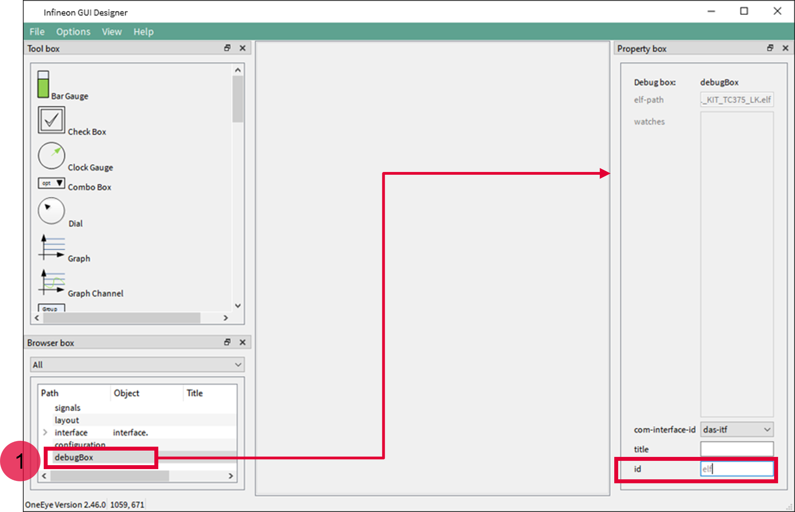
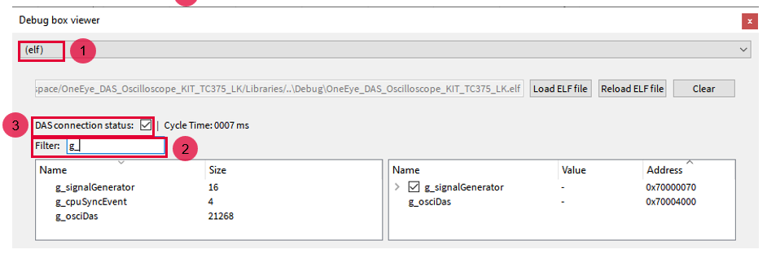
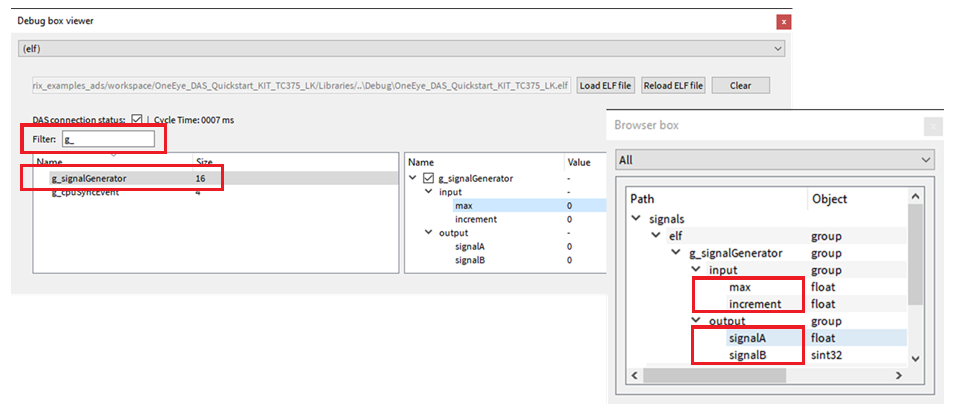
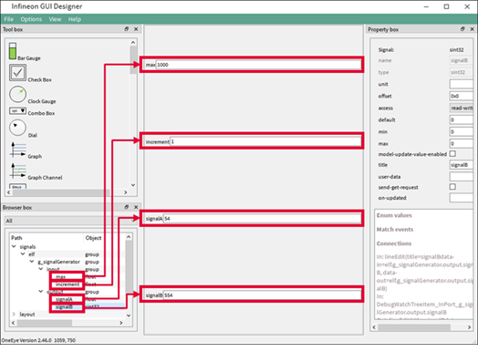
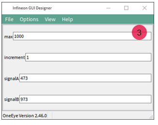

  

# OneEye_DAS_Quickstart_1_KIT_AURIX_TC375_LK
  
**Read / write variables over DAS using Infineon GUI Designer(OneEye)**  

## Device  
The device used in this example is AURIX&trade; TC37xTP_A-Step.  

## Board  
The board used for testing is the AURIX&trade; TC375 lite Kit (KIT_A2G_TC375_LITE). 

## Scope of work  
Demonstrate how to use the Infineon GUI Designer(OneEye) DAS interface to access variables. After configuring the Infineon GUI Designer DAS interface, Infineon GUI Designer is used to read / write variables.

## Introduction  
**Infineon GUI Designer** is a GUI that enables the creation of interactive Graphical User Interface. Graphical elements can be drag from a toolbox and drop onto the GUI. The behavior of the created GUI can be customized. Different communication interfaces like UART, Ethernet, CAN, DAS can be used to interact with the embedded system

The **DAS** (Device Access Server) can be used in line with Infineon Microcontroller Starter Kits, Application Kits and DAP MiniWiggler to access the micro controller resources.  

**Recommendation:** It is recommended to go through some of the basic tutorials listed in the help embedded in Infineon GUI Designer (Menu: Help &rarr; Infineon GUI Designer help). This enables a quicker ramp-up in the Infineon GUI Designer concept and ensure a nice journey with Infineon GUI Designer

## Hardware setup  
This code example has been developed for the board KIT_A2G_TC375_LITE.  

The board should be connected to the PC through the USB port.  

  

## Implementation - AURIX  
**Configuring the signal generator**
A signal generator is used to provide the user with some value to read / write. The signal generator does nothing more that incrementing two signals *signalA* and *signalB* stored in the structure *g_signalGenerator* up to a maximum before resetting them. 
The initialization of the signal generator is done with *initSignals()*.

**Running the signal generator**

The signal generator is executed in the background loop every 1ms with *computeSignals()*. For that a deadline variable is initialized with *getDeadLine()* and periodically updated with *addTTime()* to obtain the 1ms period.  

**Note**: The access to software variable does not require any special code or library, as the DAS enables Infineon GUI Designer to directly read / write the microcontroller memory.

## Compiling and programming  
Before testing this code example:  
- Connect the board to the PC through the USB interface  
- Build the project using the dedicated Build button  or by right-clicking the project name and selecting "Build Project"  
- To flash the device and immediately run the program, click on the dedicated Flash button   

## Run and Test   

For this training, the Infineon GUI Designer application is required for visualizing the values. Infineon GUI Designer can be opened inside the AURIX&trade; Development Studio using the following icon:  

  

Clicking the Infineon GUI Designer icon automatically opens the OneEye configuration for the active project. If no configuration exists, it is created by AURIX&trade; Development Studio.  

## Implementation - Infineon GUI Designer  

In this training, the OneEye configuration is provided inside the Libraries folder. The following steps are needed to configure the oscilloscope from a brand-new configuration.  

**Setup Infineon GUI Designer for editing**  

Select the Infineon GUI Designer menu *Options &rarr; Edit mode* (if not already checked) to enable the edit mode.
Select the Infineon GUI Designer menu *View &rarr; Browser box*, *View &rarr; Property box* , *View &rarr; Tool box* (if not already checked) to display the browser, property box, and tool box.
Close the Welcome screen if it was shown.

  

**Configuring the DAS interface**  

When the OneEye configuration is created by ADS, it is already setup with a DAS interface.  
Select the DAS interface in the Browser box (1).  

Notice the *system-key* {ADS} that enables the connection to the device in parallel with the ADS debugger  

  

**Create a debug box to get access to variables from the .elf file**  
A debugBox item is already setup by default when ADS creates the OneEye configuration, preconfigured with the *project.elf* file path.  
Select the DAS interface in the Browser box (1).  
Set the id property to *elf*, which enables to group variables into the signal tree later.  
**Note**: this value is not set by default by ADS.  

  

**Open the debug box viewer and connect to the device**  
Select the Infineon GUI Designer menu *View &rarr; Debug box viewer* (if not already checked) to display the debug box. Select the debug box with the id *(elf)* (1) if not yet selected by default.  
Note that the debug box enables the selection of the *.elf* file to be used to get information about the variables.  
The Filter field (2), enables to filter variables by name. E.g. in this example, entering *g_* will filter for global variables.  

To enable the connection with the microcontroller and have read / write access to variables, check the *DAS connection status* box (3).  

  

**Create signals for variable**  
In the debug box, search for the *g_signalGenerator* variable, right click on it and select *Add watch on: g_signalGenerator*. The watch should appear on the right side of the debug box. Watches are periodically polled for new values on the micro controller. 
Expand the *g_signalGenerator* item on the right and right-click on each watch member variables to create a signal with *Create signal for: ...*
  

 

The created signals should appear in the browser box under the *signals.elf* group

**Show and edit variables**
Drag and drop each of the variable corresponding signals (*max*, *increment*, *signalA*, *signalB*) from the browser box onto the layout to create default widget for them.
The values for signalA and signalB should be changing, if it is not the case check if the *DAS connection status* is checked in the debug box viewer. One can change the max and increment values to change the generator behaviour.

 

Save your configuration with CTRL+S.
Exit the edit mode with the Infineon GUI Designer menu *Options &rarr; Edit mode* to only see the GUI:

  

## References  

AURIX&trade; Development Studio is available online:  
- <https://www.infineon.com/aurixdevelopmentstudio>  
- Use the "Import..." function to get access to more code examples  

More code examples can be found on the GIT repository:  
- <https://github.com/Infineon/AURIX_code_examples>  

For additional trainings, visit our webpage:  
- <https://www.infineon.com/aurix-expert-training>  

For questions and support, use the AURIX&trade; Forum:  
- <https://community.infineon.com/t5/AURIX/bd-p/AURIX>  
