  

# OneEye_UART_Mux_1_KIT_AURIX_TC375_LK

**Data multiplexer over UART using Infineon GUI Designer(OneEye)**  

## Device  
The device used in this example is AURIX&trade; TC37xTP_A-Step.  

## Board  
The board used for testing is the AURIX&trade; TC375 lite Kit (KIT_A2G_TC375_LITE). 

## Scope of work  
Demonstrate how to implement the data multiplexer over the UART (USB) interface
After configuring the Infineon GUI Designer(OneEye) UART interface, a data multiplexer is created. Infineon GUI Designer is used to visualize the signal values.

## Introduction  
**Infineon GUI Designer** is a GUI that enables the creation of interactive Graphical User Interface. Graphical elements can be drag from a toolbox and drop onto the GUI. The behavior of the created GUI can be customized. Different communication interfaces like UART, Ethernet, CAN, DAS can be used to interact with the embedded system

*SyncProtocol / ProtocolBB* is a synchronous protocol that enables data streaming between the target microcontroller and Infineon GUI Designer. It enables to open multiple communication channels, provide packet acknowledge and packet checksum. Data are transported within a message with a message ID and a message payload. See the Infineon GUI Designer help for more information.

  

*Note:* It is recommended to go through some of the basic tutorials listed in the help embedded in Infineon GUI Designer (Menu: Help  Infineon GUI Designer help). This enables a quicker ramp-up in the Infineon GUI Designer concept and ensures a nice journey with Infineon GUI Designer

## Hardware setup  
This code example has been developed for the board KIT_A2G_TC375_LITE.  

The board should be connected to the PC through the USB port.  

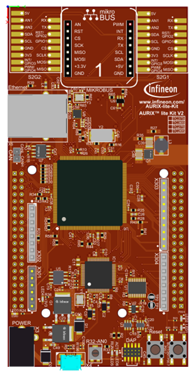  

## Implementation - AURIX  
**Configuration overview**
In this configuration two C struct are used to exchange data over the COM port between the microcontroller and Infineon GUI Designer. 
In Infineon GUI Designer, two signals *bb.in* and *bb.out* are used to connect the COM port data stream to the BB protocol. The BB protocol is configured to open a channel reserved for the data multiplexer. This channel connects to the Mux-Demux widget using the *mux.in* and *mux.out* signals. The Mux-Demux widget connects to a slider with the *command.max* signal and a Graph with the *status.signalA* and *status.signalB* signals.

  

**Enabling the OneEye library**
The OneEye library must be enabled by adding the following line to *Ifx_Cfg.h*:

*#define IFX_CFG_OE_AL_UC IFX_CFG_OE_AL_UC_AURIX_ILLD*

*#define IFX_CFG_OE_AL_UTILS*

**Configuring the data multiplexer**
An Infineon GUI Designer BB protocol client (*Ifx_Oe_SyncProtocol_Client*) is an object that enables raw massage data transmission using the BB protocol (*Ifx_Oe_SyncProtocol*). 
The Infineon GUI Designer BB protocol client is initialized with *initDataMultiplexer() / Ifx_Oe_SyncProtocol_addClient()*.
The *ifx_oe_syncprotocol.h* file can be found in the Libraries\OneEye directory.

**Configuring the UART communication**
The UART communication is initialized with the function *initUart()*, which also initializes the BB protocol.
In the infinite while loop, the function *processUart()* executes the SyncProtocol.

**Receiving data from Infineon GUI Designer**
Receiving data from Infineon GUI Designer is done within *processDataMultiplexer()*. The client is periodically checked for incoming messages using the *Ifx_Oe_SyncProtocol_isMessageAvailable()* passing a pointer to the BB client as parameter.
To decode the received data, a message buffer must be acquired first with the function *Ifx_Oe_SyncProtocol_getReadMessageBuffer()*. The function takes a pointer to the BB client as input parameter, and pointers to a message ID, a message payload buffer and a message length as output parameters. Then the message payload pointer is cast to the C struct type that defines the data. Finally the data are readout from the C struct and the message is released using *Ifx_Oe_SyncProtocol_releaseReadMessageBuffer().*

**Sending data to Infineon GUI Designer**
Sending data to Infineon GUI Designer is done within *processDataMultiplexer().* Data are send periodically (100ms). The timing is ensured using the *Ifx_Oe_Time_isDeadLine()* and *Ifx_Oe_Time_add()* functions.
To send data, a message buffer must be acquired first with *Ifx_Oe_SyncProtocol_setSendMessageBuffer()*. The function takes a pointer to the BB client, the message ID and the message size parameters. Then the message payload is cast to the C struct type containing the data and the C struct is filled with data. Finally, the message is send using *Ifx_Oe_SyncProtocol_sendMessage()* passing the message pointer as parameter.

*Note:* it is important to ensure the struct member offset and size to enable proper encoding / decoding by Infineon GUI Designer. This memory mapping is specific to the CPU data alignment and compiler. For Hightec compiler, the__attribute__((packed)) is added to the *DataStreaming_Data_0* and *DataStreaming_Data_1* struct definition.

**Configuring the signal generator**
A signal generator is used to provide the user with some value to read / write. The signal generator does nothing more than incrementing two signals, *signalA* and *signalB*, stored in the structure *g_signalGenerator* up to a maximum value before resetting them. 
The initialization of the signal generator is done with *initSignalGenerator()*.

**Running the signal generator**
The signal generator is executed in the background loop every 1ms with *processSignalGenerator()*. To ensure the timing, a deadline variable is periodically updated with *Ifx_Oe_Time_add()* to obtain the 1ms period.

## Compiling and programming  
Before testing this code example:  
- Connect the board to the PC through the USB interface  
- Build the project using the dedicated Build button  or by right-clicking the project name and selecting "Build Project"  
- To flash the device and immediately run the program, click on the dedicated Flash button   

## Run and Test   

For this training, the Infineon GUI Designer application is required for visualizing the values. Infineon GUI Designer can be opened inside the AURIX&trade; Development Studio using the following icon:  

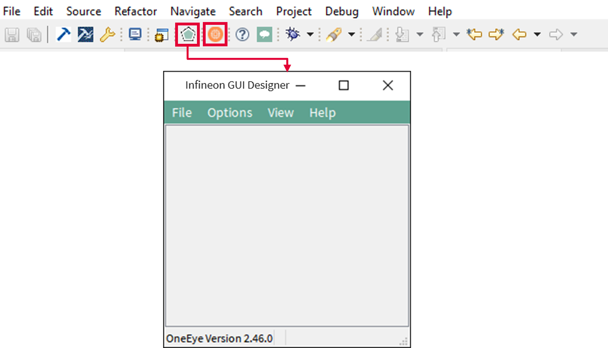  

Clicking the Infineon GUI Designer icon automatically opens the OneEye configuration for the active project. If no configuration exists, it is created by AURIX&trade; Development Studio.  

## Implementation - Infineon GUI Designer  

In this training, the OneEye configuration is provided inside the Libraries folder. The following steps are needed to configure the oscilloscope from a brand-new configuration.  

**Setup Infineon GUI Designer for editing**  

Select the Infineon GUI Designer menu *Options &rarr; Edit mode* (if not already checked) to enable the edit mode.
Select the Infineon GUI Designer menu *View &rarr; Browser box*, *View &rarr; Property box* , *View &rarr; Tool box* (if not already checked) to display the browser, property box, and tool box.
Close the Welcome screen if it was shown.

  

**Removing the default DAS interface**
When the OneEye configuration is created by ADS, it is already setup with a DAS interface.
Select the interface in the Browser box (1) and delete it with *right click and remove* as it is not required in this example.

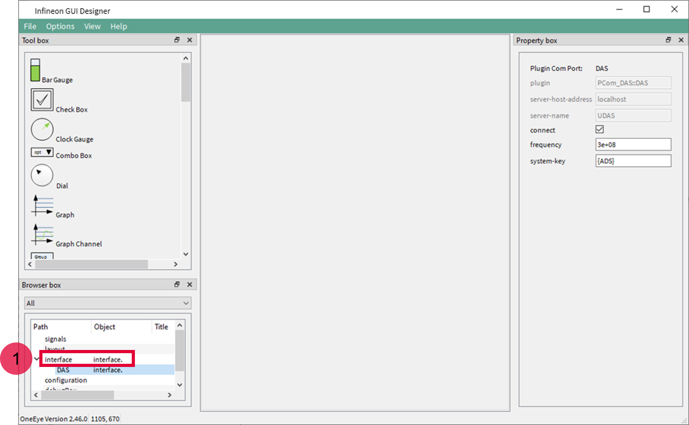  

**Configuring the UART interface: Signal creation**
The first step is to create 2 signals to connect the received and transmit data over the UART.
Create a signal group and set its name property to *bb.* 

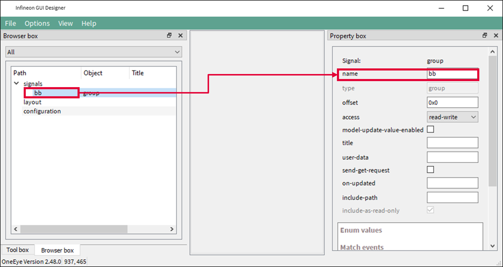  

Add two signals of type char into the bb group, name them in and out, and set their title property to respectively BB in and BB out.

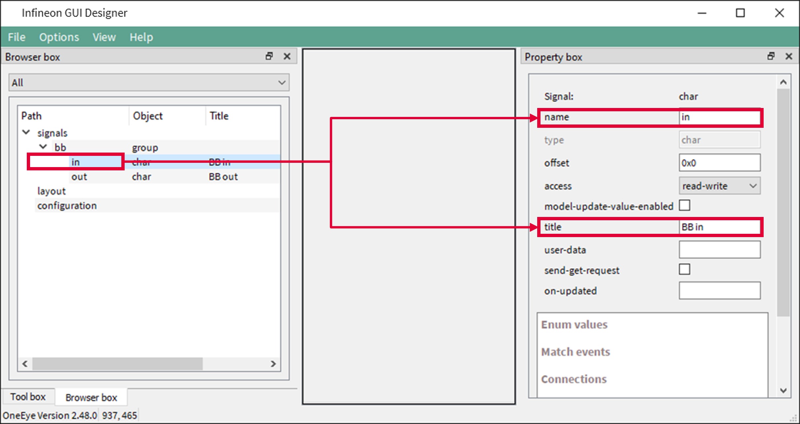  

**Configuring the UART interface: COM port**
Right click in an empty area of the Browser box, and select *Add child &rarr; Interface*. Then right click on the created interface and select *Add child &rarr; com.* Select the com item and set its device property to the COM port connected to the AURIX board. Set the *baudrate* property to *115200* and click connect.

The COM port is now opened and ready for communication.

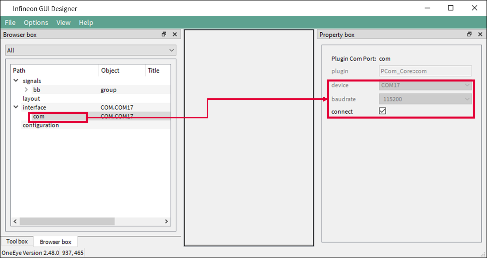  

**Configuring the UART interface: Transmit stream**
Right click on the interface in the Browser box, and select *Add child &rarr; dataMessageHandler*. Then right click on the created dataMessageHandler and select *Add child &rarr; message* to create a message item. 
Configure the message with the *interval=0.001*, send-on-new-data checked, *dir=tx*, stream checked.

  

Right click on the message, and select *Add child &rarr; field*. 
Configure the field with *name=bb.out*, *bit-pos=0*, *buffer=512*.

Now, data will be transmitted over the UART each time the bb.out signal is written with some data.

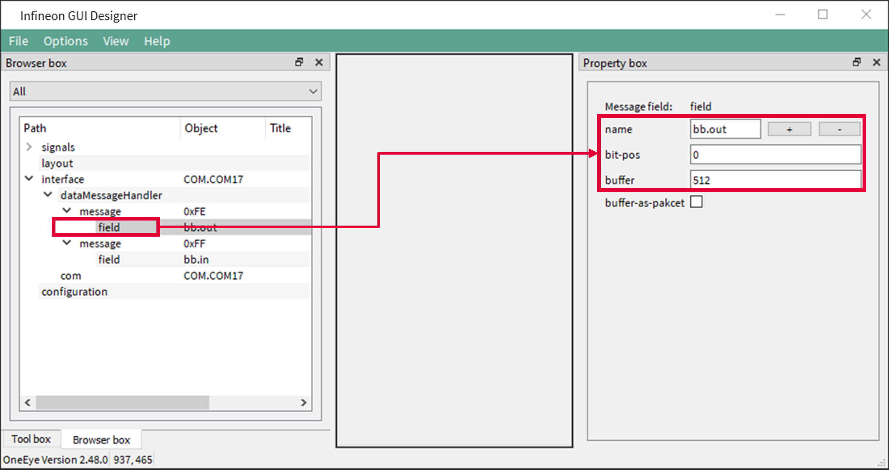  

**Configuring the UART interface: Receive stream**

Right click on the dataMessageHandler and select *Add child &rarr; message* to create a second message item. 
Configure the message with the *interval=-1*, *dir=rx*, stream checked.

  

Right click on the message and select *Add child &rarr; field*. 
Configure the field with *name=bb.in*, *bit-pos=0*.

Now each time data are received over the UART, the *bb.in* signal will be updated.

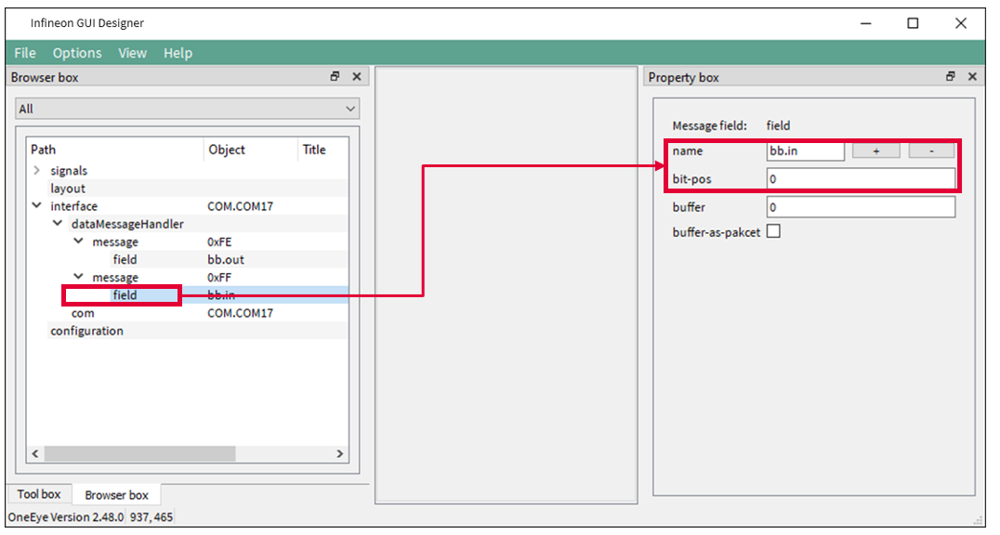  

**Configuring the UART interface: Push button**

Drag and drop a pushButton widget from the toolbox onto the layout, configure it with *title=Setup Serial Interface*, *on-click={show.connection.ui}*.

Clicking the button now shows the COM port configuration window.

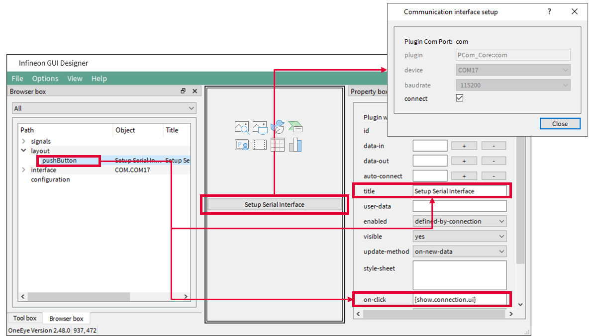  

**Configuring the BB protocol**

Right click in an empty area of the Browser box, and select *Add child &rarr; protocolEngine*. Then right click on the created *protocolEngine* and select *Add child &rarr; protocol-core-bb*. Connect the BB protocol stream to the *bb.in* and *bb.out* signals by setting respectively the *data-in* and *data-out* properties. Set the name property to *BB-core*. And set the timeout to 2000 ms so that frames are dropped after 2 seconds in case the microcontroller is not answering.

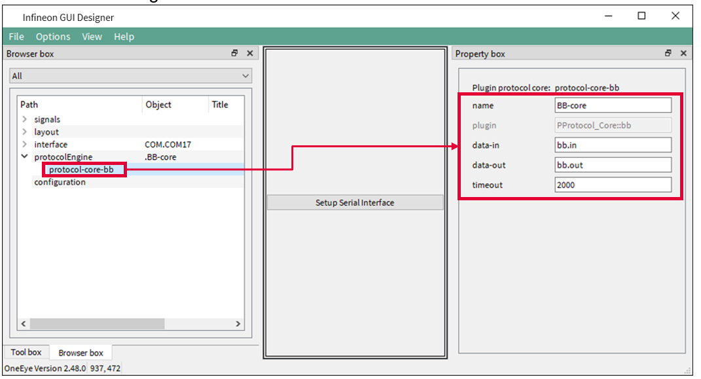  

**Configuring the Data multiplexer: signals creation**

Create a signal group under the *signals* root and set its name property to mux. 

  

Add two signals of type char into the mux group, name them in and out, and set their title property to respectively Mux in and Mux out.

  

**Creating signals to send commands to the AURIX**

Create a signal group under the signals root and set its name property to command. 
Add two signals of type float into the command group, name them max and increment, and set their title property to respectively Max and Increment.

  

**Creating signals for the received data**

Create a signal group under the signals root and set its name property to status. 
Add two signals of type float and sint32 into the status group, name them *signalA* and *signalB*, and set their title property to respectively *Signal A* and *Signal B*. Note that the data type must match the one defined in the AURIX C struct *DataStreaming_Data_0*.

  

**Create the slider widgets to send command to the AURIX**

Drag and drop a slider widget from the toolbox onto the layout, set the slider properties auto-connect to  command.max. and max to 1200, 

  

**Create the graph widgets to display the signals value**

Drag and drop a graph widget from the toolbox onto the layout.

  

**Create the graph widgets to display the signals value**

Drag and drop a Graph Channel (channel) widget from the toolbox onto the layout, set the channel properties auto-connect to  *status.signalA*, unit-per-division-y to 200, and color to green. Repeat the operation for a second channel and set the channel properties auto-connect to  *status.signalB*, and color to black.

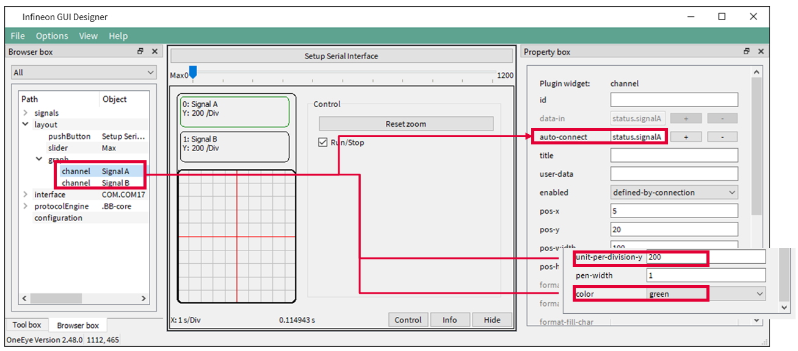  

**Create the muxDemux widgets to connect the BB protocol to the graph  and slider widgets**

Drag and drop a Mux-Demux (muxDemux) widget from the toolbox onto the layout, set the muxDemux properties data-in and data-out to respectively *mux.in* and *mux.out*.

  

Right click on the muxDemux widget in the browser box, and select *Add child &rarr; muxDemuxMessage*, set the *muxDemuxMessage* properties id to 0x4000 and dir to demux to decode received messages.

  

Right click on the *muxDemuxMessage* in the browser box, and select *Add child &rarr; muxDemuxField*, set the *muxDemuxField* properties name to *status.signalA*, bit-pos to 0.

Repeat the operation for a second signal and set its properties name to status.signalB, bit-pos to 32.

Note: the *status.signalA* and *status.signalB* signal size (32 bits), type (float / sint32) and offset (0 / 32) must match the data member *signalA* and *signalB* of the C struct *DataStreaming_Data_0*.

  

Right click on the *muxDemux* widget in the browser box, and select *Add child &rarr; muxDemuxMessage*, set the *muxDemuxMessage* properties id to 0x4001 and dir to mux to encode and send messages. Set the length property to 4 bytes, which corresponds of the size of the C struct DataStreaming_Data_1. 

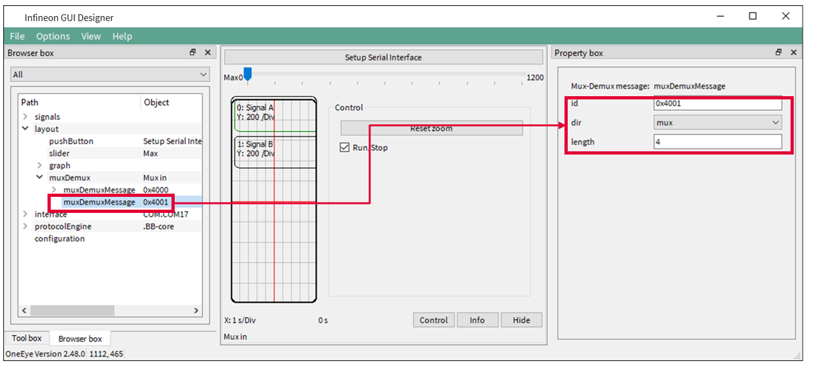  

Right click on the *muxDemuxMessage* in the browser box, and select *Add child &rarr; muxDemuxField*, set the *muxDemuxField* properties name to command.max, bit-pos to 0, and check send-on-new-data.

Note: the command.max signal size (32 bits), type (float) and offset (0) must match the data member max or the C struct DataStreaming_Data_1.

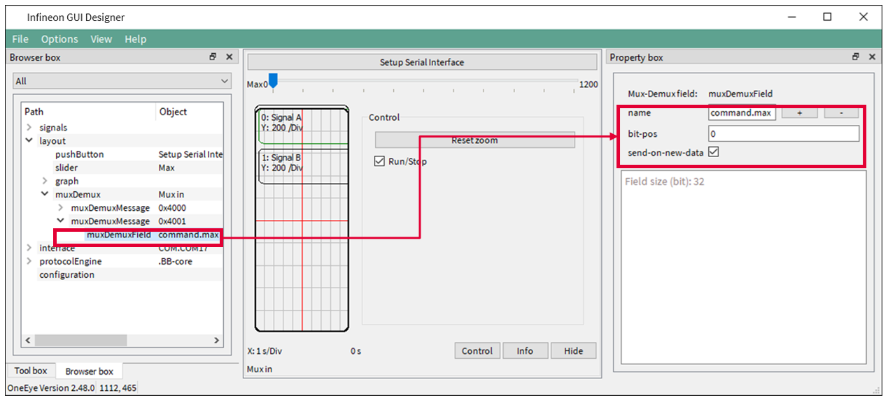  

**Connect the Mux-Demux widget to the BB protocol**

Right click on the protocol-core-bb and select *Add child &rarr; target*. Select the *target* item and set *local-port* and remote-port to 1 to match the AURIX settings, set *signal-in=mux.out*, *signal-out=mux.in*, and forward checked.

  

**Test the data multiplexer interface**

Save your configuration with CTRL+S and, exit the edit mode with the Infineon GUI Designer menu *Options &rarr; Edit mode* to only see the GUI.

Restart the AURIX software.

Move the slider cursor (1) to change the max value and affect the generated signals value. 

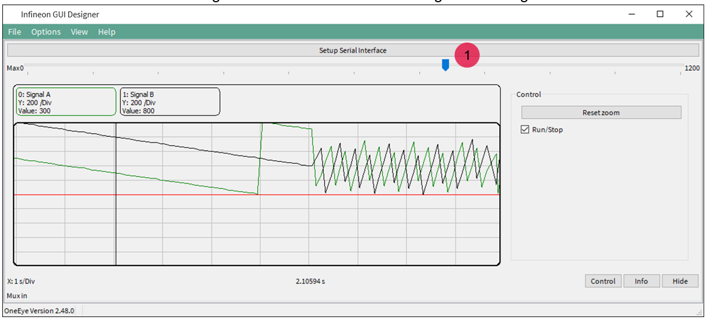  

## References  

AURIX&trade; Development Studio is available online:  
- <https://www.infineon.com/aurixdevelopmentstudio>  
- Use the "Import..." function to get access to more code examples  

More code examples can be found on the GIT repository:  
- <https://github.com/Infineon/AURIX_code_examples>  

For additional trainings, visit our webpage:  
- <https://www.infineon.com/aurix-expert-training>  

For questions and support, use the AURIX&trade; Forum:  
- <https://community.infineon.com/t5/AURIX/bd-p/AURIX>  
