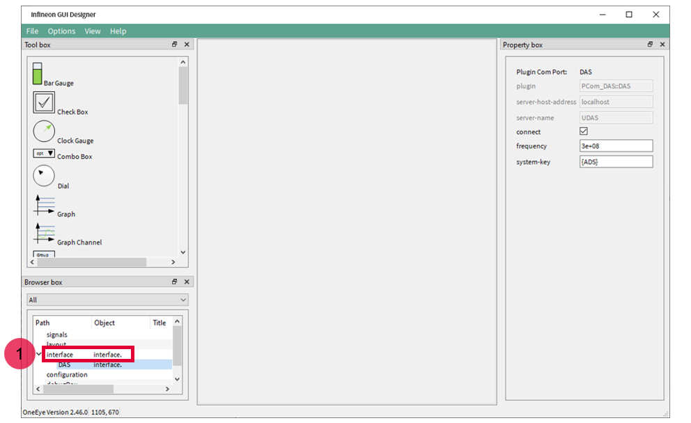
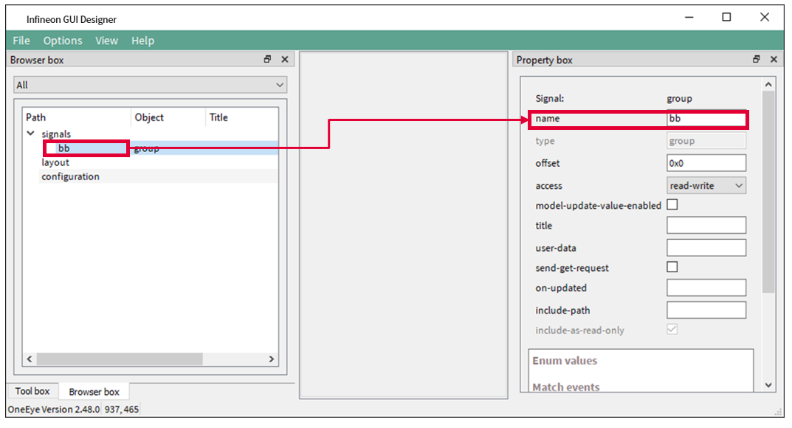
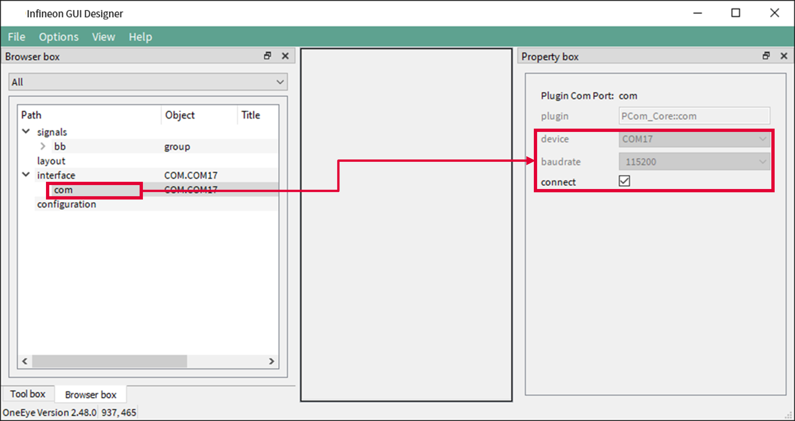
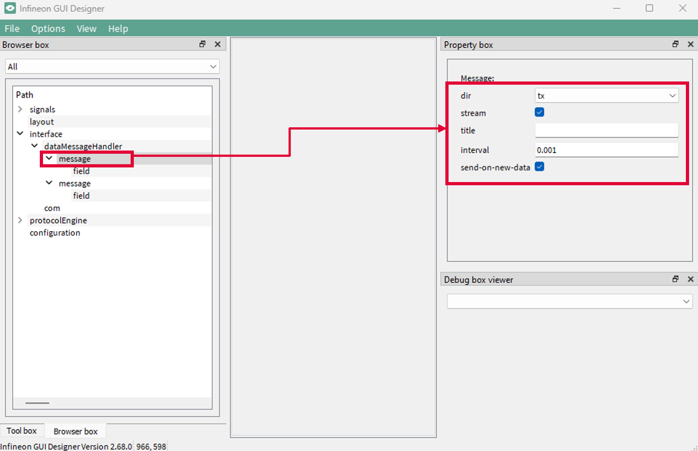
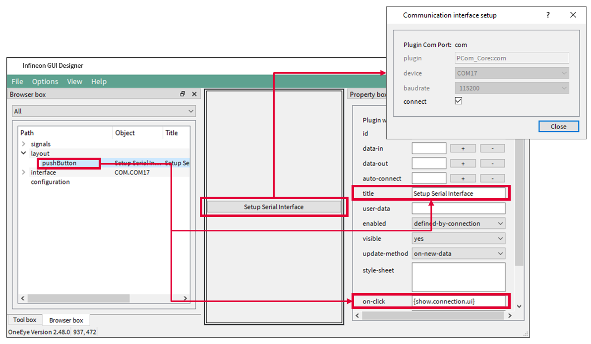
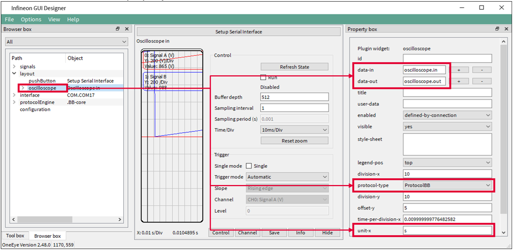
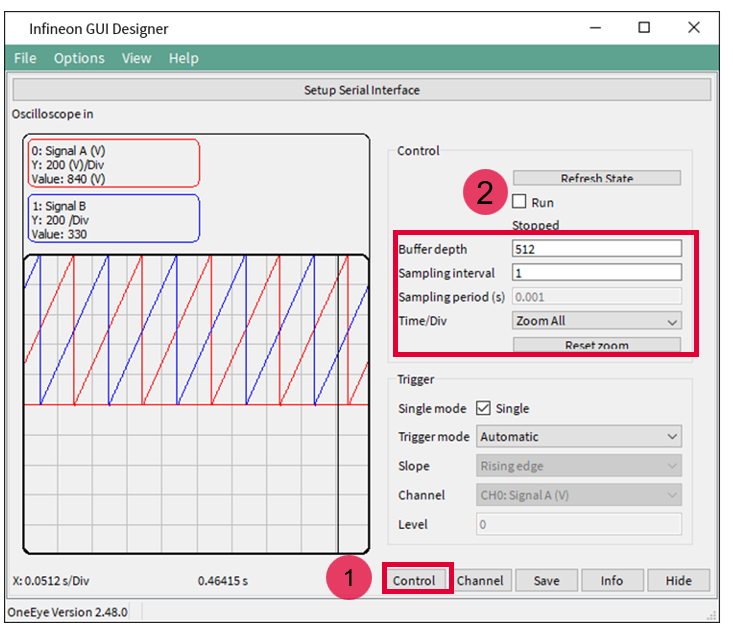

  

# OneEye_UART_Oscilloscope_1_KIT_AURIX_TC375_LK

**Oscilloscope over UART using Infineon GUI Designer(OneEye)**  

## Device  
The device used in this example is AURIX&trade; TC37xTP_A-Step.  

## Board  
The board used for testing is the AURIX&trade; TC375 lite Kit (KIT_A2G_TC375_LITE). 

## Scope of work  
Demonstrate how to implement the Infineon GUI Designer(OneEye) oscilloscope over the UART (USB) interface
After configuring the Infineon GUI Designer UART interface, an Infineon GUI Designer oscilloscope is created. The signals are updated and sampled every millisecond. Infineon GUI Designer is used to visualize the signal values.

## Introduction  
**Infineon GUI Designer** is a GUI that enables the creation of interactive Graphical User Interface. Graphical elements can be drag from a toolbox and drop onto the GUI. The behavior of the created GUI can be customized. Different communication interfaces like UART, Ethernet, CAN, DAS can be used to interact with the embedded system

**SyncProtocol / ProtocolBB** is a synchronous protocol that enables data streaming between the target microcontroller and Infineon GUI Designer. It enables to open multiple communication channels, provide packet acknowledge and packet checksum. Data are transported within a message with a message ID and a message payload. See the Infineon GUI Designer help for more information.

  

*Note:* It is recommended to go through some of the basic tutorials listed in the help embedded in Infineon GUI Designer (Menu: Help  Infineon GUI Designer help). This enables a quicker ramp-up in the Infineon GUI Designer concept and ensures a nice journey with Infineon GUI Designer

## Hardware setup  
This code example has been developed for the board KIT_A2G_TC375_LITE.  

The board should be connected to the PC through the USB port.  

  

## Implementation - AURIX  
**Configuration overview**
In this configuration two C struct are used to exchange data over the COM port between the microcontroller and Infineon GUI Designer. 
In Infineon GUI Designer, two signals *bb.in* and *bb.out* are used to connect the COM port data stream to the BB protocol. The BB protocol is configured to open a channel reserved for the data multiplexer. This channel connects to the Mux-Demux widget using the *mux.in* and *mux.out* signals. The Mux-Demux widget connects to a slider with the *command.max* signal and a Graph with the *status.signalA* and *status.signalB* signals.

  

**Enabling the OneEye library**
The OneEye library must be enabled by adding the following line to *Ifx_Cfg.h*:

*#define IFX_CFG_OE_AL_UC IFX_CFG_OE_AL_UC_AURIX_ILLD*

*#define IFX_CFG_OE_AL_UTILS*

**Configuring the Infineon GUI Designer Oscilloscope**

An Infineon GUI Designer oscilloscope (*Ifx_Oe_Osci*) is an object that enable data sampling and provide triggering functionality. 

The Infineon GUI Designer oscilloscope communication interface (*Ifx_Oe_OsciBb*) enables streaming of data and control of the oscilloscope using the BB protocol (*Ifx_Oe_SyncProtocol*).  
The Infineon GUI Designer oscilloscope is initialized with *initOscilloscope()* / *Ifx_Oe_Osci_init()*. 

The autoAddChannels parameter enables to automatically add channels for each created oscilloscope signal. 
The sample period (samplePeriod) is set to 1ms and provides Infineon GUI Designer information about sample timing. 
The triggerMode is set to automatic, note that this value can be changed from the Infineon GUI Designer oscilloscope interface later.
The *ifx_oe_osci.h* file can be found in the Libraries\OneEye directory.

**Adding signals to the oscilloscope**

Oscilloscope signals are mainly pointers that the oscilloscope can use for data sampling. The signals are added using *Ifx_Oe_Osci_addSignal()*. The function takes as parameter the signal name displayed by the oscilloscope, with an optional unit string in parenthesis, the signal type which informs the oscilloscope how to read the pointer value and a source pointer to the data. The last parameter corresponds to the q format used in case of fix point data, or 0 if not used. 

**Starting the oscilloscope**

The oscilloscope is started with the function *Ifx_Oe_Osci_start()*.

**Configuring the signal generator**

A signal generator is used to provide the user with some value to read / write. The signal generator does nothing more than incrementing two signals, *signalA* and *signalB*, stored in the structure *g_signalGenerator* up to a maximum value before resetting them. 
The initialization of the signal generator is done with *initSignalGenerator()*.

**Running the signal generator and the oscilloscope**

The signal generator is executed in the background loop every 1ms with *processSignalGenerator()*. To ensure the timing, a deadline variable is periodically updated with *Ifx_Oe_Time_add()* to obtain the 1ms period.  
The oscilloscope runs in the same background loop with *sampleOscilloscope()* / *Ifx_Oe_Osci_step()*. This function handles the triggering and sampling of data. 

Note: the call to *Ifx_Oe_Osci_step()* can be moved to an interrupt service routine if required by the application use case.

## Run and Test   

For this training, the Infineon GUI Designer application is required for visualizing the values. Infineon GUI Designer can be opened inside the AURIX&trade; Development Studio using the following icon:  

  

Clicking the Infineon GUI Designer icon automatically opens the OneEye configuration for the active project. If no configuration exists, it is created by AURIX&trade; Development Studio.  

## Implementation - Infineon GUI Designer  

In this training, the OneEye configuration is provided inside the Libraries folder. The following steps are needed to configure the oscilloscope from a brand-new configuration.  

**Setup Infineon GUI Designer for editing**  

Select the Infineon GUI Designer menu *Options &rarr; Edit mode* (if not already checked) to enable the edit mode.
Select the Infineon GUI Designer menu *View &rarr; Browser box*, *View &rarr; Property box* , *View &rarr; Tool box* (if not already checked) to display the browser, property box, and tool box.
Close the Welcome screen if it was shown.

  

**Removing the default DAS interface**

When the OneEye configuration is created by ADS, it is already setup with a DAS interface. 
Select the interface in the Browser box (1) and delete it with “right click and remove” as it is not required in this example.

  

**Configuring the UART interface: Signal creation**

The first step is to create 2 signals to connect the received and transmit data over the UART.
Create a signal group and set its name property to *bb*. 

  

Add two signals of type char into the bb group, name them in and out, and set their title property to respectively *BB* in and *BB out*.

  

**Configuring the UART interface: COM port**

Right click in an empty area of the Browser box, and select *Add child &rarr; Interface*. Then right click on the created interface and select *Add child &rarr; com*. Select the com item and set its device property to the COM port connected to the AURIX board. Set the baudrate property to 115200 and click connect.

The COM port is now opened and ready for communication.

  

**Configuring the UART interface: Transmit stream**

Right click on the interface in the Browser box, and select *Add child &rarr; dataMessageHandler*. Then right click on the created *dataMessageHandler* and select *Add child &rarr; message* to create a message item. 
Configure the message with the *interval=0.001*, send-on-new-data checked, *dir=tx*, stream checked.

  

Right click on the message, and select *Add child &rarr; field*. 
Configure the field with *name=bb.out*, *bit-pos=0*, *buffer=512*.

Now, data will be transmitted over the UART each time the bb.out signal is written with some data.

  

**Configuring the UART interface: Receive stream**

Right click on the dataMessageHandler and select *Add child &rarr; message* to create a second message item. 
Configure the message with the *interval=-1*, *dir=rx*, *stream checked*.

  

Right click on the message, and select *Add child &rarr; field*. 
Configure the field with *name=bb.in*, *bit-pos=0*.
Now each time data are received over the UART, the bb.in signal will be updated.

  

**Configuring the UART interface: Push button**

Drag and drop a pushButton widget from the toolbox onto the layout, configure it with title=Setup Serial Interface, *on-click={show.connection.ui}*.

Clicking the button now shows the COM port configuration window.

  

**Configuring the BB protocol**

Right click in an empty area of the Browser box, and select *Add child &rarr; protocolEngine*. Then right click on the created protocolEngine and select *Add child &rarr; protocol-core-bb*. Connect the BB protocol stream to the *bb.in* and *bb.out* signals by setting respectively the *data-in* and data-out properties. Set the name property to BB-core. And set the timeout to 2000 ms so that frames are dropped after 2 seconds in case the microcontroller is not answering.

  

**Configuring the Oscilloscope: signals creation**

Create a signal group and set its name property to oscilloscope. 

  

Add two signals of type char into the oscilloscope group, name them in and out, and set their title property to respectively Oscilloscope in and Oscilloscope out.

  

**Create the oscilloscope widget**

Drag and drop an oscilloscope widget from the toolbox onto the layout, set the oscilloscope properties *data-in* and *data-out* to respectively *oscilloscope.in* and *oscilloscope.out*. Set the protocol-type property to *ProtocolBB*. Set the unit-x property to s.

  

**Connect the oscilloscope widget to the BB protocol**

Right click on the *protocol-core-bb* and select *Add child &rarr; target*. Select the target item and set local-port and remote-port to 3 to match the AURIX settings, *set signal-in=oscilloscope.out*, *signal-out=oscilloscope.in*, forward=checked.

  

**Test the oscilloscope**

The oscilloscope Control tab provides configuration for the trigger and information about the oscilloscope state (armed, triggered, uploading). 
Click on the Control button (1) and the Refresh State button to retrieve the oscilloscope settings (channels, timings, …).

  

In the oscilloscope Channel tab, click on the Channel button (1) and check the visible check box for both CH0: Signal A and CH1: Signal B to display the two channels.

Set the Unit per div Y to 200 for both CH0: Signal A and CH1: Signal B.

Select the Pen color red for CH0: Signal A and blue for CH1: Signal B.

  

Click on the Control button (1), check the run button (2), the values for signalA and signalB should be updating in the oscilloscope.

Set the Time/Div value to Zoom All to configure the horizontal scale to use the full screen of the oscilloscope window.

The Buffer depth configures the oscilloscope buffer depth, here 512 points are used to fill the buffer. This value can be changed within the limit set by the software.

The Sampling interval provides the information whether to sample at each interval (1) or not (>1) to the oscilloscope.

  

**Advanced options**

Advanced configuration can be added to the file *Ifx_Cfg.h* or *ifx_oe_cfg.h* to tune the oscilloscope capabilities, this includes:
- IFX_CFG_OE_OSCI_MAX_NUM_OF_SIGNALS: the maximum number of signals that can be declared by the user
- IFX_CFG_OE_OSCI_MAX_NUM_OF_CHANNELS: the maximum number of channels that can be buffered
- IFX_CFG_OE_OSCI_NUM_OF_SAMPLES: the maximum number of sample per channel

Note: the memory used by the oscilloscope is mainly defined by IFX_CFG_OE_OSCI_MAX_NUM_OF_CHANNELS * IFX_CFG_OE_OSCI_NUM_OF_SAMPLES * 4

Default values for the above-mentioned macros are provided in ifx_oe_oscicfg.h under Library/OneEye.

## References  

AURIX&trade; Development Studio is available online:  
- <https://www.infineon.com/aurixdevelopmentstudio>  
- Use the "Import..." function to get access to more code examples  

More code examples can be found on the GIT repository:  
- <https://github.com/Infineon/AURIX_code_examples>  

For additional trainings, visit our webpage:  
- <https://www.infineon.com/aurix-expert-training>  

For questions and support, use the AURIX&trade; Forum:  
- <https://community.infineon.com/t5/AURIX/bd-p/AURIX>  
