  

# OneEye_UART_Shell_1_KIT_TC375_LK

**Shell over UART using Infineon GUI Designer(OneEye)**  

## Device  
The device used in this example is AURIX&trade; TC37xTP_A-Step.  

## Board  
The board used for testing is the AURIX&trade; TC375 lite Kit (KIT_A2G_TC375_LITE). 

## Scope of work  
Demonstrate how to implement the Infineon GUI Designer(OneEye) shell over the UART (USB) interface. A Shell is used to parse a command line and call the corresponding command execution.
After configuring the Infineon GUI Designer UART interface, an Infineon GUI Designer shell is used to interpret and manage commands like "info" or "help".

## Introduction  
**Infineon GUI Designer** is a GUI that enables the creation of interactive Graphical User Interface. Graphical elements can be drag from a toolbox and drop onto the GUI. The behavior of the created GUI can be customized. Different communication interfaces like UART, Ethernet, CAN, DAS can be used to interact with the embedded system

**SyncProtocol / ProtocolBB** is a synchronous protocol that enables data streaming between the target microcontroller and Infineon GUI Designer. It enables to open multiple communication channels, provide packet acknowledge and packet checksum. Data are transported within a message with a message ID and a message payload. See the Infineon GUI Designer help for more information.

  

*Note:* It is recommended to go through some of the basic tutorials listed in the help embedded in Infineon GUI Designer (Menu: Help  Infineon GUI Designer help). This enables a quicker ramp-up in the Infineon GUI Designer concept and ensures a nice journey with Infineon GUI Designer

## Hardware setup  
This code example has been developed for the board KIT_A2G_TC375_LITE.  

The board should be connected to the PC through the USB port.  

  

## Implementation - AURIX  
**Configuration overview**
In this configuration a shell running on the microcontroller is connected to the COM port. 
In Infineon GUI Designer, two signals bb.in and bb.out are used to connect the COM port data stream to the BB protocol. The BB protocol is configured to open a channel reserved for the shell. This channel connects to the lineEdit and textEdit with the console.in and console.out signals.

  

**Enabling the OneEye library**

The OneEye library must be enabled by adding the following line to Ifx_Cfg.h:

#define IFX_OE_AL_USE_AURIX_ILLD

**Configuring the UART communication**
The UART communication is initialized with the function *initUart()*, which also initializes the BB protocol.

In the infinite while loop, the function *processUart()* executes the SyncProtocol.

**Configuring the shell**

A shell (*Ifx_Oe_Shell*) is an object that enables command line parsing and command execution. 

The shell communication interface (*Ifx_Oe_ShellBb*) enables streaming of data using the BB protocol (*Ifx_Oe_SyncProtocol*).  
The shell is initialized with *initShell()* / *Ifx_Oe_Shell_init()*. 

The *ifx_oe_shell.h* file can be found in the Libraries\OneEye directory.

**Running the shell**
The shell is executed in the background loop by calling *processShell()* / *Ifx_Oe_Shell_process()*.

## Run and Test   

For this training, the OneEye application is required for visualizing the values. OneEye can be opened inside the AURIX&trade; Development Studio using the following icon:  

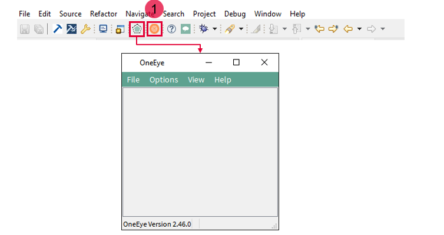  

Clicking the OneEye icon automatically opens the OneEye configuration for the active project. If no configuration exists, it is created by AURIX&trade; Development Studio.  

## Implementation - OneEye  

In this training, the OneEye configuration is provided inside the Libraries folder. The following steps are needed to configure the oscilloscope from a brand-new configuration.  

**Setup Infineon GUI Designer for editing**  

Select the Infineon GUI Designer menu *Options &rarr; Edit mode* (if not already checked) to enable the edit mode.
Select the Infineon GUI Designer menu *View &rarr; Browser box*, *View &rarr; Property box*, *View &rarr; Tool box* (if not already checked) to display the browser, property box, and tool box. Note that the box can be moved around.  

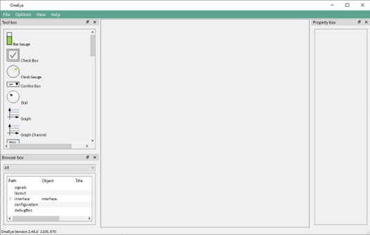  

**Removing the default DAS interface**

When the OneEye configuration is created by ADS, it is already setup with a DAS interface. 
Select the interface in the Browser box (1) and delete it with “right click and remove” as it is not required in this example.

  

**Configuring the UART interface: Signal creation**

The first step is to create 2 signals to connect the received and transmit data over the UART.
Create a signal group and set its name property to *bb*. 

  

Add two signals of type char into the bb group, name them in and out, and set their title property to respectively *BB* in and *BB out*.

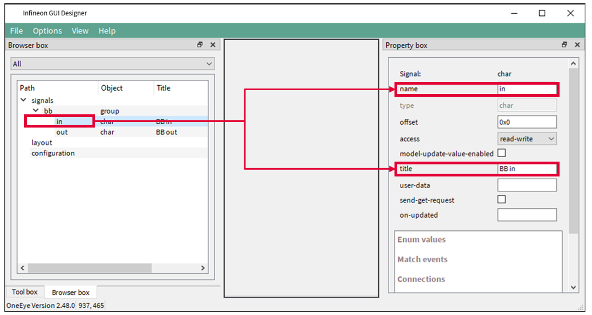  

**Configuring the UART interface: COM port**

Right click in an empty area of the Browser box, and select *Add child &rarr; Interface*. Then right click on the created interface and select *Add child &rarr; com*. Select the com item and set its device property to the COM port connected to the AURIX board. Set the baudrate property to 115200 and click connect.

The COM port is now opened and ready for communication.

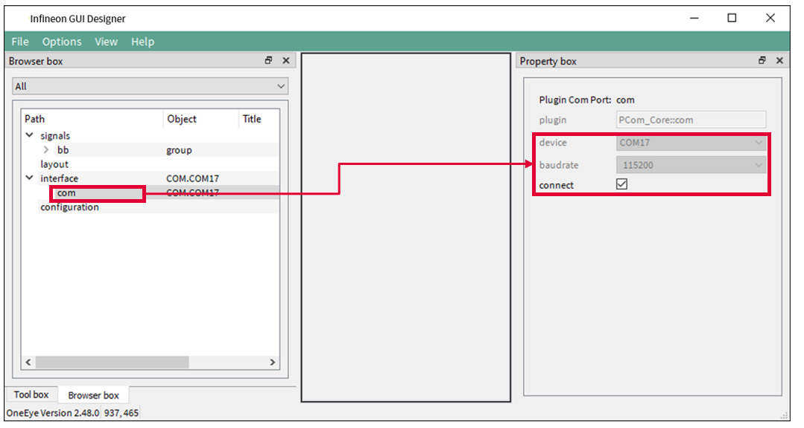  

**Configuring the UART interface: Transmit stream**

Right click on the interface in the Browser box, and select *Add child &rarr; dataMessageHandler*. Then right click on the created *dataMessageHandler* and select *Add child &rarr; message* to create a message item. 
Configure the message with the *interval=0.001*, send-on-new-data checked, *dir=tx*, stream checked.

  

Right click on the message, and select *Add child &rarr; field*. 
Configure the field with *name=bb.out*, *bit-pos=0*, *buffer=512*.

Now, data will be transmitted over the UART each time the bb.out signal is written with some data.

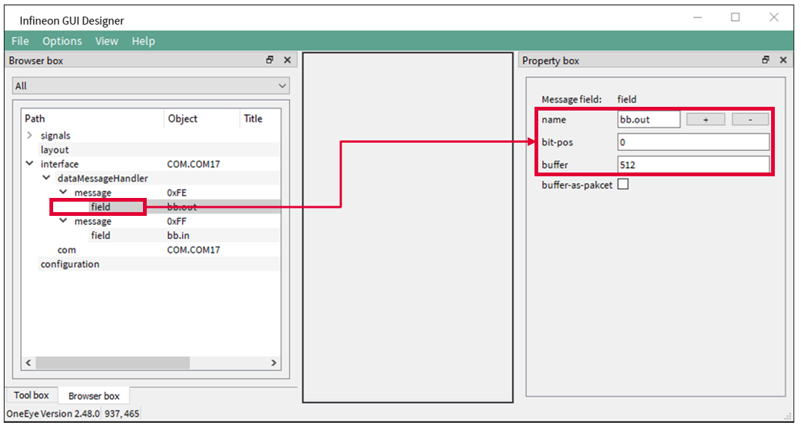  

**Configuring the UART interface: Receive stream**

Right click on the dataMessageHandler and select *Add child &rarr; message* to create a second message item. 
Configure the message with the *interval=-1*, *dir=rx*, *stream checked*.

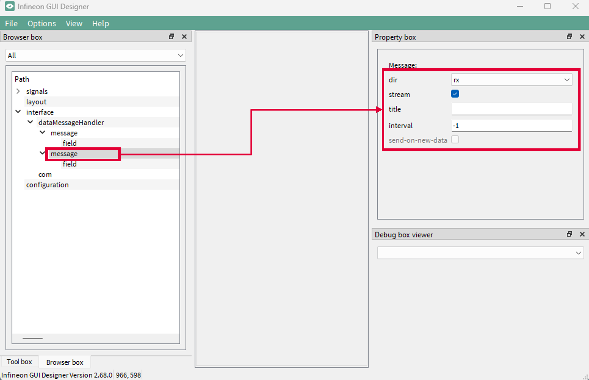  

Right click on the message, and select *Add child &rarr; field*. 
Configure the field with *name=bb.in*, *bit-pos=0*.
Now each time data are received over the UART, the bb.in signal will be updated.

  

**Configuring the UART interface: Push button**

Drag and drop a pushButton widget from the toolbox onto the layout, configure it with title=Setup Serial Interface, *on-click={show.connection.ui}*.

Clicking the button now shows the COM port configuration window.

  

**Configuring the BB protocol**

Right click in an empty area of the Browser box, and select *Add child &rarr; protocolEngine*. Then right click on the created protocolEngine and select *Add child &rarr; protocol-core-bb*. Connect the BB protocol stream to the *bb.in* and *bb.out* signals by setting respectively the *data-in* and data-out properties. Set the name property to BB-core. And set the timeout to 2000 ms so that frames are dropped after 2 seconds in case the microcontroller is not answering.

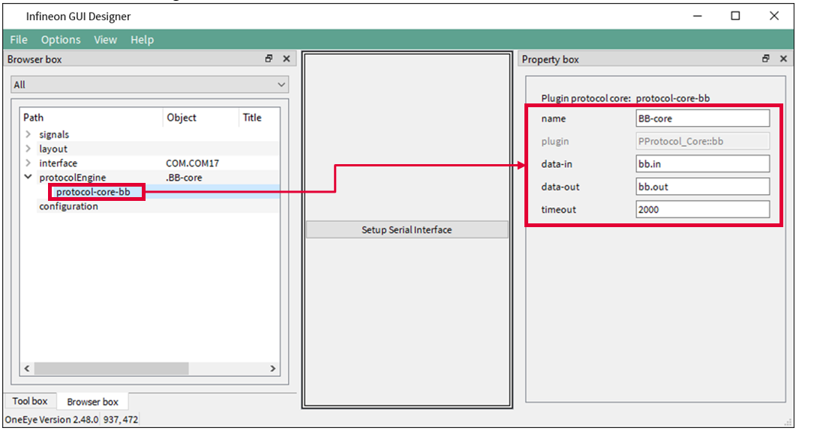  

**Configuring the Shell: signals creation**

Create a signal group and set its name property to console.  

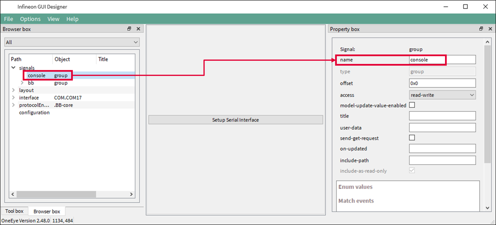  

Add two signals of type char into the console group, name them in and out, and set their title property to respectively Console Rx and Console Tx. Set the access property of the in signal to read-only and the access property of the out signal to write-only.

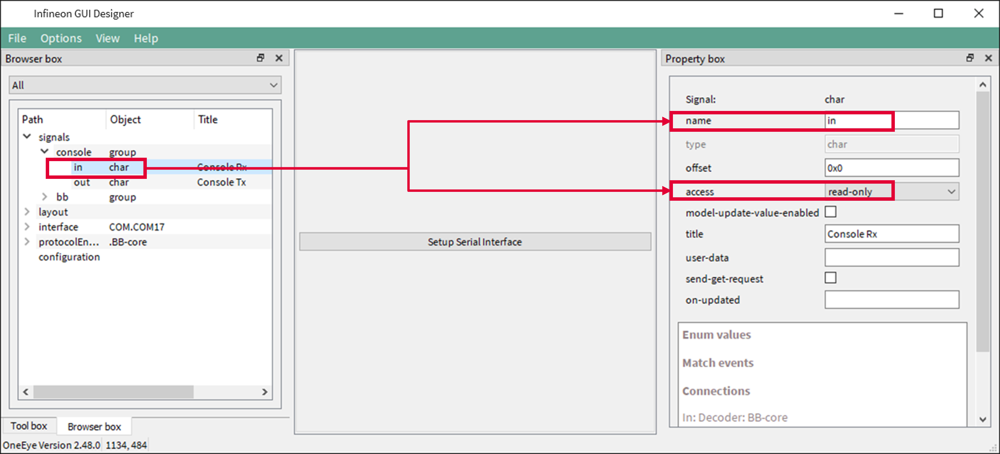  

**Create the Shell widget**

Drag and drop a textEdit widget from the toolbox onto the layout, set the textEdit properties auto-connect to  console.in. Set the update-method to all-on-new-data.

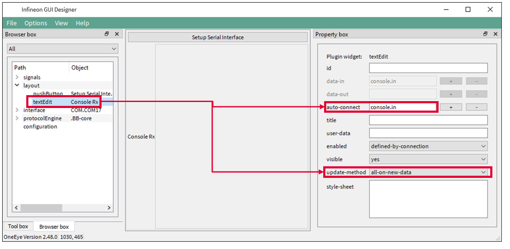  

Drag and drop a lineEdit widget from the toolbox onto the layout, set the lineEdit properties auto-connect to  console.out. Check the capture-key property to enable each key stroke to be send.

  

**Connect the lineEdit and textEdit widget to the BB protocol**

Right click on the protocol-core-bb and select Add child &rarr; target. Select the target item and set local-port and remote-port to 2 to match the AURIX settings, set *signal-in=console.out*, *signal-out=console.in*.

  

**Test the shell interface**

Restart the AURIX software. The shell textbox should display the *Hello World !* text (1). 

Enter “info” in the Console Tx lineEdit field (2) and press ENTER, the microcontroller executes the *printShellInfo()* function and should answer as below to acknowledge the command. 

  

Save your configuration with CTRL+S.

Exit the edit mode with the Infineon GUI Designer menu *Options &rarr; Edit mode* to only see the GUI (3).

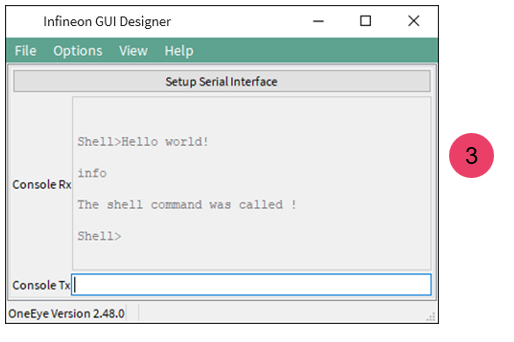  

## References  

AURIX&trade; Development Studio is available online:  
- <https://www.infineon.com/aurixdevelopmentstudio>  
- Use the "Import..." function to get access to more code examples  

More code examples can be found on the GIT repository:  
- <https://github.com/Infineon/AURIX_code_examples>  

For additional trainings, visit our webpage:  
- <https://www.infineon.com/aurix-expert-training>  

For questions and support, use the AURIX&trade; Forum:  
- <https://community.infineon.com/t5/AURIX/bd-p/AURIX>  
