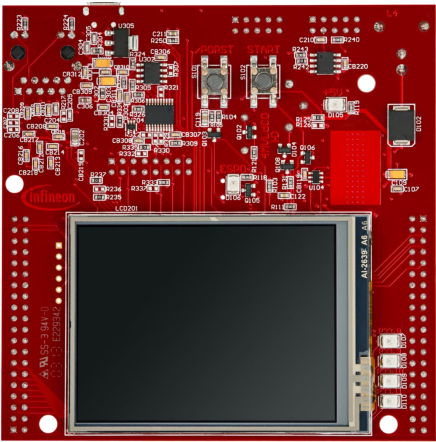
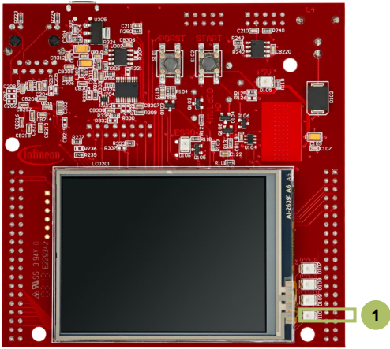

  

# PMS_Power_Down_Idle_1_KIT_TC397_TFT
CPU0 switches periodically between run mode and idle mode triggered by STM timer.

## Device  
The device used in this example is AURIX&trade; TC39xTP_A-Step.

## Board  
The board used for testing is the AURIX&trade; TC397 TFT (KIT_A2G_TC397_5V_TFT).

## Scope of work  
The Power Management System (PMS) allows activation of power down modes for each CPU individually in case there are no active tasks to perform and power consumption needs to be reduced. In this example, the System Timer periodically generates interrupts (every two seconds). In the Interrupt Service Routine, the CPU0 is switched between idle mode and run mode. CPU0 toggles LED D110 during run mode whereas the LED D110 remains in the last toggling state while CPU0 is idle.

## Introduction  
The Power Management System allows activation of power down modes so that the system operates with the minimum required power for a corresponding application state.

Idle, Sleep or Standby are supported as power consumption modes. The Idle is specific to each CPU whereas the Sleep and Standby modes influence the complete system.

The System Timer (STM) is a free running 64-bit counter which can be used for timing applications requiring both high precision and long period.

The STM has the capability to generate interrupts when its count reaches a predefined compare value.

## Hardware setup  
This code example has been developed for the board KIT_A2G_TC397_5V_TFT.

 

## Implementation

### Configuring the system timer to periodically generate interrupts
The configuration of the system timer is done through the function *configSystemTimer()*.
- The system timer immediately runs after PowerUp and needs to be configured
- Create an instance of the structure *IfxStm_Timer_Config*, which is initialized by calling *IfxStm_Timer_initConfig()*. Then configure the following components:
  - Set the rate in Hz that refers to interrupt events per second
  - Define the priority for the interrupt (range from 0 to 255)
  - Define the provider for the interrupt service request as one of the CPUs or the DMA
  - Specify the comparator register that is used to store the compare value to trigger an event when timer and comparator register match
- Use the routine *IfxStm_Timer_init()* together with the instance of structure *IfxStm_Timer_Config* to create the *g_myTimer* handle

The above functions can be found in the header *IfxStm_Timer.h*.

### Blink the LED D110
CPU0 runs within the endless loop in *Cpu0_Main.c*. Before it starts a toggle cycle, it waits for approximately 4 million CPU ticks (equals to 0x400000).

If the CPU0 is set to idle state, the code execution is halted and the CPU clock is disabled. This stops the toggling of the LED.

### Set/Return to/from Idle state:
The interrupt service routine defined in *PMS_Power_Down_Idle.c* controls the CPU0, which alternates between run state and idle state. The static variable *setIdle* helps to identify the next state of the CPU0, whether it remains in run state or is set into idle state.

If the CPU0 is in idle state and the STM interrupt event occurs then the CPU returns to run state.

The function *IfxStm_Timer_acknowledgeTimerIrq()* is used to acknowledge the interrupt request and set the next compare value for the next interrupt event. The function can be found in the header *IfxStm_Timer.h*.

## Compiling and programming  
Before testing this code example:  
- Power the board through the dedicated power connector
- Connect the board to the PC through the USB interface  
- Build the project using the dedicated Build button  or by right-clicking the project name and selecting "Build Project"  
- To flash the device and immediately run the program, click on the dedicated Flash button 

## Run and Test
After code compilation and flashing the device, verify the behavior of the LED:
- Check if LED D110 (1) is blinking (equals to Run Mode) or remains on/off (equals to Idle Mode)

## References  

AURIX&trade; Development Studio is available online:  
- <https://www.infineon.com/aurixdevelopmentstudio>  
- Use the "Import..." function to get access to more code examples  

More code examples can be found on the GIT repository:  
- <https://github.com/Infineon/AURIX_code_examples>  

For additional trainings, visit our webpage:  
- <https://www.infineon.com/aurix-expert-training>  

For questions and support, use the AURIX&trade; Forum:  
- <https://community.infineon.com/t5/AURIX/bd-p/AURIX>  